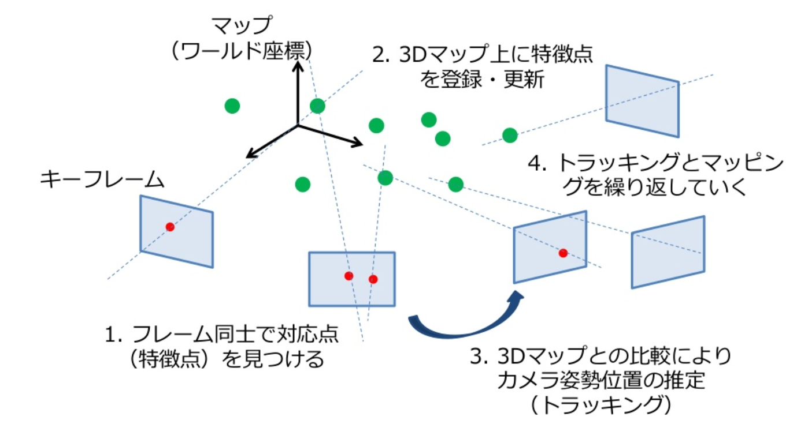

# Parallel Tracking and Mapping for Small AR Workspaces

元の論文の公開ページ : http://www.robots.ox.ac.uk/~gk/publications/KleinMurray2007ISMAR.pdf

## どんなもの?
ARの利用にも耐えうるようなvisual SLAMアルゴリズムを提案した。

## 先行研究と比べてどこがすごいの?
提案されるモデルは手持ちの単眼カメラからSLAMを行うため、通常のSLAMの様にオドメトリ等の他のセンサーの値を利用できないにもかかわらず、ARの利用にも耐えうるようなvisual SLAMアルゴリズムを提案した。[2]を見ての通り、提案手法を用いてARアプリケーションを動かしている。

## 技術や手法のキモはどこ? or 提案手法の詳細
### 手法の概要
大まかな仕組みは以下の[1]の9ページ目から引用してきた図の通り。トラッキングとマップの更新の処理を(CPUのスレッド単位で)別々に行う様にすることで、トラッキングの性能を向上させる。また、冗長な情報を省くためにキーフレームを採用している。そのため、リアルタイムな処理が必要な本タスクでもバンドル調整と呼ばれる重い処理を導入できるようになっている。ステレオの初期化を採用し、時々ローカルバンドルを更新しながら、継続的かつ長期的にマッピングする。

#### TRACKING
この章はマップがすでに作成されていることを前提としている。このトラッキングシステムはカメラから受け取った画像からリアルタイムで構築された地図に対するカメラ姿勢の推定を行う。フレームごとにシステムは次の2段階のトラッキングを行う。

##### Image acquisition
トラッキングのために8bppグレイスケールの4層ピラミッド画像を使う。さらに各層でFAST-10コーナー検出器[3]を使う。また、減衰速度モデルを使う。これはα-βフィルタ([1]を参考)に似ているが、新しい測定値がないと推定されたカメラ(の位置)は遅く動くようになり、やがて止まる。

##### Camera pose and projection
マップの点を画像平面に投影するために、地図の点をワールド座標系からカメラ座標系$C$へ変換する。

##### Patch Search
現在のフレームの中にある一つのマップの特徴点$p$を探すため、点があると思われる画像位置を中心とした固定範囲の画像探索を行う。[1]の36ページから引用すると、

>> アフィン変換行列を求めて行列式を計算し、スケーリングを概算、スケーリングに対応した階層の画像で特徴点マッチングを行う。
>> FASTコーナー、エピポーラー直線上
>> ただあまり正確でないのでinverse compositional algorithmを用いて精度を高める(省略)

ということらしい(今後修正)。

###### Pose update

### MAPPING
#### Map initialisation
システムの起動時に、[4]のfive-point stereo algorithmを使ってマップを初期化する。この段階でシステムに最初のキーフレームが(手動で)保存され、1000個の特徴点(2D patch-tracks、FAST特徴点[1,5])が検出される(ピラミッド画像の最も低い層で初期化するとあるが、検出するで問題ない?)。その後、カメラを滑らかに少し動かし、二つ目のキーフレームを手動で保存し、5点アルゴリズムとRANSACで基底ベクトルを推定&元となるマップを三角測量することで、2つのキーフレーム間の特徴点の対応を得る。結果として得られたマップはバンドル調整を介して改良されている。

#### Keyframe insertion and epipolar search
マップには最初2つのキーフレームしか含まれておらず小さい空間だけが存在するが、カメラが最初のポーズから離れると、新しいキーフレームの追加とマップへの新しい特徴点の追加でマップを拡大する。  
キーフレームは以下の条件で追加される。

- トラッキングの質が良い
- 最後にキーフレームが追加されてから20フレーム超えること
- カメラが既に地図上にある最も近いキーポイントから最低距離離れている

最低距離は一般的な単眼SLAMで、地図を破壊しうるカメラの位置静止問題を回避でき、新しい特徴点三角測量のためのステレオベースラインを保証してくれる。最小距離自体は観測した特徴点の平均深度に依存する。  
各キーフレームはトラッキングシステムのカメラ姿勢推定とトラッキングシステムで作られた全ての特徴点測定値を仮定する。

[1]を参考に作成した。

1. 新しいフレームをカメラから受け取り、事前ポーズ推定がモーションモデルから生成される。
2. マップの点はフレームの事前ポーズ推定に従って画像に投影される。
3. 画像内で少数(50)の最も粗いスケールのフィーチャーが探索される。
4. カメラのポーズはこれらの粗いマッチングから更新される。
5. より多くの数(1000)の点が画像内で再投影され探索される。
6. フレームの最終的な姿勢推定値は、見つかったすべてのマッチングから計算される。

## どうやって有効だと検証した?

## 議論はある?

## 次に読むべき論文は?
- なし

### 論文関連リンク
1. [Masaya Kaneko. SLAM勉強会(PTAM). (大いに参考になる、アクセス:2019/04/09)](https://www.slideshare.net/MasayaKaneko/slamptam)
2. [ActiveVision Oxford. Parallel Tracking and Mapping for Small AR Workspaces (PTAM). (最初に見るべき、アクセス:2019/04/10)](https://www.youtube.com/watch?v=F3s3M0mokNc)
3. [E. Rosten and T. Drummond. Machine learning for high-speed cor-ner detection. InProc. 9th European Conference on Computer Vision (ECCV’06), Graz, May 2006.](https://www.springer.com/gp/book/9783540338321)
4. [H. Stew ́ enius, C. Engels, and D. Nist ́ er. Recent developments on direct relative orientation. ISPRS Journal of Photogrammetry and Remote Sensing, 60:284–294, June 2006.](https://pdfs.semanticscholar.org/514f/a8d4981cc2b2aecfc02e0e3a8f4be717bcd7.pdf)
5. [コーナー検出のためのFASTアルゴリズム. OpenCV. (アクセス:2019/04/11)](http://lang.sist.chukyo-u.ac.jp/classes/OpenCV/py_tutorials/py_feature2d/py_fast/py_fast.html)

### 会議
ISMAR 2007

### 著者
Georg Klein, David Murray.

### 投稿日付(yyyy/MM/dd)
2007/??/??

## コメント
動画がすごくおもしろかった....。あと、[1]様様。

## key-words
SLAM, 2D_Image

## status
未完