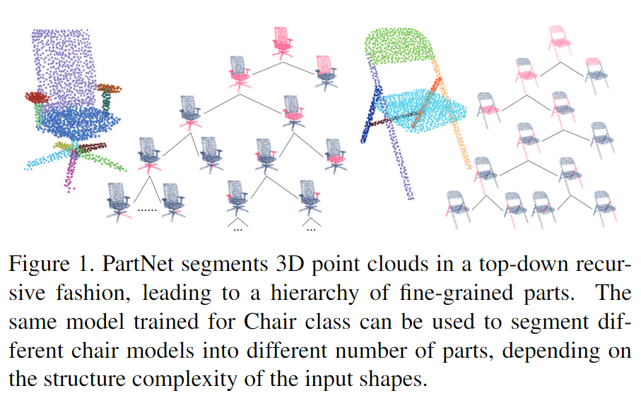
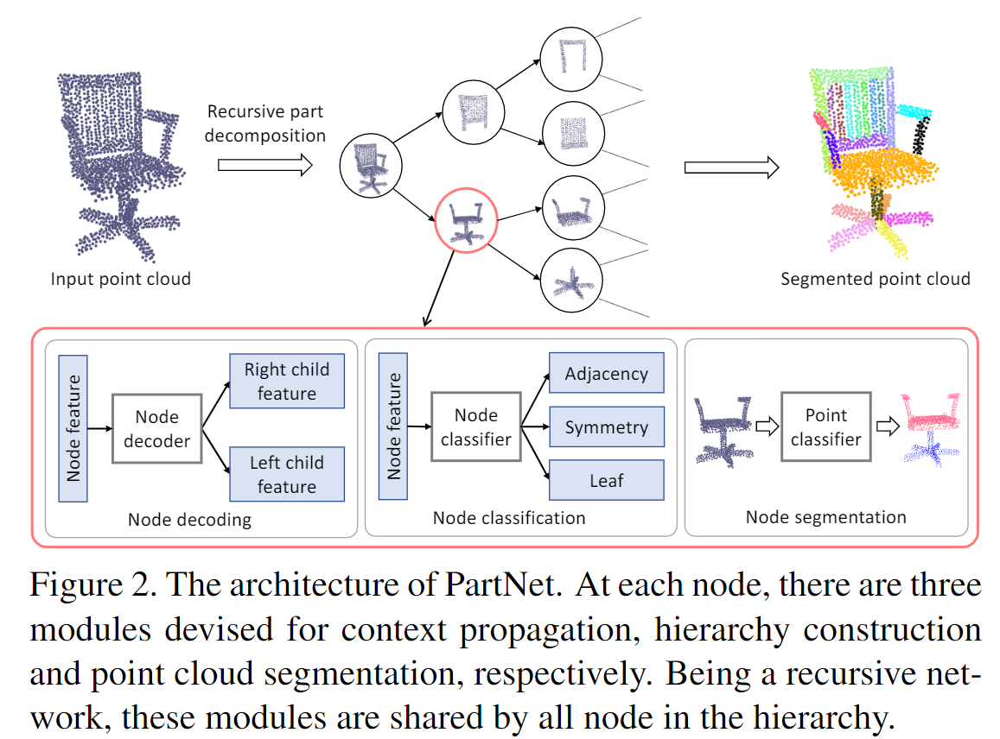
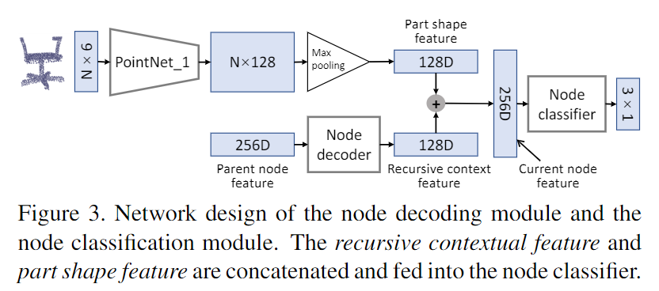
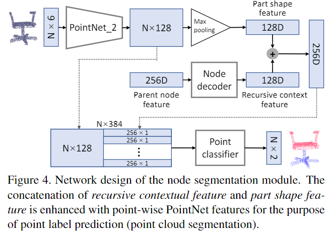
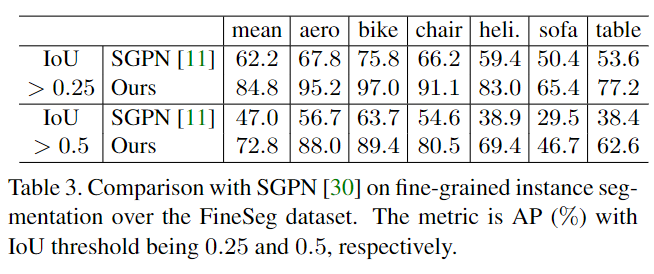

# PartNet: A Recursive Part Decomposition Network for Fine-grained and Hierarchical Shape Segmentation

元の論文の公開ページ : https://arxiv.org/abs/1903.00709

## どんなもの?
点群オブジェクトを再帰的にパーツごとに分割していくPartNetを提案した。最終的にはインスタンスレベルまで分割される。再帰的分割で分けられる点群は図1の通り。

## 先行研究と比べてどこがすごいの?
既存モデルでは固定されたパーツラベルをもとに分割するため、分割性能に限りがある(オブジェクトパーツラベルが3つで学習されたモデルで同じオブジェクトを4分割することはできない)。このモデルでは recursive neural networksを用いた再帰的な分割を行うため、先ほどの制限を取り払った分割ができる。また、新たな評価基準を提案した。

## 技術や手法のキモはどこ? or 提案手法の詳細
PartNetのアーキテクチャは図2の通り。木の各ノードは3つのモジュールに分けられる。入力はガウスノイズが追加されたデータと、ポイント法線が使われる。

### Node decoding modelue
このモジュールは現在のノードから子ノードにglobal contextual informationを渡すために使われる。モジュールの構造は図3(図内のNode decoding modelueは後述するNode classification moduleと合体している)の通り。再帰的に渡される親ノードの特徴と現ノードの点群特徴を合体させている。図の中で使用されるPoubtNet_1は後述するNode segmentaion moduleで使用されるものと別であるため区別している。

### Node classification module
このモジュールは分解階層の位相関係を構築するために使われる。具体的には、ノードを分解するかもしくは分解を止めるか、ノードのタイプの決定を予測をすることを学習し、このモジュールの役割を果たす。構造は図3(図の構造は前述したようにNode decoding modelueと合体している)の通り。ノードのタイプはadjacency、symmetryもしくはleafに分類される。adjacencyとsymmetryは分解位置、leafは分解停止を示す。  
symmetryノードである場合、論文関連リンクの1と同様に左の子をsymmetry generatorと右の子をsymmetry parametersとする。symmetry generatorにsymmetry parameterを適応すると、symmetryノードの完全な点群が得られる。例えば、図1の左でいえば、
- (多分左下から3番目の)脚部のスポークに対応するノードはrotational symmetryノードである。
  - 左の子はスポークの点群を持つ。
  - 右の子はsymmetry axis(対称性を持つための軸?)とsymmetry fold(?)を持つ。

### Node segmentation module
このモジュールは現在のノードの点群のセグメンテーションを実行するために使用される。最終的には点ごとの二値ラベルが出力される。構造は図4の通り。ここにあるPointNet_2はPointNet_1と重みを共有しないまったく別のPointNetである。symmetryノードでは、symmetry parameterに基づいてsymmetry generatorの対称物は分割される。

### Loss function
各ノードに含まれるPointNetの平均を損失とする。損失は式(1)の通り。

$$
L_{partnet} = \frac{1}{|\mathcal{H}|}\sum_{n\in\mathcal{H} } L_{class}(n) + \frac{1}{|\mathcal{T}|}\sum_{n\in\mathcal{T} } L_{seg}(n)
$$

このとき、$L_{class}(n)$と$L_{seg}$はそれぞれnノードの分類損失とセグメンテーション損失である。両方とも、cross entropy損失で定義されている。$\mathcal{H}$は階層内のすべてのノードの集合、$\mathcal{T}$はすべての非leafノードの集合である。

## どうやって有効だと検証した?
### The Fine-grained Segmentation Benchmark (FineSeg)
著者らはきめ細かいパーツのインスタンスセグメンテーションのためのベンチマークを提案した。このベンチマークはきめ細かいshape segmentationを評価するのに役に立つ。データセットには椅子1000個、テーブル500個、飛行機600個、ソファ600個、ヘリコプター100個、バイク140個の約3000個が含まれている。論文関連リンクの3で使用されているShapeNetの一部分が使われ、一様に整列、拡大縮小されている。きめ細かい分割が行われていない場合は手でセグメントしている。そして、論文関連リンクの2の手法で各形状のための部品階層を構築する。このベンチマークはAverage Precisionを用いて定量的に点群のきめ細かいセグメンテーションの評価を行える。このベンチマークについては[www.kevinkaixu.net/partnet.html](http://kevinkaixu.net/partnet.html)を参照すること。

### Visual results on FineSeg
視覚的な結果は図5に示すとおりである。

### Comparison of semantic segmentation
ShapeNet partデータセットで評価する。PartNetはセマンティックセグメンテーションを行えないので、分解する各部品のセマンティックラベルを予測するためのモジュールを追加した。結果は表2の通り。

### Comparison of instance segmentation
SGPNとFineSegでインスタンスセグメンテーションの比較を行う。結果は表3の通り。

### その他の評価
きめ細かい点群を含んでいないShapeNetを使ったラベルの生成などいろいろある。

## 議論はある?
1. 形状分解を階層的に行うものの、結果として得られるその階層に、既存研究の様に意図して学習されたもの(論文関連リンクの4など)ほどの意味は必ずしもない。
2. このモデルは、論文関連リンクの2で構築された階層で訓練される。完全に階層がランダムな場合はパフォーマンスが低下する。これらより、階層を構築することを必要としない、教師なし階層分割を開発す津べきである。

## 次に読むべき論文は?
- [J. Li, K. Xu, S. Chaudhuri, E. Yumer, H. Zhang, and L. Guibas. GRASS: Generative recursive autoencoders for shape structures. ACM Transactions on Graphics (TOG), 36(4):52, 2017.](https://arxiv.org/abs/1705.02090)

## 論文関連リンク
1. [J. Li, K. Xu, S. Chaudhuri, E. Yumer, H. Zhang, and L. Guibas. GRASS: Generative recursive autoencoders for shape structures. ACM Transactions on Graphics (TOG), 36(4):52, 2017.](https://arxiv.org/abs/1705.02090)
1. [Y. Wang, K. Xu, J. Li, H. Zhang, A. Shamir, L. Liu, Z. Cheng, and Y. Xiong. Symmetry hierarchy of man-made objects. Computer Graphics Forum, 30(2):287–296, 2011.](https://onlinelibrary.wiley.com/doi/abs/10.1111/j.1467-8659.2011.01885.x)
1. [M. Sung, H. Su, V. G. Kim, S. Chaudhuri, and L. Guibas. ComplementMe: Weakly-supervised component sugges-tions for 3D modeling. ACM Trans. on Graph. (SIGGRAPH Asia), 2017.](https://arxiv.org/abs/1708.01841)
1. [T. Liu, S. Chaudhuri, V. G. Kim, Q. Huang, N. J. Mitra, and T. Funkhouser. Creating consistent scene graphs us-ing a probabilistic grammar. ACM Transactions on Graphics (TOG), 33(6):211, 2014.](https://dl.acm.org/citation.cfm?id=2661243&dl=ACM&coll=DL)

## 会議
CVPR 2019

## 著者
Fenggen Yu, Kun Liu, Yan Zhang, Chenyang Zhu and Kai Xu.

## 投稿日付(yyyy/MM/dd)
2019/03/08

## コメント
再帰的に点群を分解するところが面白いと思った(ひねりのない感想)。Node classification moduleとNode segmentation moduleは詳細まで理解できてない(論文関連リンクの1の事前知識が必要?)。

## key-words
Point_Cloud, Instance_Segmentation, Semantic_Segmentation, treeRNN

## status
更新済