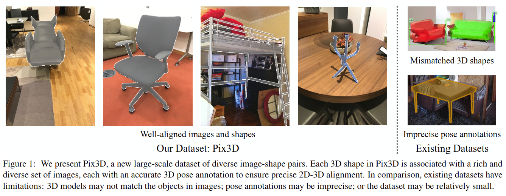
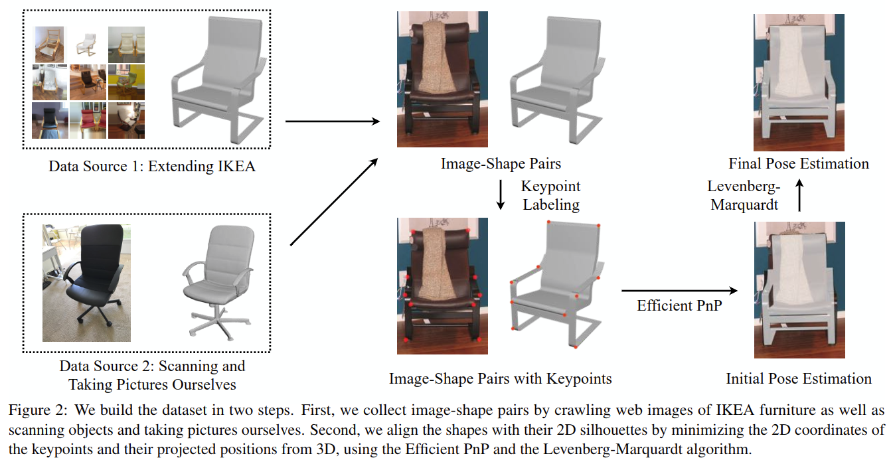
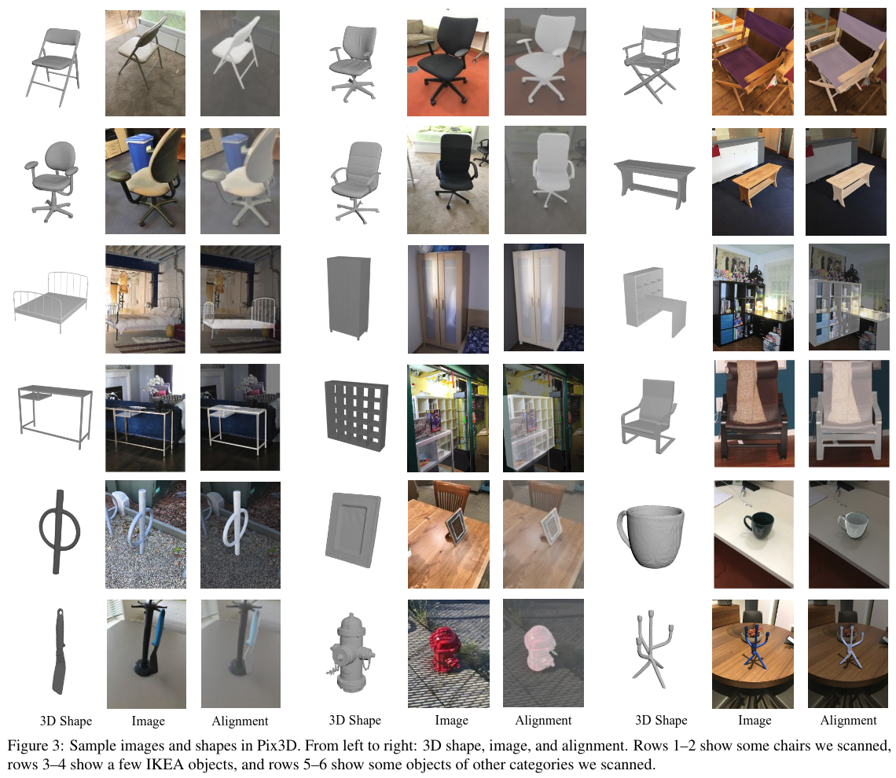
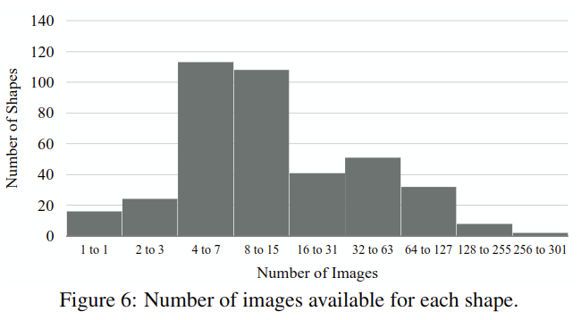
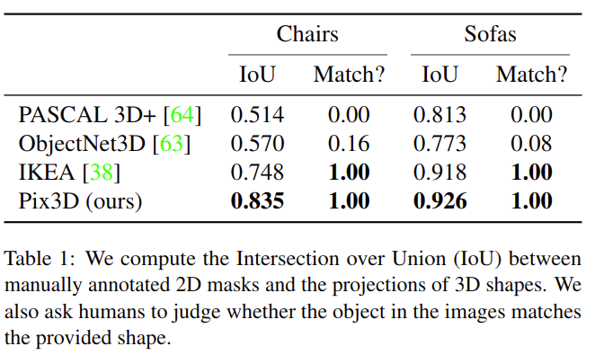
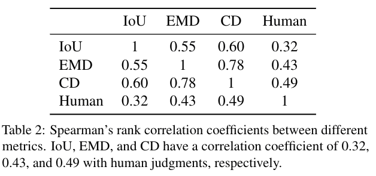
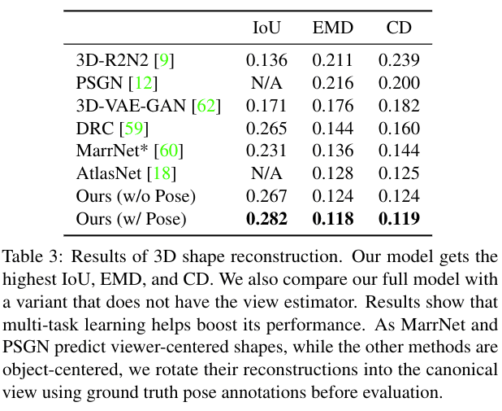
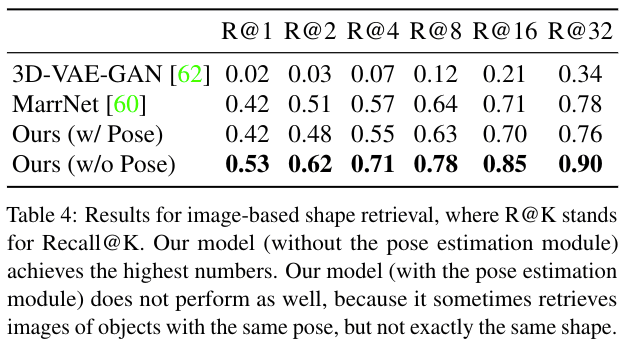
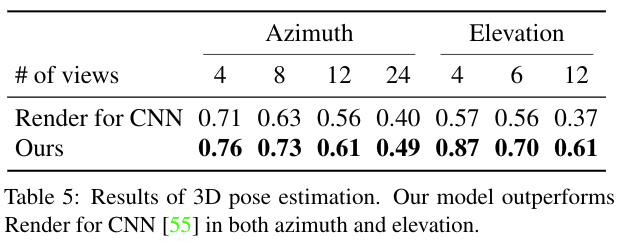

# Pix3D: Dataset and Methods for Single-Image 3D Shape Modeling

元の論文の公開ページ : [cvf](http://openaccess.thecvf.com/content_cvpr_2018/papers/Sun_Pix3D_Dataset_and_CVPR_2018_paper.pdf)  
Github Issues : [#45](https://github.com/Obarads/obarads.github.io/issues/45)

## どんなもの?
画像と3Dモデルがペアになっているデータセット、Pix3Dを提供した。また、MarrNetに姿勢推定器を追加したアプローチも実験している。

## 先行研究と比べてどこがすごいの?
3D表現データセットとしてはShapeNet、Princeton Shape Benchmark、Pascal 3D+、ObjectNet3D、IKEAなどがある。しかし既存のデータセットは、図1に示すように単一の画像から3Dオブジェクトをモデル化するタスクに制限がある。

明確には、

- ShapeNetは大きなデータセットであるものの、3Dモデルのみであり実際の画像を含まない。
- Pascal 3D+とObjectNet3Dは実際の画像を持つが、3Dモデルが画像中のオブジェクトと一致しないため画像形状のアライメントが粗い。
- IKEAは高品質な画像と3Dアライメントを持つが、90個の3Dモデルと759個の画像しか持ち合わせていない。

このPix3Dというデータセットは9個のカテゴリの395個の3Dモデルを持ち、各形状は実際の画像と関連付けがされている。更に、10069個の画像と形状のペアは正確な3Dアノテーションを持ち、画像中のシルエットと形状間でピクセルレベルのアライメントを持つ。  
PiX3Dは3つのステップを踏む。

1. 自分自身で3Dスキャンを行い、Webをクロールして多数の画像と形状のペアを収集する。
2. Amazon Mechanical Truk(AMT)で画像中の2Dキーポイントアノテーションを集める。これにより、形状を画像のシルエットに合わせる3D姿勢に対して最適化する。
3. 貧弱なアライメントを持つ画像と形状のペアを取り除き、同時に各インスタンスに対する特性(truncation, occlusion等)を収集する。これら(これ?)にはクラウドソーシングを利用する。

また、良い形状かどうか測るための計測手法を比較するために、Chamfer距離、earth mover's距離、intersection over union(IoU)について調べる。  
さらに、Pix3Dが姿勢推定や形状検索にも適していることを示すため、新しい姿勢推定と形状推定を同時に行う手法を提案する。

## 技術や手法のキモはどこ? or 提案手法の詳細
図2にPix3Dの制作過程を要約した。手順は以下の通り。

### 1. Collecting Image-Shape Pairs
#### Extending IKEA
IKEAのデータセットは219個の高品質な3Dモデルがあるにも関わらず、759個の画像に対応している3Dモデルは90個しか無い。そこで、IKEAの3Dモデルを引き継ぎながら、webサイトから足りない分の画像を探し、クラウドソーシングも利用する。その後、集めた画像からいらないものを削除するためにAMTを使った。結果として219個の3Dモデルに対して14600個の画像が得られた。

#### 3D scan
非IKEAのオブジェクトをStructure Sensorでスキャンする。結果として209個の3Dオブジェクトと2313個の画像が得られた。

### 2. Image-Shape Alignment
3D CADモデルを2D画像の投影に合わせるため、3D姿勢と画像をとるのに使われるカメラパラメーターについて解決する必要がある。  
そのため、[1]を参考にしたkeypoint-basedな手法を使う。keypoints' 2D座標を$X_ {2 \mathrm{D} }$$=\\{ \mathbf{x}_ 1, \mathbf{x}_ 2, \cdots, \mathbf{x}_ n \\}$として、これらに対応する3D座標を$X_ {3 \mathrm{D} }$$=\\{ \mathbf{X}_ 1, \mathbf{X}_ 2, \cdots, \mathbf{X}_ n \\}$とする。ここで、keypointの再投影誤差を最小化するようなカメラパラメーターと3D姿勢を解く。具体的には式(1)を最小化するような投影行列$P$を探す。

$$
\mathcal{L}\left(\boldsymbol{P} ; \boldsymbol{X}_{3 \mathrm{D} }, \boldsymbol{X}_{2 \mathrm{D} }\right)=\sum_{i}\left\|\operatorname{Proj}_{\boldsymbol{P} }\left(\mathbf{X}_{i}\right)-\mathbf{x}_{i}\right\|_{2}^{2} \tag{1}
$$

ここで$\operatorname{Proj}_ {\boldsymbol{P} }(\cdot)$は投影関数である。  
重心投影仮定(zero-skew、square pixel、optical centerはフレームの中心にある)では、$\boldsymbol{P}=\boldsymbol{K}[\boldsymbol{R} | \boldsymbol{T}]$を持ち、$\boldsymbol{K}$はカメラの内部行列である。$\boldsymbol{R} \in \mathbb{R}^{3 \times 3}$と$\boldsymbol{T} \in \mathbb{R}^{3}$は、それぞれオブジェクトの3D回転と3D移転を表す。$\boldsymbol{K}$は式(2)の様に表される。

$$
\boldsymbol{K}=\left[ \begin{array}{ccc}{f} & {0} & {w / 2} \\ {0} & {f} & {h / 2} \\ {0} & {0} & {1}\end{array}\right] \tag{2}
$$

ここで、$f$は焦点距離を、$w$と$h$は画像の幅と高さを表す。そのため、全部で7つのパラメーターを推定する。回転の$\theta,\phi,\psi$、移転の$x,y,z$と焦点距離の$f$である。  
式(1)を解くため、はじめにEfficient PnPアルゴリズム[2]を使っておおよその3D姿勢を計算する。次に、Levenberg-Marquardtアルゴリズム[3,4]を使ってそれを洗練する。

#### Efficient PnP
Perspective-n-Point(PnP)は3D点と2D投影のペアが与えられた時、キャリブレーションされたカメラの姿勢を推定する問題である。Efficient PnP (EPnP)アルゴリズムはvirtual control points[3]を使ってこの問題を解く。EPnPは焦点距離を推定できないため、焦点距離$f$を300から2000の間で10のステップサイズを用いて数え上げ(?)、各$f$で3D姿勢を解き、最小投影誤差であるものを選択する(?)。

#### The Levenberg-Marquardt algorithm (LMA)
初期状態として50のrandom disturbancesを持つEPnPの出力を取得し、それらおのおのにLMAを適応する。最後に、最小投影誤差を持つ解を選択する。

Pix3Dのサンプルは図3の通り。

## どうやって有効だと検証した?
### Exploring Pix3D
画像と形状の分布は図4と5の通り。図6は各形状で利用できる画像の数の分布である。  
25個の椅子と25個のソファーの画像を使い、各画像に対して、データセットが持つ姿勢アノテーションを使って、形状の投影された2Dシルエットをレンダリングする。次に、これらの画像にground truth オブジェクトマスクを手動で注釈付けし、ground truthと投影間のIoU値を計測する。
また、AMTを利用してground truthの形状が正しいかどうか評価してもらった。結果は表1の通り。

### Metrics
良い形状であるかどうか測ることができる計測手法の調査は非常に重要であるため、Chamfer距離、earth mover's距離、intersection over union(IoU)を比較する。

#### Which one looks better?
3D-R2N2とDRC、3D-VAE-GANという3つの形状再構成アルゴリズムを使って、無作為に選んだ200個の椅子の画像を3D復元する。これらで再構成された構造体と画像のペアをAMTに見てもらい、ペアが自然なものを選んでもらう。最後に、異なる計測手法間(人の知覚も含む)のSpearman'sランクの相関関係を計算する。結果が表2の通り。

#### How good is it?
無作為に選んだ400個の画像のDRCによるボクセル予測とground truthをAMTに見せて、どれくらい似ているか1~7で評価してもらった。結果は図7の通り。

### Approach
新しく提案するモデルでPix3Dでベンチマークを行う。提案手法はMarrNetの拡張であり、追加されたものは姿勢推定器である。姿勢推定器は回帰ではなく分類問題を解くものとして扱う。各手法で再構築の比較を行った。結果は図8と表3の通り。

また、画像検索を行った。結果は図9と表4の通り。

3D姿勢推定も行った。結果は表5と図10の通り。

## 議論はある?
なし

## 次に読むべき論文は?
- なし

## 論文関連リンク
1. [J. J. Lim, H. Pirsiavash, and A. Torralba. Parsing ikea objects: Fine pose estimation. In ICCV, 2013.](http://people.csail.mit.edu/torralba/publications/ikea_iccv2013.pdf)
2. V. Lepetit, F. Moreno-Noguer, and P. Fua. Epnp: An accurate o (n) solution to the pnp problem. IJCV, 81(2):155–166, 2009. 
3. K. Levenberg. A method for the solution of certain non-linear problems in least squares. Quarterly of applied mathematics, 2(2):164–168, 1944.
4. D. W. Marquardt. An algorithm for least-squares estimation of nonlinear parameters. Journal of the society for Industrial and Applied Mathematics, 11(2):431–441, 1963.

## 会議
CVPR 2018

## 著者

## 投稿日付(yyyy/MM/dd)
2018/06/18

## コメント
なし

## key-words
3D_Estimation, RGB_Image, Voxel, Dataset

## status
更新済