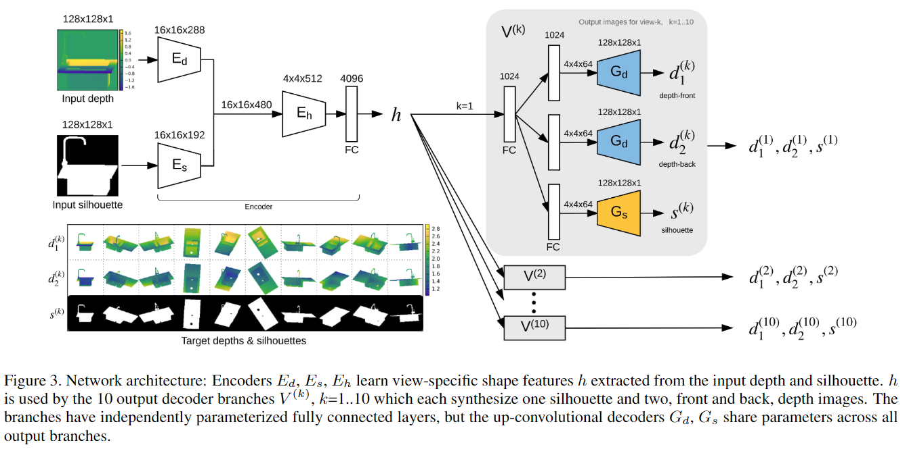

# Pixels, voxels, and views: A study of shape representations for single view 3D object shape prediction

元の論文の公開ページ : [arxiv](https://arxiv.org/abs/1804.06032)  
Github Issues : [#137](https://github.com/Obarads/obarads.github.io/issues/137)

## どんなもの?
この論文では、2D画像から3Dオブジェクトの形状を予測を行う(図1)。その過程で、この論文では二つの課題について取り組む(二つの課題は図2にも記載)。

1. 様々な視点から取得した複数の2.5D表面として表現するのか、形状を体積的に表現するのか、どちらの表現がよいのだろうか。
2. オブジェクト中心座標系と視点中心座標系を用いた方法では、形状予測にどのような差が生まれるのか。

これらの問題に対して、encoder-decoderネットワークアーキテクチャを利用して調査を行う。調査では、体積と表面表現の比較を行うためにデコーダーを交換する、視覚中心とオブジェクト中心を比較するために座標系を交換することを行う。また、RGB画像と震度画像からの予測の評価を行う。

貢献は以下の通り。

- 視覚中心座標系内のオブジェクトの表面予測を行う新しい手法を導入する。著者らのネットワークは入力画像に関する複数の視点の深度マップとシルエットの予測を学習する。深度マップとシルエットは局所的に位置合わせされ(registration)、表面を計算するための点群に統合される。
- 著者らは3D形状予測において表面もしくは体積表現のどちらが効果的か比較する。比較で、最終評価が体積ベースであるか表面ベースであるかにかかわらず(?)、未知のオブジェクトカテゴリーにおける表面ベース表現の利点を示す。
- オブジェクト中心座標系もしくは視覚中心座標系における予測の影響を調査し、ネットワークが視覚中心座標系で予測を学習する場合に新規形状をより一般化することに向いていること、そして座標系の選択がネットワークエンコーダーによって学習された埋め込みを著しく変化させることを示す。

## 先行研究と比べてどこがすごいの?
(形状予測において)形状表現や座標枠の選択など、重要な設計上の選択に関する体系的な評価がなかった。著者らはそれらに取り組む。

## 技術や手法のキモはどこ? or 提案手法の詳細
### Network architectures for shape prediction
シルエットと深度を予測するencoder-decoderネットワークを使った多表面形状予測システムは図3の通り。入力にそれぞれ一つの深度マップとシルエットを取り入れ、出力は$k$個の指定した方向の深度マップと$k$個の指定した方向のシルエットとなる。図1にあるRGB画像を入力として使った予測も実験で行う。表面ベースの表現とボクセルベースの表現の相対的な利点を直接評価するために、decoderをボクセル生成器に置き換えることによって表面と体積予測ネットワークと比較する。両ネットワークは、視覚中心もしくはオブジェクト中心の予測を行う。

#### Generating multi-surface depth and silhouettes
この項の内容は図3の通り。オブジェクトを見る位置に関しては、[1,2]と同様の手法である、20個の正十二面体の頂点$\\{\mathbf{v}_ {0}, \dots, \mathbf{v}_ {19}\\}$から得るという方法をとる。入力画像の頂点位置が$v_ 0$である(つまり、入力は$v_ 0$から取得したシルエットなどの画像)という事前情報はないが、出力は$\\{\mathbf{v}_ {0}, \dots, \mathbf{v}_ {k}\\}$まで固定されている。

入力以降の処理は図3の通り。この構造では入力を2ブランチとしている。チャンネル数をシルエット+深度にすることで一つの画像を作成し、それを単体(1ブランチ)のencoderに入力する方法も調べたが、2ブランチに分けて行うほうがパフォーマンスが良かった。

出力されるものは$v_ i$のシルエットと深度の他に、$v_ i$からオブジェクトを挟んで正反対の位置から見た深度がある(つまり深度の出力の数が倍になる)。そのため、$\mathbf{v}$の数$k$は(頂点数20個中)10もしくは(頂点数6個中)3を選択する。[3]と同様の目的関数(以下の式)を用いる。

$$
\mathbf{L}_{\mathrm{proj}}=k \mathbf{L}_{s}+(1-k) \mathbf{L}_{d}
$$

それぞれシルエット(s)の平均ロジスティク回帰と深度(d)のmean MSEを示す。

#### Reconstructing multi-surface representations
ここでは、予測した多視点の深度画像から単体の三角メッシュ再構築物を生成する。生成にはFloating Scale Surface Reconstruction (FSSR)[4]を利用する。FSSRは、多視点ステレオまたは深度センサから得られた指向性3D点からの表面再構成に広く使用されている。

なお、著者らの実験では、表面再構築手法がセンサーによる観測に比べてノイズを減少させることを確認している。

[※ autoencoderと似た構造であるため、ノイズが排除できると考えられる]

#### Generating voxel representations
ボクセル出力を行うネットワークでは、オブジェクトの一視点画像(4.3節の説明では深度のみ)を入力として扱い、視点$\mathbf{v}_ 0$のカメラ座標に3D占有マップ(ボクセル)を出力する(図5のvoxel pred.)。2値ボクセル占有ラベルを使ったロジスティック損失$\mathbf{L}_ v$によって訓練される。

## どうやって有効だと検証した?

## 議論はある?

## 次に読むべき論文は?
- なし

## 論文関連リンク
1. [D.-Y. Chen, X.-P. Tian, Y.-T. Shen, and M. Ouhyoung. On visual similarity based 3d model retrieval. In Computer graphics forum, volume 22, pages 223–232. Wiley Online Library, 2003.](http://www.cmlab.csie.ntu.edu.tw/~dynamic/download/DYChen_EG03.pdf)
2 [A. A. Soltani, H. Huang, J. Wu, T. D. Kulkarni, and J. B. Tenenbaum. Synthesizing 3d shapes via modeling multi-view depth maps and silhouettes with deep generative net-works. In The IEEE Conference on Computer Vision and Pattern Recognition (CVPR), 2017.](http://openaccess.thecvf.com/content_cvpr_2017/html/Soltani_Synthesizing_3D_Shapes_CVPR_2017_paper.html)
3. [A. Dosovitskiy, J. Tobias Springenberg, and T. Brox. Learn-ing to generate chairs with convolutional neural networks. InProceedings of the IEEE Conference on Computer Vision and Pattern Recognition, pages 1538–1546, 2015.](https://arxiv.org/abs/1411.5928)
4. [S. Fuhrmann and M. Goesele. Floating scale surface recon-struction. ACM Transactions on Graphics (TOG), 33(4):46, 2014.](https://dl.acm.org/citation.cfm?id=2601163)

## 会議
CVPR 2018

## 著者
Daeyun Shin, Charless C. Fowlkes, Derek Hoiem

## 投稿日付(yyyy/MM/dd)
2018/04/17

## コメント
なし

## key-words
RGB_Image, Reconstruction, Encoder-Decoder, Supervised_Learning, Voxel, Mesh

## status
省略

## read
A, I, R, M

## Citation
