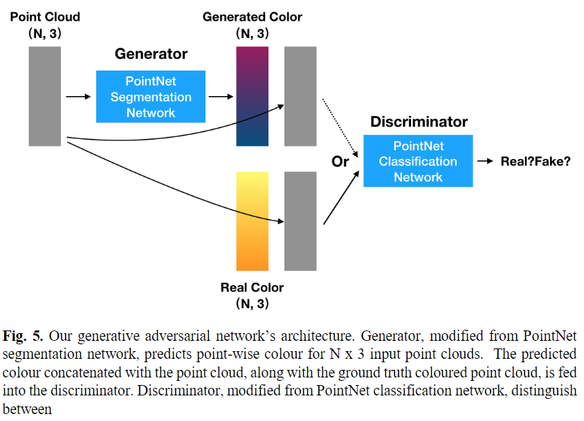
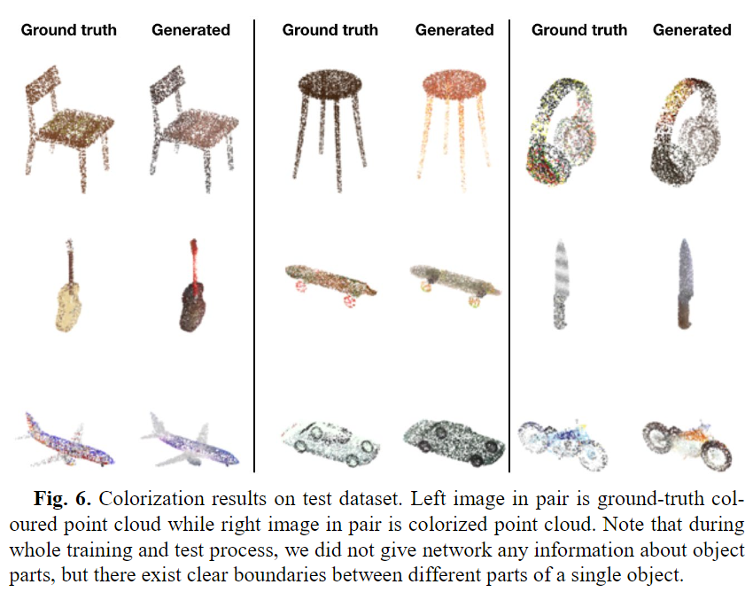

# Point Cloud Colorization Based on  Densely Annotated 3D Shape Dataset

元の論文の公開ページ : [arxiv](https://arxiv.org/abs/1810.05396)
Github Issues : [#32](https://github.com/Obarads/obarads.github.io/issues/32)

## どんなもの?
DensePointと呼ばれるデータセットの提案を提案した。データセットには16カテゴリに分けられた10000の単体オブジェクトが含まれている。1オブジェクトにつき40000個の点があり、各点にはRGBとパーツ注釈がついている。また、点群への色付け方法としてGANを使用する。発想はpix2pixより。なお、DensePointはShapeNetとShapeNetPartを拡張したものである。URLは[1]のとおり。

## 先行研究と比べてどこがすごいの?
LiDARなどのデプスセンサーだと色情報を手に入れることができないため、その情報をVRに使うことができない。また著者らの知る限り、点群に色情報が入ったデータセットが不足していることなどからもわかるように点群への色付け研究は行われていない。

## 技術や手法のキモはどこ? or 提案手法の詳細
### Point Cloud Dataset Construction
RGBと部品ラベルを含む密な点群データセットを作る。

#### Point Cloud Sampling and Alignment
使用するShapeNetにRGB情報とShapeNetPartにパーツ情報が含まれているため、この情報を含んだ二つの点群をマージする。この二つのデータセットのモデル自体は同じものが多いので合体できる。4つのプロセスを得て、二つの点群ができるだけ重なるようにする(点群位置はわずかに違う?)。評価はHausdorff距離で行い、もし4つのプロセスを得ても距離が離れている場合は手動でチェックする。

#### Label Annotation Transfer
K近傍使った分類器と重み戦略によって、パーツ情報が含まれている点群のラベルをもう片方の点群に移す。

### Point Cloud Colorization
pix2pixのスキームを使い、PointNetセグメンテーションネットワークを色回帰に利用する。全体の構造は図5の通り。弁別器にはPointNetの分類ネットワークを使う。

## どうやって有効だと検証した?
定量的な評価はなし、視覚的結果は図6のとおり。パーツ情報を入力していないにもかかわらず、異なるパーツごとに異なる色を付ける傾向があった。

## 議論はある?
このデータセットを使ってラベルと色を同時に生成できるようなモデルの作成を模索することである。

## 次に読むべき論文は?
- なし

## 論文関連リンク
1. [DensePointの公式紹介ページ](http://rwdc.nagao.nuie.nagoya-u.ac.jp/DensePoint)

## 会議
不明

## 著者
Xu Cao, Katashi Nagao.

## 投稿日付(yyyy/MM/dd)
2018/10/12

## コメント
なし

## key-words
Point_Cloud, Dataset, GAN, CV, Paper

## status
更新済