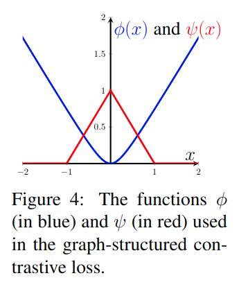

# Point Cloud Oversegmentation with Graph-Structured Deep Metric Learning 

元の論文の公開ページ : [arxiv](https://arxiv.org/abs/1904.02113)  
Github Issues : [#90](https://github.com/Obarads/obarads.github.io/issues/90)

注意: 現在このページは元論文の参考文献番号を参照している。

## どんなもの?
3D点群をスーパーポイントにoversegmentationするための新規教師あり学習フレームワークを提案した。著者らは点群オーバーセグメンテーションを、入力3D点群上で定義され、隣接グラフによって構造化された深層メトリック学習問題として定式化することを提案する。また、これら(オブジェクト)の境界面で高コントラスト(差異)を持ち、均一にオブジェクトに3D点を埋め込むことを学習するための損失関数、 graph-structured contrastive lossを導入する(?)。最終目標は意味論的なスーパーポイントを与えることでセマンティックセグメンテーション手法のアシストをすることである。

貢献は以下の通り。

- 著者らは3D点群オーバーセグメンテーションのための教師あり学習フレームワークの最初の提案者となる。
- オブジェクトの境界で高コントラストを持つ点の埋め込みを生成するcross-partition weighting strategyを組み合わせることができるgraph-structured contrastive lossを導入する。
- PointNet[41]に触発されて作成した軽量なアーキテクチャである局所点埋め込み器を導入する。これは、3D点の局所幾何学性もしくは放射性(測光的?)をコンパクトに埋め込む。
- 著者らはよく知られ、なおかつ全く異なるデータセットを二つ使い、点群オーバーセグメンテーションのSOTAを大幅に改善する。
- superpoint graph semantic segmentation手法を組み合わせるとき、著者らのアプローチはタスクのSOTAを向上させる。

## 先行研究と比べてどこがすごいの?
分析の前処理として点群をスーパーポイントと呼ばれる点の集合に分割する手法が提案されており[32, 44, 40, 7, 56]、これらは広く関心が持たれている。しかしながらこれらの教師なし手法は、幾何学的もしくは放射的(測光的?)に均質な分割は意味的にも均質であるという仮説に基づいている。この仮説は、これらの手法を用いた分析の質に影響をもたらす。本研究では、セマンティックセグメンテーションを促進するための意味的なスーパーポイントを導く、教師ありフレームワークを考案する。

スーパーピクセルとDNNは長い間使われてきたが、DNNの一種であるCNNがスーパーピクセルのオーバーセグメンテーションに使われたのはつい最近である。[37]はオーバーセグメンテーションメトリックを模倣する損失関数を導入しており、これはグラフベースクラスタリング手法と相性が良い。[28]は、SLIC[1]の微分可能版を提案しており、これは空間的クラスタリング手法のEnd-to-Endな訓練を可能にしている。どちらの手法も有望な結果を残しており、hand-craftedな特徴に依存する手法に対して顕著な改善を示している。この研究は、3Dにこれらのアイデアに基づく(ここまでは1章の導入までの内容を参照)。

3D点群のオーバーセグメンテーションにおいて、いくつかの提案がなされているが、これらはいずれもhand-crafted geometric and/or colorimetricな特徴に依存している(2章のOversegmentation of 3D Point Cloudsを参照)。また、スーパーポイントを生成するための深層学習ベースの埋め込みを利用した教師あり3D点群オーバーセグメンテーション手法はまだ開発されていない(2章のDeep Learning for 3D Point Clouds)。また、著者らは埋め込みを分類問題ではなくグラフ分割問題を介したオーバーセグメンテーションに関連付ける(2章のMetric Learning)。

## 技術や手法のキモはどこ? or 提案手法の詳細
著者らの目的は、スーパーポイントベースのセマンティックセグメンテーションアルゴリズムのための、高品質な3D点群オーバーセグメンテーションを生成することである。これを言い換えると以下の3つ特性につながる。

- (P1) **object-purity(オブジェクトの純粋さ)**: 特にこれらが意味的な違いを持つとき、スーパーポイントはオブジェクト同士で重複するべきではない。
- (P2) **border recall(境界の再現)**: スーパーポイント間の境界は、オブジェクト間の境界と一致しなければいけない。
- (P3) **regularity(規則的)**: 形状とスーパーポイントの輪郭はシンプルでなくてはいけない。

以下に、1)局所点埋め込み器と、2)グラフもしくはクラスタベースのオーバーセグメンテーションアルゴリズムを使った埋め込みから点群オーバーセグメンテーションを計算する方法を説明する。

各点$i$を含む点群$C$を処理すると考える。この各点は座標情報$p_ i\in\mathbb{R}^3$と$d$次元の放射計測情報$r_ i\in\mathbb{R}^d$(色、LiDARならレーザーの強度、無い場合は使わない)を含む。また各点$i$は入力点中の$k$近傍$N_ i$の座標情報と放射計測情報から成る集合特徴$P_ {i}=\\{p_ {j} | j \in N_ {i}\\}$と$R_ {i}=\\{r_ {j} | j \in N_ {i}\\}$にそれぞれ関連している。集合特徴$X$へ適応する任意の演算子や関数$f(X)=\\{f(x) | x \in X\\}$は全ての要素に適応される。

### Local Point Embedding
著者らの目的は、各点特徴の局所近傍の幾何学情報と放射計測情報をコンパクトな$m$次元の埋め込み$e_ i$を関連付けることである。埋め込みは訓練中に崩壊しないように$m$単位球$\mathbb{S}_ m$に制約され[52]、そして互いの距離を正規化する。この目的のため、Local Point Embedder(LPE)というPointNetからインスパイアされた軽量のネットワークを導入する。このLPEはPointNetと違い、入力点群全体ではなく純粋なローカル情報に基づき各点を符号化する。以下にPointNetと違うLPEの部品について説明する。

#### Spatial Transform
この部品は点$p_ i$を中心とする$k$近傍点$P_ i$を回転&標準化[27]する。この処理は次のネットワークが(点の)位置分布を学習する際の役に立つ。また、回転&標準化された近傍点$\tilde{P_ i}$に共変性を持たせるため、部品内の計算途中で算出した回転行列と近傍半径、elevation $p_ i^{(z)}$(?)を出力する。
この部品は構造は図2の通り。構造の定義式は式(1,2,3,4,5)に沿う。

$$
\operatorname{rad}=\operatorname{std}\left(P_{i}\right) \tag(1)
$$

$$
\Omega=\operatorname{PTN}\left(\tilde{P}_{i}\right) \tag{2}
$$

$$
P_{i}^{\prime}=\left(P_{i}-p_{i}\right) / \operatorname{rad} \tag{3}
$$

$$
\tilde{P}_{i}=\left\{p \times \Omega | p \in P_{i}^{\prime}\right\} \tag{4}
$$

$$
\tilde{p}_{i}=\left[p_{i}^{(z)}, \operatorname{rad}, \Omega\right] \tag{5}
$$

#### Local Point Embedder(LPE)
この部品は標準化された点特徴$x_ i$と集合特徴$X_ i$の２つの入力から正規化された埋め込みを計算する。埋め込みは$e_ i$はshared LPEを介して$C$の各点$i$に対して計算される。先程示した入力の集合特徴$X_ i$には前節の$\tilde{P}_ i$と放射測定情報$R_ i$、点特徴$x_ i$には点$i$の$\tilde{p}_ i$と放射分析(?)$r_ i$が割り当てられる。
構造は図3の通り。構造の定義式は式(6,7,8)に沿う。

$$
\mathrm{L}_{2}(\cdot)=\cdot /\|\cdot\| \tag{6}
$$

$$
\operatorname{LPE}\left(X_{i}, x_{i}\right)=\mathrm{L}_{2}\left(\operatorname{MLP}_{2}\left(\left[\max \left(\mathrm{MLP}_{1}\left(X_{i}\right)\right), x_{i}\right]\right)\right) \tag{7}
$$

$$
e_{i}=\operatorname{LPE}\left(\left[\tilde{P}_{i}, R_{i}\right],\left[\tilde{p}_{i}, r_{i}\right]\right) \tag{8}
$$

### Graph-Based Point Cloud Oversegmentation
#### The Generalized Minimal Partition Problem
埋め込み計算後にadjacency graphに関連づくsuperpointsを定義する。
- 具体的には、埋め込み計算後、点群$C$から算出されるadjacency graph $G=(C,E)$に関連するスーパーポイントを定義する。
    - この$E$はLPEに使用される近傍構造から取得できる。
- ただし、the local neighborhood of pointsを記述するより、the cloud's adjacency structureを得るためにmuch smaller neighborhoodsを必要とされる。[違いがいまいちわからない、local\~の方はcvpr2018なんかでよく使われた半径もしくはk最近傍を用いたもの、cloud's\~はそれよりも更に小さい範囲で点を得ることなのか?]
- [21]で提案されているように、著者らはsuperpointsをconstant connected componentsとして定義する。
    - constant connected componentsは埋め込み$e \in \mathbb{S}_ {m}^{C}$のpiecewise-constant approximation(区分定数近似)の$G$中のものである。
    - この近似は式(9)の最適化問題の解$f^*$である。

$$
f^{\star}=\underset{f \in \mathbb{R}^{C \times m}}{\arg \min } \sum_{i \in C}\left\|f_{i}-e_{i}\right\|^{2}+\sum_{(i, j) \in E} w_{i, j}\left[f_{i} \neq f_{j}\right] \tag{9}
$$
- この式のパラメーターは、
    - $w \in \mathbb{R}_ {+}^{E}$はエッジの重み、
    - $[x \neq y]$は$x=y$のとき0に、その他は1になる。
    - ネットワークが高コントラストの領域に沿ってより分割するために、エッジの重みとして$w_ {i, j}=\lambda \exp (\frac{-1}{\sigma}\|e_ {i}-e_ {j}\|^{2})$を定義して、
        - パラメーターとして$\lambda$と$\sigma\in \mathbb{R}^+$を使う。

Problem 9(最適化問題の式9, GMP)の解を求める際に注意がある。
- 式9は[31]で導入されており、generalized minimal partition (GMP)として知られている。
    - 式9はcontinuousでも、differentiableでも、convexでもない。
- この式9は(大域的な)最小値を導出することができない。
    - なお、$\ell_ 0$-cutpursuit algorithm[31]なら高速で近似解を求められる。[これは[32]で使用した手法について述べている、今回は使っていない?]

式9とP3の関わりと補足。
- the contour penalty[式9のこと?]は、問題を合理的にパラメータ化するため、P3の条件を自動的に満たす。
- 最適化変数$f$は$\mathbb{R}^{C \times m}$中の値を取り、一方で各埋め込み$e_ i$は$m$-sphere上に制約される。
    - これは著者らのアプローチでの制限であり、効率性の問題があるから。
    - いくつかのsuboptimal approximate solutionsを導くことができる可能性がある。
        - しかしながら、著者らの実験で学習した埋め込みが良い結果を残すことを示した。

[GPMは微分不可であると言っている。でも微分したい。]

#### Graph-Structured Contrastive Loss
GMPを介した、微分によるconnected components on a graph [多分、superpoints]の最適化が不可能である。
- GMPはnon-continuous non-convex optimization problemであり、connected components on a graphの計算は本質的に微分不可能である。
    - そのため、分割の最適化が不可能でなくても極めて難しくなる。
    - そもそも、the semantic purity propertyであるP1は、式9の解のsemantic purityを損失関数として推定する方法があるという上で成り立っている。

代わりに、graph-structured contrastive lossを提案する。
- P2が実現できた場合(つまり、superpointsとobjectsが同じ境界線を持つ)にP1も結果的に満たすことを踏まえた提案である。
- この損失は代理損失であり、オブジェクト間の境界線の正確な検知に焦点を当てている。
- 損失は下の式のとおりである。:
    - $E_ {\text {intra }}\left(\text { resp. } E_ {\text {inter }}\right)$[resp.は[こちらを参照](http://ibisforest.org/index.php?English)]の$\text {intra-edges (resp. inter-edges) }$を同じオブジェクト(resp. point from different adjacent objects)である点間の$G$のエッジのセットとして定義する。[?]
    - この損失関数の元ネタであるcontrastive loss[8]の意向に沿って、著者らの損失はintra-edgeによってリンクされた頂点埋め込みが類似するように、またinter-edgeによってリンクされるときは異なる埋め込みを評価するようになっている。[意訳気味]
    - このとき、$\phi (\text{resp. } \psi)$ a function minimal $(\text{resp. maximal})$ at 0 [??]、$\mu_ {i,j}\in\mathbb{R}^{E_ {inter}}$ a weight on inter-edges [???].

$$
\ell(e)=\frac{1}{|E|}\left(\sum_{(i, j) \in E_{\text {intra }}} \phi\left(e_{i}-e_{j}\right)+\sum_{(i, j) \in E_{\text {inter }}} \mu_{i, j} \psi\left(e_{i}-e_{j}\right)\right) 
$$

- この損失を最小化する点の埋め込みfunction(関数)はオブジェクト内で均等な状態になり、界面上で明確なコントラストを持つ。
- 結果として、**式9のthe components of the piece-wise constant approx-imationはオブジェクトの境界線に沿うはずである。**
    - この損失はtriplet loss[24,52]とは違い、アンカーとrelated positive/negative examplesだけでなく[?]、graph(or sub-graph)内のすべての点を同時に関係させている。
        - この方法なら、example picking altogetherの問題を回避できる。[?]
        - 事実、positive and negative examplesは$E_ \text{intra}$と$E_ \text{inter}$にによってセットされたadjacency structureで直接与えられる。[?]
    - [12]とは異なりsemantic informationを学習せずに(semanticsに注目せずに)、constant approximationがcertain propertiesを評価するようにグラフ上の信号を計算する。
       - 実際、異なるクラスのオブジェクトは、屋内の床や天井等のように隣接していない限り同じ埋込みを共有できる。[?????]

著者らはgraph-structured contrastive lossの$\phi$にintra-object homogeneityを促進する関数を適応する。
- 具体的な式は次の通り: $\phi(x)=\delta(\sqrt{\|x\|^{2} / \delta^{2}+1}-1)$
    - $\delta=0.3$とする。
    - この式は図4のように示される。
- これは、$\ell$の最初の項がthe (pseudo)-Hubergraph-total variation on the Eintra edge [25, 6]であり、同じオブジェクト内の埋め込みのsmooth homogeneityを促進することを意味する。

$\ell$の2項目にはthe opposite of the truncated graph-total variation [61] on the inter-edgesを使う。
- 具体的な式は次の通り: $\psi(x)=\max (1-\|x\|, 0)$
    - オブジェクト間の境界で、類似の埋め込みを罰則化する。
    - 埋め込みがunit sphereに制約されることを考慮し、この関数で1(角度60度に相当)よりも大きい差があるのでしきい値を設置する。[意訳]
    - 言い換えれば、$\psi(x)$はan euclidean distance of 1を持つ埋め込みを取るために、inter-edgeによってリンクされた頂点を促進するが、大きすぎる差を出そうとはさせない。

オブジェクト内でconstant(一定)であり、なおかつ隣接するオブジェクト間で少なくとも1の差がある場合、任意の埋め込みが持つ損失は0になる。
- four-color theorem [17] は埋め込みの次元が最低3つある限りは常に可能であると言っている。[?, [17]を見ないとわからない]
- しかしながら、LPEによって計算された埋め込みであるため、認識可能な幾何学的 or 放射的な形状を表現できない境界線は著者らの手法で復元できない。

## どうやって有効だと検証した?
### Datasets
著者らはS3DIS(インドア)とvKITTI(アウトドア)の二つのデータセットを利用して評価している。vKITTIは色情報を利用する場合とそうでない場合で評価する。大量の点を持つ両方のデータセットに対して、S3DISは3cm、vKITTIは5cm幅のregular grid of voxelsを使ってsubsampleする。各ボクセルでは位置と色を平均化する。これにより、メモリのロードと計算量を減らす。

### PointCloud Oversegmentation
#### Evaluation Metrics
著者らは(P1)object-purity、(P2)border recall、(P3)regularityを測定するための基準を用意する。具体的には、superpointがobject boundariesを順守し、変に交わらないか評価するために、Boundary Recall(BR)とPrecision(BP)が使われる((P2),(P3))。これらの計測方法はpoints[1]やboundary pixels[2]に関して定義されている。しかしながら、著者らは点群の点ではなく点間でtransitionが起こると主張する。そのため、著者らは

## 議論はある?

## 次に読むべき論文は?
- なし

## 論文関連リンク
1. なし

## 会議
CVPR 2019

## 著者
Loic Landrieu, Mohamed Boussaha.

## 投稿日付(yyyy/MM/dd)
2019/04/03

## コメント
なし

## key-words
Supervised_Learning, Point_Cloud, Semantic_Segmentation, Oversegmentation, CV

## status
導入

## read
A, I, R