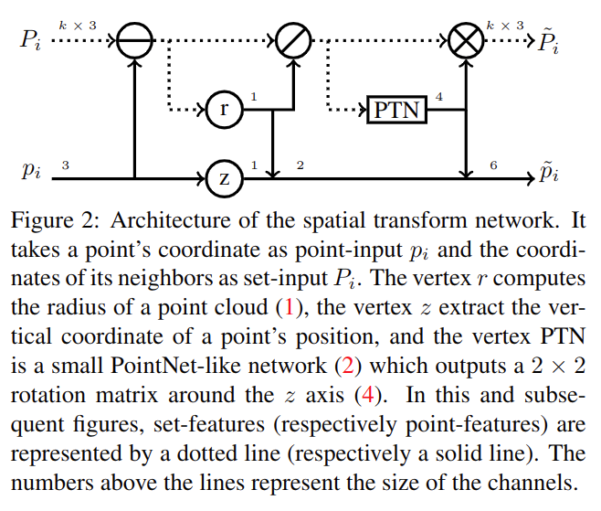
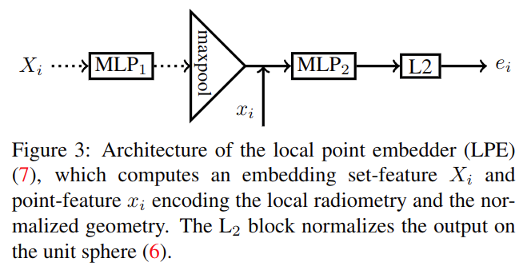

# Point Cloud Oversegmentation with Graph-Structured Deep Metric Learning 

元の論文の公開ページ : [arxiv](https://arxiv.org/abs/1904.02113)  
Github Issues : [#90](https://github.com/Obarads/obarads.github.io/issues/90)

## どんなもの?

## 先行研究と比べてどこがすごいの?

## 技術や手法のキモはどこ? or 提案手法の詳細
各点$i$を含む点群$C$を処理すると考える。この各点は座標情報$p_ i\in\mathcal{R}^3$と$d$次元の放射計測情報$r_ i\in\mathcal{R}^d$(色、LiDARならレーザーの強度、無い場合は使わない)を含む。また各点$i$は入力点中の$k$近傍$N_ i$の座標情報と放射計測情報から成る集合特徴$P_ {i}=\\{p_ {j} | j \in N_ {i}\\}$と$R_ {i}=\\{r_ {j} | j \in N_ {i}\\}$に関連している。集合特徴$X$に適応される任意の演算子や関数$f(X)=\\{f(x) | x \in X\\}$は全ての要素に適応される。

### Local Point Embedding
著者らの目的は、各点特徴の局所近傍の幾何学情報と放射計測情報をコンパクトな$m$次元の埋め込み$e_ i$を関連付けることである。埋め込みは訓練中に崩壊しないように$m$単位球$\mathcal{S}_ m$に制約され、そして互いの距離を正規化する。この目的のため、Local Point Embedder(LPE)というPointNetからインスパイアされた計量のネットワークを導入する。以下に各部品について説明する。

#### Spatial Transform
このネットワークは図2の通り。ある点座標$p_ i$とその局所$k$近傍$P_ i$を入力として受け付け、標準化された近傍位置$\tilde{P}_ i$、$\tilde{P}_ i$に沿った幾何学的点特徴$\tilde{p}_ i$(elevation $p_ i^{(z)}$,近傍半径,original orientation(4つの値で示される回転行列)を含む)を出力する。標準化を施すことで、点の位置が正規化されたり回転されたりしてもoriginal orientation,高さ,元の近傍範囲の共変性を維持できる。

この出力はLPEで使われ、出力は下記の式(1,2,3,4,5)で表される。図2中の番号は値の数、丸の中の記号は減算等の演算子を示す。

#### Local Point Embedder
構造は図3の通り。中身はPointNetを真似たものとなっている。$\mathrm{MLP}_ {2}$で得られたベクトルは式(7)を介して処理され、最終的に単位球上で正規化される。埋め込み$e_ i$は式(8)のLPEを介して$C$の$i$点に対応して計算される。

### Graph-Based Point Cloud Oversegmentation
#### The Generalized Minimal Partition Problem

## どうやって有効だと検証した?

## 議論はある?

## 次に読むべき論文は?
- なし

## 論文関連リンク
1. なし

## 会議
CVPR 2019

## 著者
Loic Landrieu, Mohamed Boussaha.

## 投稿日付(yyyy/MM/dd)
2019/04/03

## コメント
なし

## key-words
Point_Cloud

## status
未完