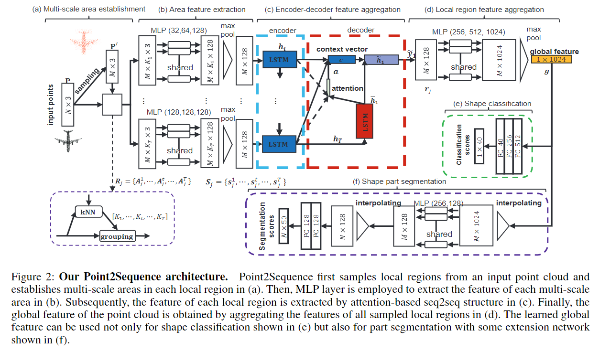
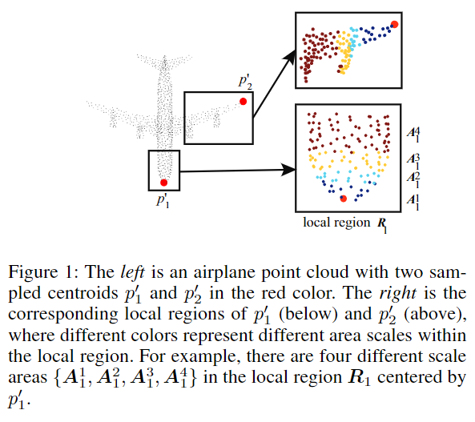
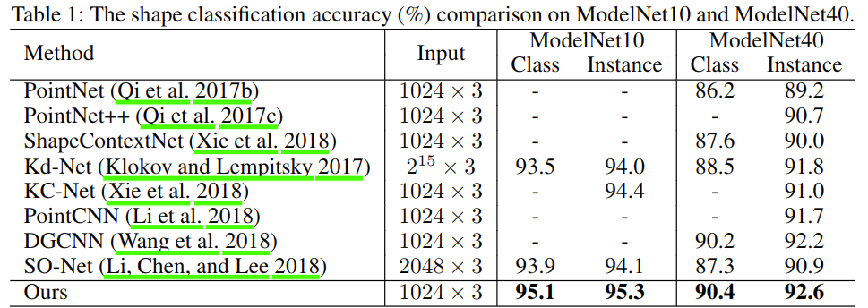

# Point2Sequence Learning the Shape Representation of 3D Point Clouds with an Attention-based Sequence to Sequence Network

元の論文の公開ページ : https://arxiv.org/abs/1811.02565

## どんなもの?
点群から特徴を捉える際の局所領域内の異なるエリアの相関性などの細かい文脈情報を保持するためのモデルを提案した。領域の関係性を把握するためにRNNのEncoder-Decorderとattention機構を取り入れている。

## 先行研究と比べてどこがすごいの?
論文中の主張では、ShapeContextNetやDGCNNなどの既存の深層学習を用いた点群の特徴抽出モデルは局所領域の特徴抽出にhand-crafted(手作業)またはexplicit ways(明示された方法)な特徴を使っている。その結果、局所領域内のエリア間の相関などのきめ細かい文脈情報を保持することが困難になっている。この文脈情報も重要な情報を保持しており、形状解析に必要なものである。Point2Sequenceでは新たな暗黙的な手法を使い、その問題を解決する。

## 技術や手法のキモはどこ?
下のfig2を見ての通り、(a)から(f)までのパーツに分かれている(タスクによって(e)か(f)を選択する)。

このモデルでは以下の工程を踏む。
1. (a)ではN個の点群PからM(M<N)個の点群P'を選び出す。P'={p'_j∈R**3,j=1,2,...,M}であり、p'_jは局所領域{R_1,...,R_j,...,R_M}の中心点である。その後、図1の様にR_jをT個の異なるマルチスケールなエリア{A1_j,...,At_j,...,AT_j}に分割する。この時、{A1_j,...,At_j,...,AT_j}にはそれぞれ\[K_1,...,K_t,...,K_T\]個の点群が含まれている。
2. (b)では(a)で分けられた\[K_1,...,K_t,...,K_T\]を入力してこれらから抽出を行う。
3. (c)でRjの特徴シーケンスSj={s1_j,...,st_j,...,sT_j}はD-dimの特徴ベクトルrjに集約される。
4. (d)で全てのrjを集約し最終的にglobal featureのgが生成される。
5. タスクに合わせて(e)か(f)にgを入力する。

- **(a) Multi-scale area establishment**  
    NからM個の点を得るためにPointNet++等で紹介されているFarthest point sampling(以下FPS)を採用した。FPSは大雑把に言えば選ばれた点から最も遠い点を選択するアルゴリズムである(詳しくは論文関連リンクの1を参照)。その後、kNNを使ってp'_jを中心とする局所領域Rjに分ける。

- **(b) Area Feature Extraction**  
    fig2に通り、各スケールの領域At_jはMLPで抽出後Max-poolingでD次元特徴st_jに集約される。追加で、At_jの点plはp'_jを中心とした相対座標に変換される。

- **(c) Encoder-decoder feature aggregation**  
    Sj={s1_j,...,st_j,...,sT_j}はRNN(LSTM)に入力される。RNNの出力値は式(1)、式(2)を経て出力される。

    

    

    encoder部分でまとめられたhTは、式(3)に渡され式(4)のような出力を行う。このとき、z_oは0ベクトルである。なお、decoderのRNNが一つしか無いのは機械翻訳のように連続した解答を持ち合わせていないからとのこと。

    

    

    Attention機構は異なるエリアの重要性を明確化するために適応した。context vectorのcが式(5)を生成することを目標とし、このときαはattentionベクトルである。

    

    αに関係する式は式(6)と(7)となる。(6)は正規化、(7)はfig2の点線h_tと赤いLSTMから出ている実線h ̄_1TWcをかけ合わせたもの。

    

    

    最終的に式(5)と(3)を用いて式(8)、(9)となる。(8)の[]内はおそらく連結であり、cのattentionが施されたcontextベクトルとh ̄_1を連結することで文脈情報を保有しながら全体の特徴量を要約した形にしている(と思う)。

    

    

- **(f) Shape part segmentation**  
    fig2に示すinterpolate layesはupsamplingによって形状レベルから点群レベルに特徴を伝播するものである。upsamplingについては論文関連リンクの1と2の論文を参照。このようなことを行う理由は、セグメンテーションが分類問題よりも難しいからとのことである。式(10)に基づいて補完する(ここよくわからない)。

    

## どうやって有効だと検証した?
以下のようにModelNet10とModelNet40、ShapeNet part datasetを用いて検証した。

他には学習率の比較、Attention等の機構の有無、Tの数を比較している。

## 議論はある?
なし

### 論文関連リンク
1. Charles R. Q, Li Yi, Hao Su, Leonidas J. Guibas. PointNet++: Deep Hierarchical Feature Learning on Point Sets in a Metric Space. 2017.
2. Li, J.; Chen, B. M.; and Lee, G. H. 2018. SO-Net: Self-organizing network for point cloud analysis. In CVPR, 9397–9406. 

### 会議
AAAI 2019

### 著者/所属機関
Xinhai Liu, Zhizhong Han, Yu-Shen Liu, Matthias Zwicker

### 投稿日付(yyyy/MM/dd)
2018/11/06

## コメント
explicit waysの手法っていうのは、graphとかshape contextのことを指しているのかな...。あと、DGCNNが強い。