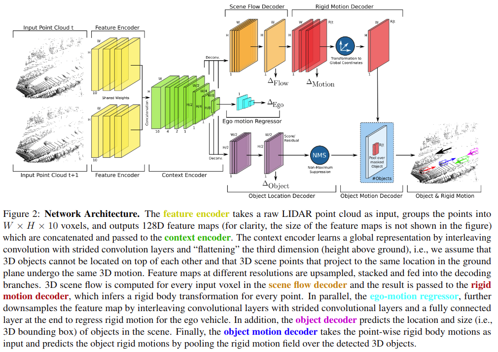
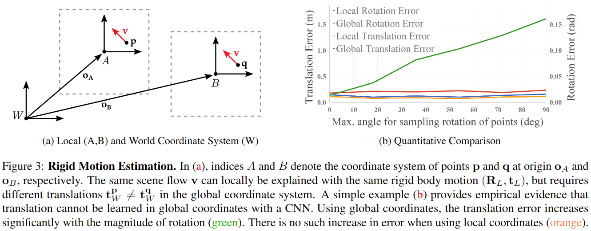
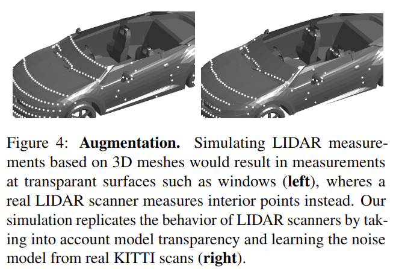
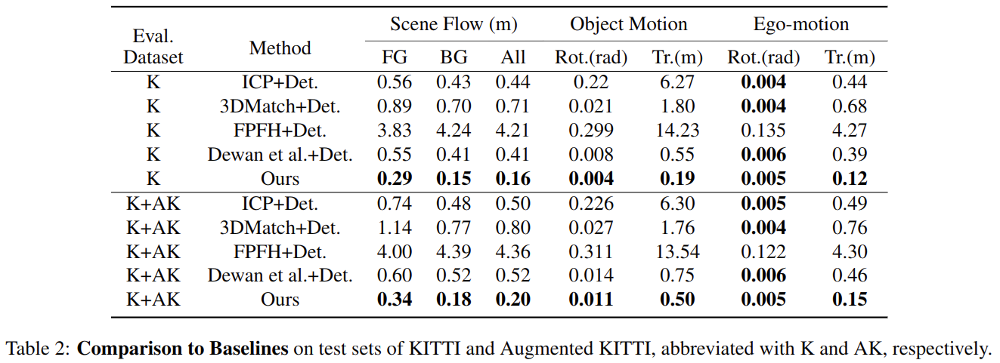
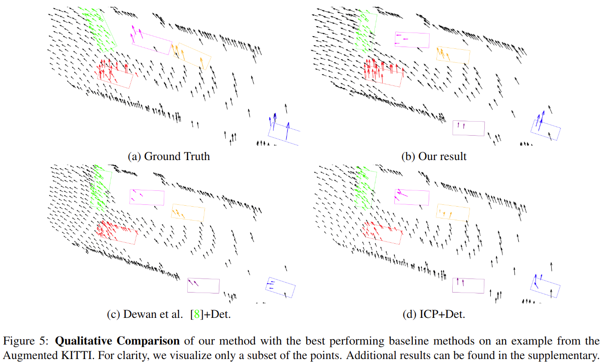

# PointFlowNet: Learning Representations for Rigid Motion Estimation from Point Clouds

元の論文の公開ページ : [arxiv](https://arxiv.org/abs/1806.02170)  
Github Issues : [#92](https://github.com/Obarads/obarads.github.io/issues/92)

## どんなもの?
深層学習を用いて構造化されていない生の点群から3Dモーションを推定する。貢献は以下の通り。

1. **新規モデル** : 自動運転車両からLIDARの点群データが得られるという想定のもと、End-to-Endで訓練可能なモデルを提案する。3Dシーンフロー、剛体運動予測、3Dオブジェクト検知を行うことができる。
2. **新規表現** : グローバル表現が剛体運動予測に適切ではないことを示し、代わりにこの問題を解くためのlocal translation-equivariant representation (局所移動同変表現)を提案する。
3. **データセット拡張** : センサーノイズのシミュレーションとオクルージョンを考慮し、KITTIデータセットを仮想車両で増強することで、より現実的なトレーニングデータを提供する。
4. **SOTA** : 提案手法がSOTAを記録したことを示す。

## 先行研究と比べてどこがすごいの?
点群を使うことで2D次元表現以上の幾何学的表現を扱うことができるため、より精密なシーンフロー推定を行うことができる。2D表現による制限は図1に見て取れる。図1はKITTI 2015データセットのシーンを使い手法の比較したものであり、上のISF[1]はSOTAな画像ベース(2D表現)ベースのシーンフロー手法、下のPointFlowNetは著者らの提案手法である。ISFはcurse of two-view geometry (ノイズ入りのジオメトリ、不均一な背景の運動)に苦しめられている。また、境界における深度推定誤差はオブジェクトを２つに分割することがある(赤い車)。  
また、今回は屋外で点群を得る想定をしているため、密なRGB-Dシーケンス(?)を得ることが難しい。  
似た研究として、[2]で新規の連続畳み込み演算を提案し、それを3Dセグメンテーションとシーンフローに導入しているが、剛体運動推定については考慮されていない。

## 技術や手法のキモはどこ? or 提案手法の詳細
全体構造は図2の通り。オブジェクト検知についてはVoxelNet[3]の流用であるため、主な提案はRigid Motion(剛体運動)に関するものとなる。以下に各部品の説明を行う。

### Feature Encoder
点群の符号化には、点群による3Dオブジェクト検知でSOTAであるVoxelNet[3]のVoxel feature encoding層(VFE)を利用する。生の点群を直接入力するPointNetなどの手法にも言及しているが、将来的な研究に託すとしている。

### Context Encoder
Context EncoderはFeature Encoderの出力であるグローバル表現を学習する部品であり、3次元目(地面からの高さ)を平坦化する(多分、図の10が地面からの高さに関するもの)。ここで畳み込まれた表現は各出力を行うための部品に提供される。

### 3D Detection, Ego-motion and 3D Scene Flow
検知に関しては[3]の手法に従う。Scene Flow Decoderに関しては、ボクセルごとのベクトル(ただし$W\times H\times 1$のため、高さ分のボクセルごとのベクトルはない?)を扱う。

### Rigid Motion Decoder
オブジェクトごとの剛体運動を予測する。単体の点ごとに処理すると、与えられた3Dシーンフローから剛体運動を明らかにしづらくなる(剛体運動の解釈が複数になる)ため、局所近傍を利用することでそれを解決する。  
しかし、CNNを使いワールド座標系で表される剛体運動を回帰することは不可能である。その理由としては、シーンフローとグローバル剛体運動間の変換(モデルではシーンフロー→剛体運動)はシーン内の位置に依存するため、畳み込み層の移動並進(translation equivariant)では学習できない(??)。以下にCNNでモデル化できない理由を記した後に、著者らが提案する剛体運動表現を紹介してそれらがfully convolution inferenceに適していることを示す。

#### 証明
図3(a)に示すような、ワールド座標系$W$中の点$\mathbf{p}$があり、原点$\mathbf{o}_ {A}$を持つローカル座標系を$A$と表す。式(1)の場合に限り、シーンフローベクトル$\mathbf{v}$はローカル座標系$A$中で表される剛体運動($\mathbf{R}_ {A}, \mathbf{t}_ {A}$)によって解釈される。

$$
\mathbf{v}=\left[\mathbf{R}_{A}\left(\mathbf{p}-\mathbf{o}_{A}\right)+\mathbf{t}_{A}\right) ]-\left(\mathbf{p}-\mathbf{o}_{A}\right) \tag{1}
$$

ここで、図3(a)に示すようにワールド座標系で表される第二の点$\mathbf{q}$とシーンフロー$\mathbf{v}$を仮定する。

(一旦中止、いつか編集する)

### Object Motion Decoder
最後に、3Dオブジェクト検知と剛体運動推定の結果を連結する。まずは検知閾値$\tau$を持つnon-maximum-suppressionを3Dバウンディングボックスに適応する。その後、中央移動と回転を計算し、対応するボクセル上の予測された剛体運動をプールする。※剛体運動がワールド座標系に変換されている場合のみ有効であることに注意

### Loss Functions
損失関数はシーンフロー、剛体運動、検知、自己運動の4つの項目の損失をすべて足し合わせた式(5)である。各項目の損失は以下のとおりである。

$$
\mathcal{L}=\alpha \mathcal{L}_{f l o w}+\beta \mathcal{L}_{\text {rigmo}}+\gamma \mathcal{L}_{\text {ego}}+\mathcal{L}_{d e t} \tag{5}
$$

- **Scene Flow Loss** : ボクセル単位のシーンフローベクトルを見合わせることで損失を得る。ボクセル$j$における、$\mathbf{v}_ {j} \in \mathbb{R}^3$はシーンフローの推定値、$\mathbf{v}_ {j}^{*} \in \mathbb{R}^{3}$はシーンフローのground truthを表し、$K$は空でないボクセル数を示す。

  $$
  \mathcal{L}_{f l o w}=\frac{1}{K} \sum_{j}\left\|\mathbf{v}_{j}-\mathbf{v}_{j}^{*}\right\|_{1} \tag{6}
  $$

- **Rigid Motion Loss** : 並進と回転の差によって損失が求められる。式(7)はボクセル$j$における、ローカル座標系上の予想した並進$\mathbf{t}_ {j} \in \mathbb{R}^{2}$、並進のground truth$\mathbf{t}_ {j}* \in \mathbb{R}^{2}$、予想したZ軸回りの回転$\theta_ j$、回転のground truth$\theta_ j*$で示される。

  $$
  \mathcal{L}_{\text {rigmo}}=\frac{1}{K} \sum_{j}\left\|\mathbf{t}_{j}-\mathbf{t}_{j}^{*}\right\|_{1}+\lambda\left\|\theta_{j}-\theta_{j}^{*}\right\|_{1} \tag{7}
  $$
  ワールド座標系からローカル座標系への変化は式(8)の通り。$\mathbf{p}_ {j} \in \mathbb{R}^{2}$はワールド座標系上のXY平面のボクセル$j$の位置を示し、$\mathbf{R}_ {W}\left(\theta_{j}\right)$はZ軸回りの回転$\theta_ j$に対応する回転行列である。

  $$
  \mathbf{R}_{L}=\mathbf{R}_{W}\left(\theta_{j}\right) \quad \mathbf{t}_{L}=\left(\mathbf{R}_{W}\left(\theta_{j}\right)-\mathbf{I}\right) \mathbf{p}_{j}+\mathbf{t}_{W} \tag{8}
  $$

- **Ego-motion Loss** : 第一項は予測した背景の並進とground truth(*ついてる方)を見比べている。第二項は第一項を並進から回転に変えたもの。

  $$
  \mathcal{L}_{e g o}=\left\|\mathbf{t}_{B G}-\mathbf{t}_{B G}^{*}\right\|_{1}+\lambda\left\|\theta_{B G}-\theta_{B G}^{*}\right\|_{1} \tag{9}
  $$

- **Detection Loss** : VoxelNet[3]に従う。式(10)のようになる。

  $$
  \begin{aligned} \mathcal{L}_{d e t}=& \frac{1}{M_{p o s}} \sum_{k} \mathcal{L}_{c l s}\left(p_{k}^{p o s}, 1\right)+\mathcal{L}_{r e g}\left(\mathbf{r}_{k}, \mathbf{r}_{k}^{*}\right) \\ &+\frac{1}{M_{n e g}} \sum_{l} \mathcal{L}_{c l s}\left(p_{l}^{n e g}, 0\right) \end{aligned} \tag{10}
  $$

## どうやって有効だと検証した?
### KITTIデータセットについて
データセットとしてKITTIデータセットを使用する。ただし、KITTIデータセットには点群のシーンフローベンチマークが存在しないため、オリジナルのトレーニングセットを使用する。ここでは、オリジナルのトレーニングセットの70%をトレーニング、10%をバリデーション、20%をテストシーケンスとして利用する。

KITTIオブジェクト検知データセットには多様な運動範囲を持つ車が欠けている。そこで、車の高品質な3D CADデータを利用し、それらのデータを複合したLIDARデータセットを作る。手順は以下の通り。

1. RANSAC 3D平面フィッティングを使って地上平面をフィッティングし、運転可能な領域を発見する。
2. 運転可能な領域にランダムに仮想車両を設置した後、それらの仮想車両を含めた新規のLIDARスキャンを行う。
3. リアルなKITTIスキャナーから学習されたノイズモデルを使用する。また、図4に示すようにCADモデルによって提供される透過情報を使用して、透明な表面で欠測値を生成する。
4. 増設された車によって起こるオクルージョンを考慮し、各点とLIDAR間の光線を利用してオリジナルのスキャンの点を削除する。
5. 最後は、Ackermann steering geometryの単純な近似を使用して増設された車の剛体運動をサンプリングし、次のフレーム中の対応する位置に車を配置する。
6. 1~5を繰り返す。

### 結果
KITTIのデータ拡張の有用性を示すため、KITTI+データ拡張とKITTIのみのときの性能比較を表1に示す。拡張によるパフォーマンス向上を確認した。

また、シーンフローを直接推定する方法とオブジェクトレベルor密のいずれかの剛体運動推定から計算する方法を比較した。剛体推定からの手法のほうが円滑であったが、大した差はなかった(?)。

表2にKITTIテストセットの比較を示す。Dewanとの比較は彼らに有利に偏っている(?)。表2では提案手法が最良の結果を出していることが確認できる。図5は実際の予測結果。なお、動作時間は点群一つにつき0.5秒となった。

## 議論はある?
エンコーダーを生の点群で処理できるものに変えるとどうなるか。

## 次に読むべき論文は?
- なし

## 論文関連リンク
1. [A. Behl, O. H. Jafari, S. K. Mustikovela, H. A. Alhaija, C. Rother, and A. Geiger. Bounding boxes, segmentations and object coordinates: How important is recognition for 3d scene flow estimation in autonomous driving scenarios? In Proc. of the IEEE International Conf. on Computer Vision (ICCV), 2017.](http://www.cvlibs.net/publications/Behl2017ICCV.pdf)
2. [S. Wang, S. Suo, W.-C. Ma, A. Pokrovsky, and R. Urtasun. Deep parametric continuous convolutional neural networks. InProc. IEEE Conf. on Computer Vision and Pattern Recog-nition (CVPR), June 2018.](http://openaccess.thecvf.com/content_cvpr_2018/papers/Wang_Deep_Parametric_Continuous_CVPR_2018_paper.pdf)
3. [Y. Zhou and O. Tuzel. Voxelnet: End-to-end learning for point cloud based 3d object detection. In Proc. IEEE Conf. on Computer Vision and Pattern Recognition (CVPR), 2018.](http://openaccess.thecvf.com/content_cvpr_2018/CameraReady/3333.pdf)

## 会議
CVPR 2019

## 著者
Aseem Behl, Despoina Paschalidou, Simon Donné, Andreas Geiger.

## 投稿日付(yyyy/MM/dd)
2018/06/06

## コメント
なし

## key-words
Point_Cloud, Flow_Estimation, Detection, CV

## status
修正

## read
A, I, R, M, E, C

## Citation
