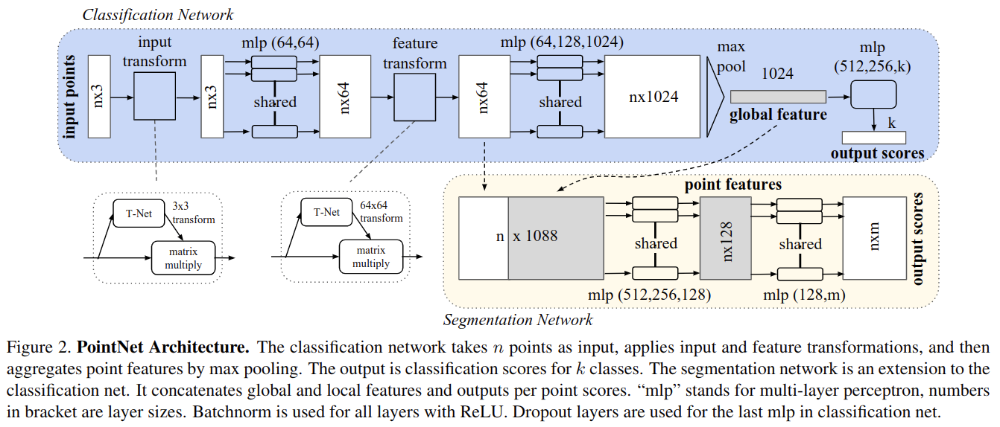

# PointNet: Deep Learning on Point Sets for 3D Classification and Segmentation

元の論文の公開ページ : [arxiv](https://arxiv.org/abs/1612.00593)
Github Issues : [#1](https://github.com/Obarads/obarads.github.io/issues/1)

## どんなもの?
Point Cloud(以下点群)に対してClassification、Part Segmentation、Semantic Segmentationを行う教師あり学習モデル、PointNetを提案した。入力される点群の以下のような特性があり、これらに対して学習できるモデルを提案する。

- 入力に順序なし  
  画像のようにグリッドに沿った値ではない。つまり、入力値の順序が変化する。ボクセルを使うことで対策できるがこのモデルはそれを使わない。(ボクセル表現は値を離散化させ、本来の不変性を曖昧にする。おそらく離散化した影響で細かい値が消えるせいで出力値にずれが出る。)

- 点間の相互作用  
  点と点の間には相互作用が有り、モデルは点と点の局所的構造を捉える必要がある。(あとで説明するが、点と点の局所構造を捉えるような畳込みを持っているとは言いづらい様に思える。ただし、点ごとの特徴をローカルな特徴として扱っている。)

- 変換の不変性  
  幾何学的オブジェクトは剛体変換されている可能性がある。回転、平行移動されたオブジェクトであっても結果が変わらないようにしなければならない。

## 先行研究と比べてどこがすごいの?
通常、voxelなどで点群をグリッドに合わせ処理しやすいようにするが、PointNetはそれをせずとも処理を行うことができる上、SOTAに勝るとも劣らない結果を出した。

## 技術や手法のキモはどこ? or 提案手法の詳細
PointNetのアーキテクチャは図2の通り。入力は生の点群、出力はクラスを表す配列(クラス分類)もしくは点ごとの点ごとにクラスを表す配列を割り振った2次元配列(セマンティックセグメンテーション)となっている。アーキテクチャの説明は以下のようになっている。

### Symmetry Function for Unordered Input
入力する点群は順不同になる可能性があるが、それでも点群が表す表現は変わらないため、最終的なアーキテクチャの出力は変化しないようにしなければいけない。これを定式化すると式(1)の様になる。

$$
f\left(\left\{x_{1}, \ldots, x_{n}\right\}\right) \approx g\left(h\left(x_{1}\right), \ldots, h\left(x_{n}\right)\right) \tag{1}
$$

$\\{x_ {1}, \ldots, x_ {n}\\}$がある時、順不同な関数$f$は入力内の順序が変化しても出力するものが一緒である。そのような関数に近似するような関数を実現するため、PointNetでは入力点群$\\{x_ {1}, \ldots, x_ {n}\\}$に多層パーセプトロンネットワーク(ここでは点ごとに独立した変換を行うため、point-wise Convolutionを使用)$h$を適応し、そこから抽出した入力点ごとの特徴量$h(x)$を要素ごとの最大値を取る最大プーリング層$g$に入れることで達成する。最大プーリング層は対称関数であるため、出力は入力順序の影響を受けない。また、最大プーリング層から出力する特徴をグローバル特徴量とする。

### Local and Global Information Aggregation
セグメンテーションの場合は点ごとにクラスのラベルを振り分ける必要があり、グローバル特徴量だけでは個々の点に的確なラベルを振り分けられるほどの情報を持てない。そこで、多層パーセプトロンネットワークが算出した点ごとの特徴量(ローカルな特徴量)とグローバル特徴量を連結した特徴量を用いてセマンティックセグメンテーションを行う。

### Joint Alignment Network
剛体変換を受けた点群と元の点群の処理結果が同じであるようなアーキテクチャでなければいけない。そこでSTN[3]を元としたネットワークであるT-Net(ほぼ同じ?)を導入する。T-Netは点群座標と特徴空間上の特徴量に対して適応される(特徴量の配置にも効果があるとされる)。  
しかしながら、特徴量が存在する高次元空間では最適化が難しいため、損失関数に式(2)のような正則化項を加える。この項は特徴変換行列が直交行列に近づくような役割を持つ。直交行列に近づけるのは、直交行列が情報を失わないからである。

$$
L_{r e g}=\left\|I-A A^{T}\right\|_{F}^{2} \tag{2}
$$

### Theoretical Analysis
直感的な結論に言えば、このネットワークは形状を要約するような点を探索できるように学習できるということである。実験でも、グローバル特徴量の抽出に寄与した点を視覚化する実験を行っている。

## どうやって有効だと検証した?
ClassificationはModelNet40、Part SegmentationはShapeNet part data set、Semantic SegmentationはStanford 3D semantic parsing data setを使った。また、対称関数の有用性を検証するため、対称関数の代わりの処理候補(ソートとRNN)を用いて処理を行った。Poolingもmax、average、attention sumで比較を行っている。

## 議論はある?
局所的な形状情報を取り扱うための仕組みがないので、それをどう取り入れるか改善の余地がある(これが冒頭で点間の相互作用に対する考えの理由である)。

## 次に読むべき論文は?
- Pointwise Convolutional Neural Networks (このPointNetと同等の結果を示しているため)

## 論文関連リンク
1. [Naoya Chiba, 三次元点群を取り扱うニューラルネットワークのサーベイ, (アクセス:2019/05/26)](https://www.slideshare.net/naoyachiba18/ss-120302579)
2. [Fujimoto Keisuke, Point net, (アクセス:2019/05/26)](https://www.slideshare.net/FujimotoKeisuke/point-net)
3. [M. Jaderberg, K. Simonyan, A. Zisserman, et al. Spatial transformer networks. InNIPS 2015.](https://papers.nips.cc/paper/5854-spatial-transformer-networks.pdf)

## 会議
CVPR2017

## 著者
Charles R. Qi, Hao Su, Kaichun Mo,  Leonidas J. Guibas  

## 投稿日付(yyyy/MM/dd)
2016/12/02

## コメント
CVPR2018では、局所形状を取り込む手法を取り入れたモデルが大量に生まれた。「ローカルな構造」について論文中に出ているが、ローカルな構造=局所形状のイメージが強いせいか、ローカルな構造を言うほど活かしていないように思えた(Segmentationではちゃんと使っているが)。

## key-words
Classification, Point_Cloud, Semantic_Segmentation, CV, Paper, 完了, 旧版

## read
A, R, M, E

## status
完了

## Citation

