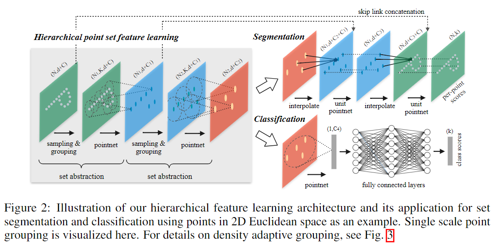

# PointNet++: Deep Hierarchical Feature Learning on Point Sets in a Metric Space

元の論文の公開ページ : https://arxiv.org/abs/1706.02413

## どんなもの?
PointNetは設計上、距離空間上の局所構造を取得できなかったが、本論文のPointNet++はその欠点を克服したモデルである。距離空間上の局所構造を得ることでメトリック空間上のコンテキストを取得し、結果としてPointNetよりもロバストな処理を行うことができるようになる。

## 先行研究と比べてどこがすごいの?
どんなもの?に示した通り。

## 技術や手法のキモはどこ? or 提案手法の詳細
PointNet++のアーキテクチャは図2の通り。PointNet++はSampling層、Grouping層、PointNet層の3種類の層から成り立つ。

### Hierarchical Point Set Feature Learning
#### Sampling layer
入力点 $\\{x_ 1,x_ 2,\ldots,x_ n\\}$が与えられたとき、farthest points sampling(FPS)を繰り返し使って点のサブセット $\\{x_ {i_ 1},x_ {i_ 2},\ldots,x_ {i_ m}\\}$を選択する。このとき、$x_ {i_ j}$は$\\{x_ {i_ 1},x_ {i_ 2},\ldots,x_ {i_ {j-1} } \\}$のセットから一番遠い残りの点である。通常のランダムサンプリングよりも全体的に点を取得できる。

#### Grouping layer
入力として$N\times(d+C)$サイズの点の集合と$N'\times d$サイズの重心の集合の座標を受け取る。出力は$N'\times K \times (d+C)$サイズの点集合のグループであり、各グループは局所領域に対応し、$K$は重心点の近傍中の点の数である。$K$はグループによって異なるが、後続のPointNet層は、自由な数の点を固定長の局所領域特徴ベクトルに変換することができる。  
グループ化には$K$の上限値が決まっているボールクエリ(重心点から指定した距離内にある点を選択する)を使う。kNNではなくボールクエリである理由は選ばれる点の距離範囲が固定長の上限を持ち、それによって一般化可能になるからである。

#### PointNet layer
入力として$N^{\prime} \times K \times(d+C)$サイズの$N^{\prime}$個の局所領域(グループ)点情報をもつデータを扱う(上記の訳が間違っていなければこの$K$はグループごとにちがうはず、本来は$K$がグループごとに違うことを書かなければいけない)。出力は$N^{\prime} \times(d+C)$サイズの近傍情報を要約した$N^{\prime}$個の特徴量である。なお、局所領域内の近傍点の座標には重心点との相対距離が使われる。

### Robust Feature Learning under Non-Uniform Sampling Density

## どうやって有効だと検証した?

## 議論はある?

## 次に読むべき論文は?
- なし

## 論文関連リンク
1. なし

## 会議
NIPS 2017

## 著者
Charles R. Qi, Li Yi, Hao Su, Leonidas J. Guibas.

## 投稿日付(yyyy/MM/dd)
2017/06/07

## コメント
なし

## key-words
Point_Cloud, Classification, Semantic_Segmentation

## status
未完