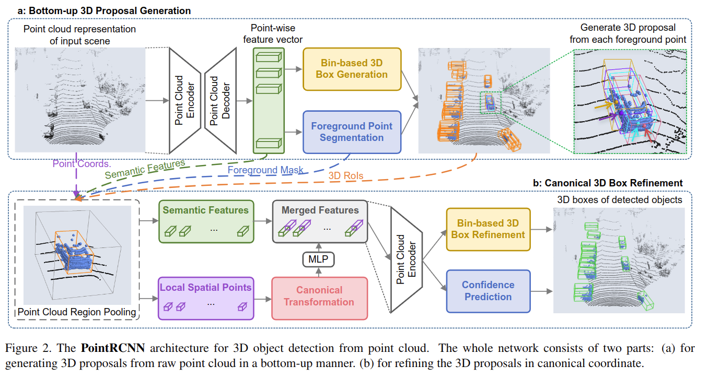
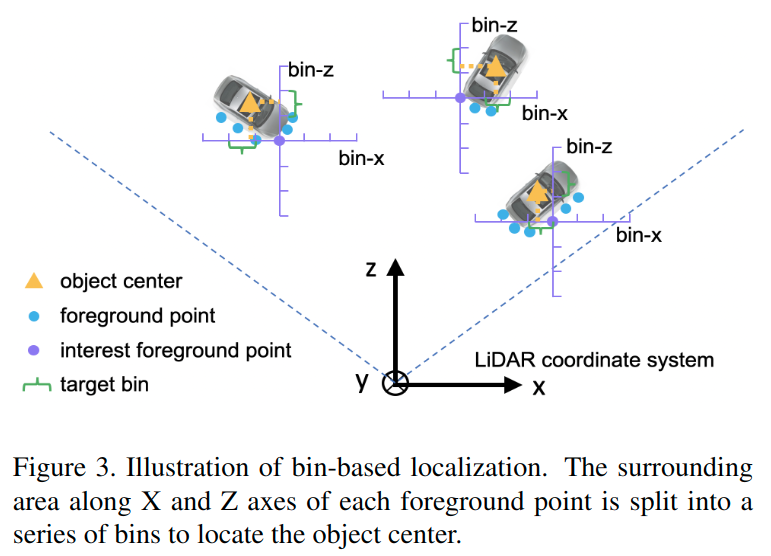

# PointRCNN: 3D Object Proposal Generation and Detection from Point Cloud

元の論文の公開ページ : [arxiv](https://arxiv.org/abs/1812.04244)
Github Issues : [#96](https://github.com/Obarads/obarads.github.io/issues/96)

## どんなもの?
##### 2つのステージで構成される検知フレームワークPointRCNNを提案した。入力として点群を受け取る。

## 先行研究と比べてどこがすごいの?
##### 省略

## 技術や手法のキモはどこ? or 提案手法の詳細
##### 著者らは点群から3Dオブジェクトを検知するための2ステージ検出フレームワーク、PointRCNNを提案した。
- その概要は図2の通り。この手法はbottom-up 3D proposal genera-tion stageとcanonical bounding box refinement stageで構成されている。
- [(Bottom-up 3D proposal generation via point cloud segmentationの項より、)2ステージ手法(R-CNNなど)では、最初に提案を生成して、更に提案と信頼度(Confidence)を改善する方法を取っている。2Dから3Dへこの構造を拡張するのは簡単ではないが、著者らはこの構造を取る。]

### Bottom-up 3D proposal generation via point cloud segmentation
##### この第一ステージでは、シーン全体に対して正確でロバストな3D提案生成手法を導入する。[この手法でオブジェクトマスクと提案を生成する。]
- 具体的には生の点群の分割と分割された前景点から3D提案を同時に行うためのpoint-wiseな特徴量を学習する。
- このbottom-up strategyに基づいて、著者らの手法は3D空間内で事前に定義されている3Dボックスのlarge setを使うことを避け、3D提案生成に対して模索範囲を制限する。
    - 実験より、この3Dボックス提案手法は他の手法よりも高い再現率を獲得した。

#### Learning point cloud representations
##### 判別しやすいpoint-wiseな特徴を学習するためにPointNet++をバックボーンネットワークとして利用する。
- PointNet++のmulti-scale groupingを利用する。
- このバックボーンネットワークには他のものも使える。
- [Bin-based 3D Box GenerationとForeground Point Segmentationに特徴ベクトルを提供するためのバックボーンネットワークである。]

#### Foreground point segmentation
##### この機構は前景点のマスクを生成するためのセグメンテーションヘッドである。
- [ここで出てくるHeadは[1]で説明しているもの?[1]のものであるなら、このヘッドというのはそれらの予測器ということになる。]
- ポイントセグメンテーションのためのground-truthセグメンテーションマスクは3D ground-truthボックスから提供される。

##### 前景点と背景点の点の数はかなりバランスが悪い(前景点が背景点よりもかなり少ない)ため、損失にはfocal loss[2]を使用する。
- 損失は式(1)の通り。
- $$\begin{array}{l}{\mathcal{L}_{\text {focal }}\left(p_{t}\right)=-\alpha_{t}\left(1-p_{t}\right)^{\gamma} \log \left(p_{t}\right)} \\ {\text { where } p_{t}=\left\{\begin{array}{ll}{p} & {\text { for forground point }} \\ {1-p} & {\text { otherwise }}\end{array}\right.}\end{array}\tag{1}$$
    - 本提案では$\alpha_ t=0.25, \gamma=2$とした。

#### Bin-based 3D bounding box generation
##### この機構は前景点から3Dバウンディングボックスの位置を回帰するためのヘッドである。
- なお、背景点は回帰されないが、ボックス生成のための補助的な情報を提供する。

3Dバウンディングボックスは$(x, y, z, h, w, l, \theta)$として表現される。
- $(x, y, z)$はオブジェクトの中心座標
- $(h, w, l)$はオブジェクトサイズ(ボックスサイズ)
- $\theta$は鳥瞰図から見たオブジェクトの向きを示す。

##### 生成された3Dボックス提案に制約を課すために、3Dバウンディングボックス位置を推定するためのbinベースの回帰損失を提案する。
- 図3に示すように、各前景点はX軸とZ軸に沿ったbinsに分けられる。  
  
- それぞれ、前景点がある領域を離散的なbinsへ分割する。
    - 具体的には、各前景点のXとZ軸に対して探索範囲$\mathcal{S}$を定義し、各XとZ軸の探索範囲を均一な長さ$\delta$のビンに分割して、X-Z平面上にオブジェクトの中心(x,z)を示す。[(ここのdifferent object centersのdifferentは、様々という意味だと思うから抜いた。)]
- binsベースの分類を使用して中心位置を特定する。[(そのbinsに基づいて分けられた領域のどこに中心位置があるか分類する。)]
    - 既存の手法はsmooth L1損失を使った回帰で座標を直接求める。著者らは代案としてこの手法を使用することでより正確でロバストな特定ができた。[検証必要。]
- 具体的な損失は以下の式2の通り。
    - $$
    \begin{aligned} \operatorname{bin}_{x}^{(p)} &=\left\lfloor\frac{x^{p}-x^{(p)}+\mathcal{S}}{\delta}\right\rfloor, \operatorname{bin}_{z}^{(p)}=\left\lfloor\frac{z^{p}-z^{(p)}+\mathcal{S}}{\delta}\right\rfloor \\ 
    \operatorname{res}_{u \in\{x, z\}}^{\operatorname{res}_{u}^{(p)}} &=\frac{1}{\mathcal{C}}\left(u^{p}-u^{(p)}+\mathcal{S}-\left(\operatorname{bin}_{u}^{(p)} \cdot \delta+\frac{\delta}{2}\right)\right) \\ 
    \operatorname{res}_{y}^{(p)} &=y^{p}-y^{(p)} \end{aligned} \tag{2}
    $$
    - [XとZに関して全く回帰を使わないわけではない。]損失には、binベース分類と残差回帰から求めることができる2項が使われる。
    - Y座標は値の変化があまりないため、smooth L1損失を使った回帰だけで最適化する。
    - この式の詳細は
        - $\left(x^{(p)}, y^{(p)}, z^{(p)}\right)$は前景のpoint of interest(関心点)の座標
        - $\left(x^{p}, y^{p}, z^{p}\right)$が対応するオブジェクトの中央座標
        - $bin_ x^{(p)}$と$bin _z^{(p)}$はXとZ軸に沿ったground-truth bin assignments
        - $res_ x^{(p)}$と$res_ z^{(p)}$は割り当てられたbin内でさらに位置を絞り込むためのground-truth残差
        - $\mathcal{C}$は正規化のためのbinの長さである。

##### ターゲットオブジェクトの向きにもbinベース手法を使用する。オブジェクトサイズは直接回帰する。
- [3]に類似している。
- 向きの推定は、中心位置のときと同じように、著者らは$2\pi$方向を$n$個のビンに分け、bin分類の目標ビン$bin^{(p)}_ \theta$と残差回帰の目標値$res_ \theta^{(p)}$を計算する。
- オブジェクトサイズ$(h, w, l)$は各クラスの訓練データの平均オブジェクトサイズに関して残差$\left(\operatorname{res}_ {h}^{(p)}, \operatorname{res}_ {w}^{(p)}, \operatorname{res}_ {l}^{(p)}\right)$を計算すること[?]で直接回帰する。
- 以降はまだ書いていない

## どうやって有効だと検証した?

## 議論はある?

## 次に読むべき論文は?
- なし

## 論文関連リンク
1. [shtamura, 物体検出、セグメンテーションをMask R-CNNで理解してみる (初心者). (アクセス:2019/05/14)](https://qiita.com/shtamura/items/4283c851bc3d9721ed96)
2. [agatan, qiita, [論文紹介] Focal Loss for Dense Object Detection, 2018. (アクセス:2019/11/25)](https://qiita.com/agatan/items/53fe8d21f2147b0ac982)[19]
3. [Charles Ruizhongtai Qi, Wei Liu, Chenxia Wu, Hao Su, and Leonidas J. Guibas. Frustum pointnets for 3d object detec-tion from RGB-D data. CoRR, abs/1711.08488, 2017. ](https://arxiv.org/abs/1711.08488)[25]

## 会議
CVPR 2019

## 著者
Shaoshuai Shi, Xiaogang Wang, Hongsheng Li

## 投稿日付(yyyy/MM/dd)
2018/12/11

## コメント
なし

## key-words
Point_Cloud, Instance_Segmentation, Detection, CV, Paper

## status
導入