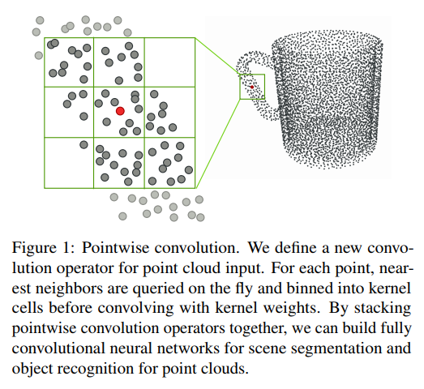
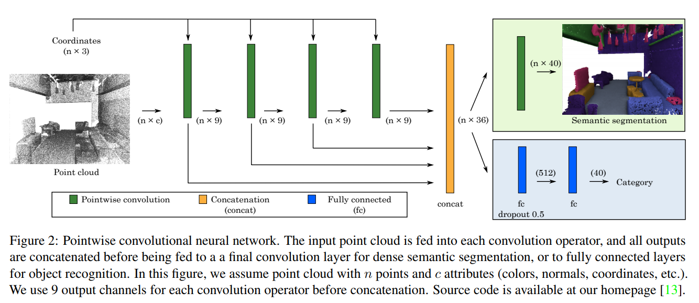
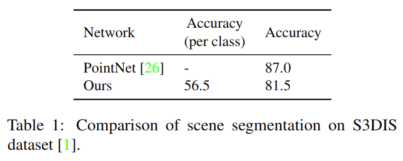
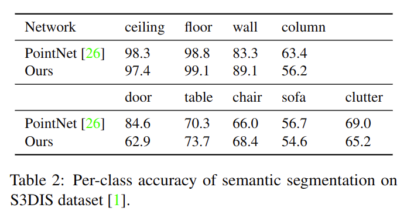
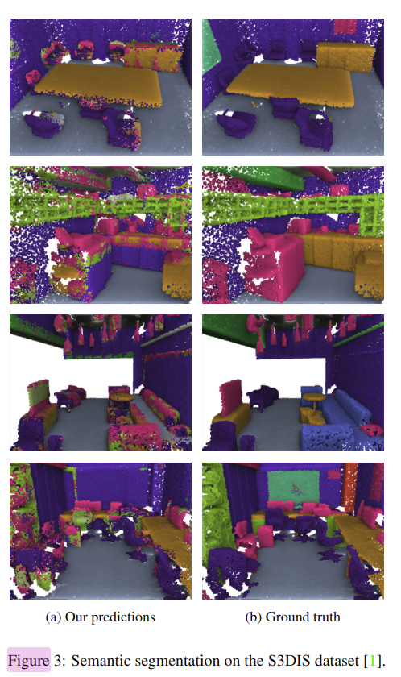
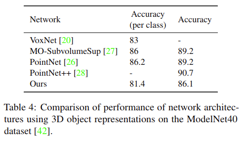

# Pointwise Convolutional Neural Networks

元の論文の公開ページ : https://arxiv.org/abs/1712.05245

## どんなもの?
点群の各点に適応できる、point-wise convolutionを根本とした新しい畳み込み演算子を提案した。

## 先行研究と比べてどこがすごいの?
PointNetやPointCNNは点群解析の分野において素晴らしい結果を残しているが、これらのPointNetをベースとした(PointCNNって使われてたっけ...)ネットワークの構造は複雑になっている。また、従来のCNNは画像やボクセル表現のような軸に沿った形式のみを取り扱うため、点群を直接使用することができなかった(PointNetは点単位の特徴学習を使っている)。そこで、この論文では**順序付けられた**点群を使ったセマンティックセグメンテーションやオブジェクト認識等のシーン理解をこなすためのシンプルな畳み込み演算子とそれを用いたモデルを提案する。

## 技術や手法のキモはどこ? or 提案手法の詳細
この畳込み演算子は点群に直接適応可能で、なおかつ点群中の各点に適応することで動作する。著者らはこの演算子をpointwise convolutionと命名した。以下に演算子の特徴を説明する。

### **Convolution**  
  図1に以下に説明する内容の図を示す。畳み込みのカーネルは点群の各点を中心としており、カーネル内の近隣の点群は中央点に作用する。各カーネルは半径値(球とはいっていない)を持ち、それぞれの畳み込み層内でカーネルごとに異なる数の近隣点を扱うために調節される。図では中心点の近傍点を紹介し、カーネルのセルに分け、セルごとにbinning(ビニングとも、周囲にあるデータを組み合わせる、この図の場合は平均値を取ることか?)してカーネルの重みを使った畳み込みを行う。

  

  以上より、pointwise convolutionは式(1)の様になる。

  $$
  x_i^\ell = \sum_k w_k \frac{1}{|\Omega_i(k)|} \sum_{p_j \in \Omega_i(k)} x_j^{\ell - 1} \tag{1}
  $$

  この式の記号は以下のとおりである。
  
  - $k$: 全てのサブドメインのインデックス(多分カーネルのセルのこと)
  - $\Omega_i(k)$: 点$i$を中心とするカーネルの$k$番目のサブドメイン
  - $p_i$: 点$i$の座標
  - |・|: サブドメイン中の全ての点の数を数える
  - $w_k$: $k$番目のサブドメインのカーネルの重み
  - $x_iとx_j$: 点$i$と点$j$の値
  - $\ell-1$と$\ell$: 入力と出力層のインデックス

  つまり、(おそらくは)ある点を中心としてその周りの点を座標を元にサブドメインごとに分割、サブドメインごとに値の平均値を割り出しそれに重みを掛けるというものである。

## **Gradient backpropagation**  
このConvolutionで示した式は訓練可能である。損失関数$L$としたとき、入力に関する勾配は式(2)の様になる。

$$
\frac{\partial L}{\partial x_j^{\ell-1}} = \sum_{i\in \Omega_j} \frac{\partial L}{\partial x_i^{\ell}} \frac{\partial x_i^{\ell}}{\partial x_j^{\ell-1}} \tag{2}
$$

このとき、

$$
  \frac{\partial x_i^{\ell}}{\partial x_j^{\ell-1}} = \sum_k w_k \frac{1}{|\Omega_i(k)|} \sum_{p_j \in \Omega_i(k)} 1 \tag{3}
$$

となる。カーネルの重みに関する勾配は式(4)の様になる。

$$
\frac{\partial L}{\partial w_k} = \sum_i \frac{\partial L}{\partial x_i^{\ell}} \frac{\partial x_i^{\ell}}{\partial w_k} \tag{4}
$$

このとき、

$$
  \frac{\partial x_i^{\ell}}{\partial w_k} = \frac{1}{|\Omega_i(k)|} \sum_{p_j \in \Omega_i(k)} x_j^{\ell-1} \tag{5}
$$

となる。これらの式にはカーネルの形状には依存しない(そのため、球体でも立方体でも良い)。この論文ではカーネルのセルは3\*3\*3のサイズの正方体を使っている。

この論文では、poolingを使用しない。こうすることで以下の利点が生まれる。

- 点群のダウンサンプリングとアップサンプリングが必要なくなる。
- ネットワーク全体で点群の変更を行わないことによって、一度近傍点へのクエリを作成するだけで良い。

## **Point order**
PointNetは入力点の順序に関係なく結果を出せる順序不変の性質を持つが、著者らは順序不変は必要ないと主張する。代わりにXYZ順のソートとMorton curve(論文関連リンクの1)を使う。ただし、順序が関係あるのは分類問題で使われるカテゴリを予測するために使用される最後のグローバル特徴ベクトルだけであり、セマンティックセグメンテーションではそれぞれの点でローカル特徴を利用するため順序は必要なくなる。

## **その他**  
a-trous convolutionへ拡張できる、ネットワークの簡素化するために座標とその他特徴を分けること(図2参照)などなど。

  

## どうやって有効だと検証した?
S3DISデータセットによるセマンティックセグメンテーション(表1、2、図3)、ModelNet40によるクラス分類(表4)等、様々な実験を行っている。比較対象はPointNetであることが多い。

  

  

  

  

## 議論はある?
大規模点群へ利用するための改良、ローカルな近隣点の構造検知などについて結論で少し補足している。

## 次に読むべき論文は?
- [C. R. Qi, L. Yi, H. Su, and L. J. Guibas. Pointnet++: Deep hierarchical feature learning on point sets in a metric space. arXiv:1706.02413, 2017.](https://arxiv.org/abs/1706.02413)

### 論文関連リンク
1. [G. M. Morton. A computer oriented geodetic data base and a new technique in file sequencing. International Business Machines Company New York, 1966.](https://domino.research.ibm.com/library/cyberdig.nsf/0/0dabf9473b9c86d48525779800566a39?OpenDocument)
1. [Naoya Chiba. 三次元点群を取り扱うニューラルネットワークのサーベイ. pp.78~81. (アクセス:2019/2/23)](https://www.slideshare.net/naoyachiba18/ss-120302579)

### 会議
CVPR 2018

### 著者
Binh-Son Hua, Minh-Khoi Tran and Sai-Kit Yeung.

### 投稿日付(yyyy/MM/dd)
2017/12/14

## コメント
Point orderで順序の必要不必要の判断理由として、分類問題は点群全体の形(それを特徴化したものがconcatによるglobal feature)を見てそれが何なのか決める必要があるため順序が必要となるが、セマンティックセグメンテーションは点一つの特徴(畳み込みによって周りから得た特徴)にしか注目せず、その点がどのクラスであるのか判断するから順序が必要ないということか?

## key-words
PointCloud,Classification,Segmentation