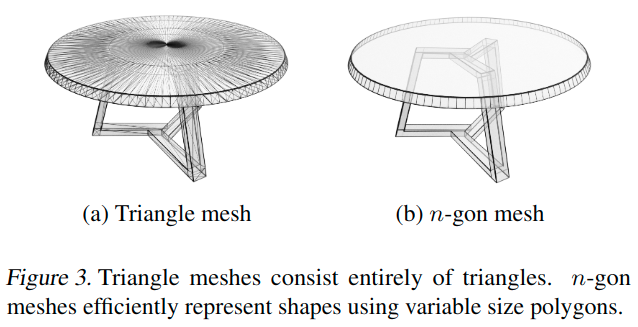
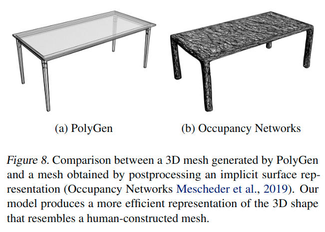

# PolyGen: An Autoregressive Generative Model of 3D Meshes

元の論文の公開ページ : [arxiv.org](https://arxiv.org/abs/2002.10880)  
提案モデルの実装 : [2020/2/29:なし]()  
Github Issues :   

Note: 記事の見方や注意点については、[こちら](/)をご覧ください。

## どんなもの?
##### Transformerベースのアーキテクチャを用いて、メッシュを直接的に形作り、メッシュの頂点と面を順次予測していくアプローチを提案した。
- 入力を介して条件付けを行うことができる[?]。例:オブジェクトクラス、ボクセル、画像
- 提案したモデルはprobabilistic[(確率的?)]であるため、曖昧なシナリオでも不確実な要素を捉えたサンプルを生成できる。
- **本提案では、triangleメッシュではなく、n-gonsメッシュを用いて3Dオブジェクトを表現する。**
  - triangleメッシュとn-gonsメッシュの違いは図3の通り。

## 先行研究と比べてどこがすごいの? or 関連事項
##### 省略

## 技術や手法のキモはどこ? or 提案手法の詳細
##### 省略

## どうやって有効だと検証した?
##### 提案手法の出力を定性的に比較する。
- 図8はOccupancy Networks(b)の出力との視覚的な比較。
- (b)と比べて(a)のほうがより効率的に3Dオブジェクトを表現している。

## 議論はある?
##### 省略

## 次に読むべき論文は?
##### なし

## 論文関連リンク
##### あり
1. [icoxfog417. Github - arXivTimes/arXivTimes. "PolyGen: An Autoregressive Generative Model of 3D Meshes #1589". 2020. (アクセス:2020/2/29)](https://github.com/arXivTimes/arXivTimes/issues/1589)

## 会議, 論文誌, etc.
##### 不明

## 著者
##### Charlie Nash, Yaroslav Ganin, S. M. Ali Eslami, Peter W. Battaglia

## 投稿日付(yyyy/MM/dd)
##### 2020/2/23

## コメント
##### なし

## key-words
##### Paper, CV, Mesh, 導入, 3D_Estimation, Voxel, RGB_Image

## status
##### 導入

## read
##### A

## Citation
##### 未記入
