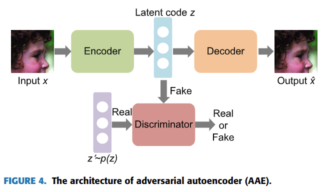
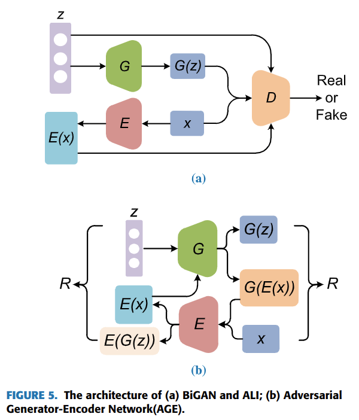

# Recent Progress on Generative Adversarial Networks (GANs): A Survey

元の論文の公開ページ : https://ieeexplore.ieee.org/document/8667290

## どんなもの?
GANのサーベイ。発行が2019/03/14(=つい最近)なのでありがたい。

## 先行研究と比べてどこがすごいの?
最新のGANのサーベイを提供してくれたこと。

## 技術や手法のキモはどこ? or 提案手法の詳細
以下全文翻訳、参考文献は本文と連動する。

### 要約
Generative adversarial network (GANs)はAI分野において最も重要な研究手法の一つであり、データ生成能力は注目を良く引く。この論文では、著者らがGANの最新の動向を紹介する。はじめに、GANの基礎理論と近年の生成モデルごとの違いについて分析、要約する。次に、GANの派生モデルをひとつずつ分類、紹介していく。3つめに、トレーニングの戦略と評価方法を紹介する。4つめに、GANのアプリケーションを紹介する。最後に、取り組むべき問題とその将来の方針について議論する。

### 1章 導入
過去数年間で、コンピュータサイエンスとデータ蓄積で大きな発展があった。AIは価値ある研究の話題と多数の有意義なアプリケーションとともに盛況な分野となった。AIのコミュニティでは、機械学習[1]が我々の日常の様々な場面で大きな影響を振るうようになった。機械学習アルゴリズムはすべて、与えられたデータの表現を必要とする。しかし、他の分野やタスク中でこれらの技術を使いたいと望んだとしても、有用な特徴を抽出することが難しいものである。そこで、研究者は分類や検出をするときに役に立つ情報を自動的に抽出する表現学習[2]と呼ばれる新しいアプローチを提案した。深層学習[3]はいくつかの簡単な表現を構成することによって、他の手法よりもより抽象的な特徴(=高レベルな特徴)を容易に抽出できる表現学習手法の一種である。 

一般的に、ラベルがあるかどうかで機械学習の手法は教師あり学習か教師なし学習の2つに分けられる。教師あり学習には異なる表現を含むデータセットが必要とされ、データセット中の各サンプルにはラベルがつけられている。教師あり学習の代表には分類、回帰、構造問題(structured output learning等)がある。しかしながら、教師なし学習はわずかなラベルを含むデータセットを必要とする。目的は、データセット内にある特有の構造を探し出すことである。通常、密度推定、クラスタリング、合成、ノイズ除去が教師なし学習とみなされる。

教師あり学習のために自動的にラベルを付けたり収集したりすることは困難である。したがって、研究者は教師なし学習により注目する。教師なし学習のタスクにおいて、生成モデルは最も有望な技術の一つである。典型的な生成モデルは基本的にマルコフ連鎖、最大尤度、近似的推論をベースとしている。制限付きボルツマンマシン[4]とその拡張モデル(Deep Belief Network[5]、Deep Boltzmann Machinescite[6])は常に最大尤度推定をベースとしている。これらの手法によって生成されたモデルは分布を生成し、そしてこれらの分布は訓練データの経験分布と一致することを目的とした多くのパラメーターを持つ。

しかしながら、これらの初期のモデル[4]-[6]は深刻な制限を持ち合わせており、もしかしたら望まれるような一般化ではないかもしれない。2014年に、Goodfellow氏がGANと呼ばれる新たな生成モデルを提案した。GANは、ゲーム理論をベースとした、生成器と弁別器の二つのネットワークから成り立っている。生成器の役割は弁別器をだますことができるほどリアルな画像を生成することである。弁別器の役割は、実際のデータと偽物のデータを識別することである。この場合、ドロップアウトアルゴリズムと逆伝播[8]を使って両方のモデルを訓練する。近似的推論かマルコフ連鎖はGANには必要とされない。

この調査では、ネットワークのアプリケーション、動機、定義を含む、最新のSOATなGANを要約&分析する。サーベイの作りは以下の様になっている。2章はいくつかの生成モデルを紹介し、GANの基礎理論に注目する。さらに、これらのモデルの簡単な比較も提供する。一連の派生GANモデルは3章で紹介される。4章では、GANのいくつかの訓練の仕組みを紹介する。5章では様々な評価方法の良し悪しについて議論する。様々な分野でのGANのアプリケーションは6章で概観される。7章では、GANの制限と将来的な提案について検討する。最後に8章で結論付ける。

### 2章 生成モデルとGAN
GANは深層生成モデルの一つであり、生成問題をうまく処理することができる。この章では、はじめに一般的な深層生成モデルのいくつかの種類を紹介し、次にこれらのモデル間で違いを比較する。その次に、基本的なGANの理論とアーキテクチャについて紹介する。

#### A. 深層生成モデル
AIの狙いは人間界の様な複雑な世界を理解することである。このアイデアに基づいて、AIの研究者が統計と確率の観点からそれらの周りの世界を描くことに専念する生成モデルを提案した。いつもお世話になっております。今現在、生成モデルはGANs[7]、VAE[9]、AutoRegressive Networks[10]の3つのカテゴリに分けることができる。VAEは確率的なグラフィカルモデルであり、データの確率分布のモデル化すること目的としている。しかしながら、最終的な確率論的シミュレーションはいくらかのバイアスを持つ。そのため、GANsよりもぼやけたサンプルが多く生成される。PixelRNN[11]はautoregressive networksの一つであり、画像生成の問題をピクセルの生成と予測の問題に転換する。それゆえ、各ピクセルは一つ一つ処理される必要があるが、GANはワンショットでサンプルを直接処理する。そして、これはGANがPixelRNNよりも早いサンプル生成をする。

確率的生成モデルとして、確率密度が提供されないとき、データの自然な解釈に依存する従来の生成モデルのいくつかは、訓練及び適応ができない。しかし、GANは非常に利口な内部の敵対的訓練メカニズムを導入しているため、GANsはこのような状況でも依然として使うことができる。

#### B. GANsの原理
GANsはゲーム理論に触発されたものであり、生成器と識別器がお互い、訓練中にナッシュ均衡を達成しようとする。GANのアーキテクチャを図1に示す。生成器$G$の動作原理は実際のデータの潜在分布を極力適合させるために偽のデータを生成することである。一方で、識別器$D$の動作原理は偽か実際のデータか正しく見分けることである。生成器の入力はランダムノイズベクトル$z$(基本的には一様分布もしくは正規分布)である。ノイズは多次元ベクトルである偽のサンプル$G(z)$を得るために生成器$G$を介して新しいデータ空間にマッピングされる。また、識別器$D$は二値分類器でありデータセットからの実際のサンプルもしくは生成器$G$から生成された偽のサンプルを入力として受け取る。そして、識別器$D$の出力は実際のデータである確率である。識別器$D$が実際のものか偽のものかどうかわからなくなった時、GANは最適な状態になる。この時点で、実際のデータ分布を学習した生成器モデル$G$が得られる。

#### C. GANsの学習モデル
このゲーム理論中の識別機と生成器は対応する自身の損失関数を持つ。このとき、これらをそれぞれ$J^{(G)}$と$J^{(D)}$と呼ぶ。[7]中では、識別器$D$が二値分類器として定義され、損失関数はクロスエントロピーで示される。定義は式(1)の通り。

ここで、$x$は実際のサンプルを示し、$z$は$G(z)$を生成器$G$で生成するためのランダムノイズベクトル、$\mathbb{E}$は期待(期待値、expectation)である。$D(x)$は$D$が$x$を実際のデータとみなす確率、$D(G(z))$は$D$が$G$によって生成されたデータを特定する確率を示す。$D$の目的はデータの出所を正しく突き止めることであるため、$D(G(z))$が0に近づくことを目標とするが、$G$は1に近づくことを目的とする。この考えに基づいて、２つのモデル間には対立が存在する(ゼロサムゲーム)。したがって、生成器の損失は識別機によって式(2)の様に導出される。

結果的に、GANsの最適化問題はminimaxゲームに変換される。定義は式(3)の通り。

訓練プロセス中に$G$中のパラメーターは$D$の更新プロセスのパラメーターと一緒に更新される。$D(G(z))=0.5$である時、識別機はこれらの2つの分布間の差異を特定することができなくなる。この状態では、モデルが大域的最適解を達成するだろう。

### 3章 派生GANsモデル
オリジナルのGANsの欠陥により、様々な派生GANsモデルが提案され、これらの派生GANsモデルはアーキテクチャ最適化ベースのGANsと目的関数最適化ベースのGANsの2種類のグループに分けられる(表1)。このセクションでは、いくつかの派生モデルの詳細について紹介する。

#### A. アーキテクチャ最適化ベースのGANs
##### 1. 畳み込みベースのGANs  
  CNN[30]は教師あり学習のとても効率的なモデルとして見なされており、画像処理分野では最も普及しているネットワークの構造の一つである。生成器と識別機のネットワーク構造に関しては、オリジナルのGANsがMLPを採用している。画像の特徴抽出に関してはMLPよりもCNNの方が優れているため、Radfoldら[12]はDeep Convolutional Generative Adversarial Networks(DCGAN)を提案した。図2に示す通り、このアプローチは生成器内の全結合層をdeconvolution層に置き換える革新的なものであり、画像生成タスクにおいて素晴らしい結果を残した。

  

##### 2. 条件付きベースのGANs  
  生成器の入力はランダムノイズベクトル$z$であるため、これらの制限されていない入力が訓練モードの崩壊を起こす可能性がある。それゆえ、MirzaとOsindero[13]はConditional Generative Adversarial Networks(CGANs)を提案した。CGANsは識別機と生成器の両方に条件変数$c$(変数$c$はラベルやテキストなどのデータ)を導入している。この変数$c$を導入することで、モデルに条件を与え、データ生成プロセスに影響を与える。図3(a)に示すように、生成器の入力は条件変数$c$とノイズベクトル$z$であり、識別機の入力は生成器からの出力$G(z|c)$と条件変数$c$から成り立つ実際のサンプルである。したがって目的関数は式(4)のように示される。

  

  追加で、Chenら[14]はInfoGANと名付けられた他のCGANsを提案した。相互情報量を導入することで、InfoGANは生成プロセスをより制御しやすくし、結果をもっと解釈しやすくなった。ここで、相互情報量は生成されたデータ$x$と潜在コード$c$間の矯正を表す。$x$と$c$の関係性を向上させるため、相互情報量の値は最大化される必要がある。その生成精機はCGANsに似ているが、潜在コード$c$がわからないという違いがあるため、訓練プロセスを通して発見する必要がある。オリジナルのGANsの識別機に加えて、InfoGANは条件変数$Q(c|x)$を出力するため追加のネットワーク$Q$を持つ。目的関数は式(5)のようになる。

  

  ここで、$\lambda$は制約関数$I(c,G(z,c))$のハイパーパラメータであり、相互情報量によって、生成されたデータに対して潜在コード$c$がより一層合理的になる。InfoGANのアーキテクチャを図3(b)に示す。  
  CGANsをベースとした、Odenaら[15]はAuxiliary Classifier GAN(ACGAN)を提案した。図3(c)では、識別機に対して条件変数$c$は追加されず、代わりに他の分類器でクラスラベルの確率を示すために使われる。次に、損失関数は正しいクラスラベル予測確率を増やすために修正される。

  

##### 3. オートエンコーダーベースのGANs  
  オートエンコーダーは入力と同じものを再構築するように訓練するニューラルネットワークの一種である。エンコーダー$z=f(x)$とデコーダー$\hat{x}=g(z)$の二つのパーツで成り立っており、ここでエンコーダーは入力$x$(画像、ビデオ、音響、テキストデータなど)を隠れ層(潜在コード$z$)へ変換するために使わるものであり、次元を削減するプロセスである。デコーダーは入力として隠れ層$h$からコードを受け取るために使われる。訓練後、デコーダーは入力$x$と同じものを出力$\hat{x}$として再構築しようとする。入力との差を損失とするため、ラベルを必要しない教師なしモデルである。近年では、潜在可変モデル理論と組み合わせてオートエンコーダーを生成モデルに適応するために使用されている。  
  また、オートエンコーダーはエンコーダによって得られる隠れ層が空間中で均一に分布しないため不完全であり、結果として分布内で多数のギャップを生む。従って、Makhzaniら[16]はオートエンコーダーと敵対的ネットワークのアイデアを組み合わせたAdversarial Autoencoder(AAE)を提案した。このアプローチは、任意の事前分布がエンコーダーによって得られた隠れ層の分布に課される。その任意の一部分から意味を持つサンプルをデコーダーが再構築できるように、事前分布中のギャップをなくすことを保証する。AAEのアーキテクチャは図4に示すとおりであり、潜在空間$z$(隠れ層)が偽物のデータを表現し、$z'$が特定の分布$p(z)$による事前分布を表す。これらは識別器の入力となる。トレーニング後は、エンコーダーが望んだ分布を学習できるようになっており、デコーダーは最終的に、必要とされる分布によって再構成されたサンプルを出力できるようになる。

  

  いくつかのモデル[17]-[19]はGANsにエンコーダーのみを付け加えた。これらのモデルの生成器は潜在空間中の特徴を学習し、そしてデータ分布の意味的変化を捉える。しかし、データサンプルの分布から潜在空間にマッピングすることができない。この問題に対処するため、Donahueら[17]は有効な推論をするだけでなく生成されたサンプルの質を保証もすることができるBidirectional Generative Adversarial Networks(BiGAN)を提案した。BiGANとALIのアーキテクチャを図5に示す。BiGANのアーキテクチャでは、識別器と生成器に加えて、潜在特徴空間にエンコーダーがそのモデルに追加される。このエンコーダーはデータ分布においてGANsによって生成されたデータを潜在特徴空間に逆マッピングするために使われる。この識別器の入力はデータで構成されたタプルとそれに対応する潜在コードになる。生成器によって生成されたデータのため、このタプルは生成されたデータ$G(z)$とデータを生成するために使われるノイズベクトル$z$である。データセットからの本物のサンプル$x$のために、こちらのタプルはサンプル$x$とエンコーダーの逆マッピングを介して$x$から得られた$E(x)$である。このアプローチでは、エンコーダーが識別器のための特徴取得手段として使われる。同様に、Dumoulinら[18]は潜在特徴分布を学習するためのエンコーダを使うAdversarially Learned Inference(ALI)を提案した。この２つのアプローチはどちらも、並列で生成器とエンコーダーを学習することができる。  
  先程説明した敵対的ネットワークとオートエンコーダーを組み合わせたアプローチに加えて、Ulyanovら[19]は敵対的ネットワークが生成器とエンコーダー間で動作し、ネットワークが識別器の導入を必要としないAdversarial Generator-Encoder Network(AGE)と名付けられたアプローチを提案した。図5にRが再構成損失関数を表すAGEのアーキテクチャを示す。モデルの構造において、生成器の狙いは潜在分布$z$と生成されたデータ分布間のダイバージェンスを最小化することであり、一方でエンコーダーの狙いは$z$ろ$E(G(z))$間のダイバージェンスを最大化することと、本物のデータ$x$のダイバージェンスを最小化することである。更に、これらはモード崩壊にならないように避けるための再構築関数を導入している。

  

  2章において、著者らはGANsを用いてVAEsと簡潔な比較をした。VAEsの利点はモード崩壊による影響をより少なくすることであるが、生成されたサンプルがぼやけている。GANsに基づいて生成されたモデルはVAEsのサンプルより高品質なものを生成するが、モード崩壊の問題を持ち合わせている。Larsenら[20]はVAEsのでコーターをGANsの生成器に置き換え、VAEsとGANsの利点を組み合わせた。このアプローチで、GANsの敵対的損失をVAEsの目的関数と組み合わせ、ぼやけた画像を生成するVAEsの問題を減らし、一方で潜在コードの分布を学習できるVAEsの特性をキープした。

#### B. GANsベースの目的関数最適化
GANsの安定性を高めるために、目的関数を最適化することによって多くの試行錯誤[21]-[29]がなされた。GANsの訓練プロセスを調節するため、生成器を向上させるための勾配ベースの損失関数を使う。そして、オリジナルのGANsは生成器の損失関数を最小化するためのJensen-Shannon(JS)ダイバージェンスを最小化することによって目的を達成した。参考文献[22]はこれが特別なケースであるとし、任意のf-ダイバージェンスがGANsのアーキテクチャで使用できるということを指摘した。参考文献[22],[24]と[26]はGANsの安定性を向上させるための目的関数を構築するために異なるダイバージェンスを使った。  
GANsの安定性を改良するための他の手法は異なる正則化を使うことである。Cheら[23]は学習をより安定するための2つの正則化を提案した。もし、生成されたデータの分布と実際のデータの分布間が重なっていないもしくは無視しても問題ない程度に重なっている場合、ダイバージェンスは定数としてセットされる。このとき、勾配はゼロになり、勾配消失問題を引き起こす可能性がある。この問題を解決するために、Arjovskyら[27]はWasserstein Generative Adversarial Networks(WGAN)を提案する。これらは理論的にEarth-Mover(EM)距離が他の距離計量と比べて分布学習の勾配挙動をより良くすることを示した。このアプローチはLipschitz制約を強制するために重み付けされたクリッピング手法を提供し、そして不安定な訓練プロセスの問題に対処するための新しい損失計量を見つけた。Gulrajaniら[28]はWGANが識別器で重みのクリッピングの使用が原因で収束できないもしくはまだ残念な結果になるかもしないことを見つけた。従って、彼らはLipschitz制約を強制するためのWGAN-GPと名付けられた勾配罰則を提案した。手法はオリジナルのWGANよりも良いパフォーマンスを残し、ハイパーパラメータのチューニングをほとんどせずに既存のものよりも安定した多様なGANsアーキテクチャのトレーニングを可能にした。更に、Petzkaら[29]はWGAN-LPとして知られるLipschitz制約を強制するための新しい罰則化項を提案した。この手法はネットワークのトレーニングにさらなる安定性をもたらした。  
追加で、オリジナルのGANsは識別器が本物のサンプル分布でなんの制約なしに無限にモデル化する能力を持つことを仮定する。これは簡単に過剰適合と乏しい一般化能力を導く。GANsの能力を無限にモデル化することを制限するために、Qiら[25]はLipschitz連続関数を満たす空間への目的関数を最小化することによって得られる損失関数を制限した。[25]と[27]の両方は勾配消失とモード崩壊の問題に対処するためLipschitzの規則化を使った。違いは[27]のLipschitz制約がKantorovich-Rubinstein双対性から来ていることである。

### 4章 GANsの訓練の仕組み
GANsの目標はナッシュ均衡を達成することであるが、実行プロセスでは非常に難しい。この章では優秀な訓練パフォーマンスを達成するためのいくつかの提案を提供する。  
[31]では、Saliansらは訓練プロセスの安定化とパフォーマンスの改善をするためのいくつかの仕組みを提案した。はじめに、特徴マッチングは生成器に新しい目的関数を与えることによってGANsの訓練をより安定させることができる。この方法では、生成されたデータがより一貫性を持ち、そして生成器がよりサンプルの情報を生成するようにになる。第二に、ミニバッチ層を使うことで識別器がモード崩壊の問題を回避するためにサンプルの多様性を反映することを可能にする。第三に、historical averagingはモデルが収束することを助ける。パラメーターの平均値と現在値に大きな差異がある場合、生成器と識別器に現在のパラメーターに対する罰則を課すための項が追加される。第四に、one-sidedラベル平滑化は本物のサンプルのために識別器の推定を1に隣接する値にセットするために提案され、これは分類器の境界を平滑化することができる。  
別々の学習率を使うことによって、[32]はモデルが安定した局所ナッシュ均衡に収束できるよう保証するために、識別器と生成器のためのtwo time-scale update rule(TTUR)を提案した。[33]では、Miyatoらがスペクトル正規化を提案した。これはGANsの識別器の訓練を安定化させる重み正規化テクニックである。これらのアプローチは識別器で制約としてLipschitz定数を追加することである。[27]や[28]の勾配罰則ｔｐ重みのクリッピングとは違い、訓練を安定化させる目にスペクトルノルムを制限する。アプローチの計算コストは小さく、他のハイパーパラメーターを調節する必要がない。[34]では、Zhangらが生成器でスペクトル正規化を使うこともまた役に立つことを実証した。

### 5章 評価の計量手法
最近では、GANsモデルは異なるタスクに適応され、各タスクが自身の評価方法を持つ。しかしながら、まだ普遍的に定量的な評価手法が存在せず、研究者が異なるタスクのための評価指標をどのように決めるかについてかなりの混乱がある。それ故、著者らは今現在広く使われているいくつかの評価方法について紹介し、それらの長所と短所について議論する。

#### A. INCEPTION SCORES (IS)
この計測はGANsで広く使われており、Salimansら[31]によって提案された。高いISは生成されたモデルが高い品質を持つサンプルを生成できることを示し、サンプルは多様性を持つ。しかしながら、ISには限界があり、もし生成モデルがモード崩壊に陥った場合、ISが優れているように見えるかもしれないが実はとてもまずい状況になる。

#### B. MODE SCORE (MS)
ISがベースであり、Nowozinら[22]がMSというもう一つの評価測量を提案した。MSは生成されたサンプルの多様性と視覚的な質を同時に反映できる。この評価手法はground truthラベル上の事前分布に繊細でないISの問題に対処する。

#### C. FRÈCHET INCEPTION DISTANCE (FID)
FIDはHeuselら[32]によって提案された。FIDはクラス内のmode droppingを検知するために使われる。このアプローチでは、生成されたサンプルがInception networkの特定の層によって提供されている特徴空間に埋め込まれる。仮定に基づいて生成されたサンプルは多次元ガウスに従い、平均と分散が生成されたサンプルと本物のデータ間で計算される。次に、FrÈchet距離は２つのガウス間が生成されたサンプルの質を評価するために計測される。しかしながら、ISとFIDは過剰適合問題をうまく処理することができない。問題に対処するため、Kernel Inception距離(KID)がBinkowskiら[35]によって提案された。

#### D. MULTI-SCALE STRUCTURAL SIMILARITY FOR IMAGE QUALITY (MS-SSIM)
２つの画像間の類似性を測るために使われるsingle scale SSIM[36]測量とは異なり、最初にWangら[37]がマルチスケールな画像の品質評価のためのMS-SSIMを提案した。MS-SSIMは人の知覚的類似性の判断を予測することによって画像の類似性を定量的に評価できる。Odenaら[15]とFedusら[38]が生成されたデータの多様性を計測するためにこの評価方法を使った。参考文献[39]はIFDとISがサンプルの多様性をテストするためにMS-SSIMを用いて補助的な評価手法として使われている。  
更に、Classifier Two-sample Tests(C2ST)[40]は2値分類器の訓練に基づくもう一つの測量である。異なるサンプルが同じ分布から来たかどうか評価する。1-Nearest Neighbor classier (1-NN)[41]は多量のハイパーパラメーターチューニングと特別な訓練を必要としないC2STの確率変数である。  
目的関数はまた、モードがこれらの課題に向いているかどうか判断するための測量として使われる。Wasserstein Critic[27]とMaximum Mean Discrepancy (MMD)[42]は生成されたサンプル分布と本物のサンプル分布間の距離を測るために提案された。もしターゲットと出力間の分布が似ている場合、両方共低い値を持つ。  
どのように適切な評価指標を選ぶかは依然として難しい問題であり、[43]は研究者が定量的な評価指標を選ぶためにガイドするためのメタ指標としていくつかの指標を提示した。良い評価指標は本物のサンプルと生成されたサンプルを見分け、モード崩壊とmode dropを確かめ、過剰適合を検知するべきである。著者らはGANsモデルの質を評価するためのより適切な方法があることを願う。

### 6章 GANsのアプリケーション
生成モデルの一種として、GANsの最も直接的なアプリケーションはデータの生成である。それは本物のサンプルの分布から学習することで、分布と一致するサンプルを生成することである。この章は自然言語処理やコンピュータービジョン、その他の分野の厳選したGANsのアプリケーションを紹介する。

#### A. コンピュータービジョン
今のところ、成功したGANsのアプリケーションの殆どはコンピュータービジョン分野にある。例えば、画像変換、画像の超解像、画像合成とビデオ生成などである。以下にアプリケーションの詳細を紹介する。

##### 1) 画像の超解像
画像の解像度を改善するために、Super-Resolution Generative Adversarial Networks (SRGAN)がLedigら[44]によって提案された。これは低解像度画像を入力として受け取り、4xのアップサンプリングで高解像度画像を生成する。SRGANによって生成されたテクスチャのリアルさが不十分であるという問題に対処するため、また他の多くのノイズをともナウ問題があるため、Wangら[45]はEnhanced Super-Resolution Generative Adversarial Networks (ESRGAN)を提案した。ESRGANでは、ネットワーのアーキテクチャ、敵対的損失と知覚損失が改良された。更に、relativistic GAN [46]に基づいたResidual-in-Residual Dense Block (RRDB)と名付けられた新しいネットワークユニットが導入された。生成パフォーマンス比較を図6に示す。著者らはESRGANがSRGANよりも良い結果を残したことを確認した。

##### 2) 画像変換

## どうやって有効だと検証した?
なし

## 議論はある?
なし

## 次に読むべき論文は?
- なし

### 論文関連リンク
この資料中の参考文献は論文中のReferenceを参照すること。

### 会議
IEEE

### 著者
Zhaoqing Pan, Weijie Yu, Xiaokai Yi, Asifullah Khan, Feng Yuan, Yuhui Zheng.

### 投稿日付(yyyy/MM/dd)
2019/03/14

## コメント
なし

## key-words
GAN