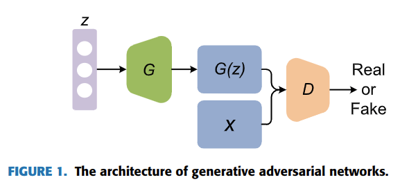
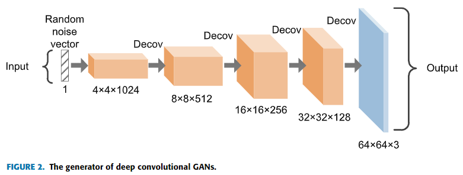

# Recent Progress on Generative Adversarial Networks (GANs): A Survey

元の論文の公開ページ : https://ieeexplore.ieee.org/document/8667290

## どんなもの?
GANのサーベイ。発行が2019/03/14(=つい最近)なのでありがたい。

## 先行研究と比べてどこがすごいの?
最新のGANのサーベイを提供してくれたこと。

## 技術や手法のキモはどこ? or 提案手法の詳細
以下全文翻訳、参考文献は本文と連動する。

### 要約
Generative adversarial network (GANs)はAI分野において最も重要な研究手法の一つであり、データ生成能力は注目を良く引く。この論文では、著者らがGANの最新の動向を紹介する。はじめに、GANの基礎理論と近年の生成モデルごとの違いについて分析、要約する。次に、GANの派生モデルをひとつずつ分類、紹介していく。3つめに、トレーニングの戦略と評価方法を紹介する。4つめに、GANのアプリケーションを紹介する。最後に、取り組むべき問題とその将来の方針について議論する。

### 1章 導入
過去数年間で、コンピュータサイエンスとデータ蓄積で大きな発展があった。AIは価値ある研究の話題と多数の有意義なアプリケーションとともに盛況な分野となった。AIのコミュニティでは、機械学習[1]が我々の日常の様々な場面で大きな影響を振るうようになった。機械学習アルゴリズムはすべて、与えられたデータの表現を必要とする。しかし、他の分野やタスク中でこれらの技術を使いたいと望んだとしても、有用な特徴を抽出することが難しいものである。そこで、研究者は分類や検出をするときに役に立つ情報を自動的に抽出する表現学習[2]と呼ばれる新しいアプローチを提案した。深層学習[3]はいくつかの簡単な表現を構成することによって、他の手法よりもより抽象的な特徴(=高レベルな特徴)を容易に抽出できる表現学習手法の一種である。 

一般的に、ラベルがあるかどうかで機械学習の手法は教師あり学習か教師なし学習の2つに分けられる。教師あり学習には異なる表現を含むデータセットが必要とされ、データセット中の各サンプルにはラベルがつけられている。教師あり学習の代表には分類、回帰、構造問題(structured output learning等)がある。しかしながら、教師なし学習はわずかなラベルを含むデータセットを必要とする。目的は、データセット内にある特有の楮を探し出すことである。通常、密度推定、クラスタリング、合成、ノイズ除去が教師なし学習とみなされる。

教師あり学習のために自動的にラベルを付けたり収集したりすることは困難である。したがって、研究者は教師なし学習により注目する。教師なし学習のタスクにおいて、生成モデルは最も有望な技術の一つである。典型的な生成モデルは基本的にマルコフ連鎖、最大尤度、近似的推論をベースとしている。制限付きボルツマンマシン[4]とその拡張モデル(Deep Belief Network[5]、Deep Boltzmann Machinescite[6])は常に最大尤度推定をベースとしている。これらの手法によって生成されたモデルは分布を生成し、そしてこれらの分布は訓練データの経験分布と一致することを目的とした多くのパラメーターを持つ。

しかしながら、これらの初期のモデル[4]-[6]は深刻な制限を持ち合わせており、もしかしたら望まれるような一般化ではないかもしれない。2014年に、Goodfellow氏がGANと呼ばれる新たな生成モデルを提案した。GANは、ゲーム理論をベースとした、生成器と弁別器の二つのネットワークから成り立っている。生成器の役割は弁別器をだますことができるほどリアルな画像を生成することである。弁別器の役割は、実際のデータと偽物のデータを識別することである。この場合、ドロップアウトアルゴリズムと逆伝播[8]を使って両方のモデルを訓練する。近似的推論かマルコフ連鎖はGANには必要とされない。

この調査では、ネットワークのアプリケーション、動機、定義を含む、最新のSOATなGANを要約&分析する。サーベイの作りは以下の様になっている。2章はいくつかの生成モデルを紹介し、GANの基礎理論に注目する。さらに、これらのモデルの簡単な比較も提供する。一連の派生GANモデルは3章で紹介される。4章では、GANのいくつかの訓練の仕組みを紹介する。5章では様々な評価方法の良し悪しについて議論する。様々な分野でのGANのアプリケーションは6章で概観される。7章では、GANの制限と将来的な提案について検討する。最後に8章で結論付ける。

### 2章 生成モデルとGAN
GANは深層生成モデルの一つであり、生成問題をうまく処理することができる。この章では、はじめに一般的な深層生成モデルのいくつかの種類を紹介し、次にこれらのモデル間で違いを比較する。その次に、基本的なGANの理論とアーキテクチャについて紹介する。

#### A. 深層生成モデル
AIの狙いは人間界の様な複雑な世界を理解することである。このアイデアに基づいて、AIの研究者が統計と確率の観点からそれらの周りの世界を描くことに専念する生成モデルを提案した。いつもお世話になっております。今現在、生成モデルはGANs[7]、VAE[9]、AutoRegressive Networks[10]の3つのカテゴリに分けることができる。VAEは確率的なグラフィカルモデルであり、データの確率分布のモデル化すること目的としている。しかしながら、最終的な確率論的シミュレーションはいくらかのバイアスを持つ。そのため、GANsよりもぼやけたサンプルが多く生成される。PixelRNN[11]はautoregressive networksの一つであり、画像生成の問題をピクセルの生成と予測の問題に転換する。それゆえ、各ピクセルは一つ一つ処理される必要があるが、GANはワンショットでサンプルを直接処理する。そして、これはGANがPixelRNNよりも早いサンプル生成をする。

確率的生成モデルとして、確率密度が提供されないとき、データの自然な解釈に依存する従来の生成モデルのいくつかは、訓練及び適応ができない。しかし、GANは非常に利口な内部の敵対的訓練メカニズムを導入しているため、GANsはこのような状況でも依然として使うことができる。

#### B. GANsの原理
GANsはゲーム理論に触発されたものであり、生成器と識別器がお互い、訓練中にナッシュ均衡を達成しようとする。GANのアーキテクチャを図1に示す。生成器$G$の動作原理は実際のデータの潜在分布を極力適合させるために偽のデータを生成することである。一方で、識別器$D$の動作原理は偽か実際のデータか正しく見分けることである。生成器の入力はランダムノイズベクトル$z$(基本的には一様分布もしくは正規分布)である。ノイズは多次元ベクトルである偽のサンプル$G(z)$を得るために生成器$G$を介して新しいデータ空間にマッピングされる。また、識別器$D$は二値分類器でありデータセットからの実際のサンプルもしくは生成器$G$から生成された偽のサンプルを入力として受け取る。そして、識別器$D$の出力は実際のデータである確率である。識別器$D$が実際のものか偽のものかどうかわからなくなった時、GANは最適な状態になる。この時点で、実際のデータ分布を学習した生成器モデル$G$が得られる。

#### C. GANsの学習モデル
このゲーム理論中の識別機と生成器は対応する自身の損失関数を持つ。このとき、これらをそれぞれ$J^{(G)}$と$J^{(D)}$と呼ぶ。[7]中では、識別器$D$が二値分類器として定義され、損失関数はクロスエントロピーで示される。定義は式(1)の通り。

ここで、$x$は実際のサンプルを示し、$z$は$G(z)$を生成器$G$で生成するためのランダムノイズベクトル、$\mathbb{E}$は期待(期待値、expectation)である。$D(x)$は$D$が$x$を実際のデータとみなす確率、$D(G(z))$は$D$が$G$によって生成されたデータを特定する確率を示す。$D$の目的はデータの出所を正しく突き止めることであるため、$D(G(z))$が0に近づくことを目標とするが、$G$は1に近づくことを目的とする。この考えに基づいて、２つのモデル間には対立が存在する(ゼロサムゲーム)。したがって、生成器の損失は識別機によって式(2)の様に導出される。

結果的に、GANsの最適化問題はminimaxゲームに変換される。定義は式(3)の通り。

訓練プロセス中に$G$中のパラメーターは$D$の更新プロセスのパラメーターと一緒に更新される。$D(G(z))=0.5$である時、識別機はこれらの2つの分布間の差異を特定することができなくなる。この状態では、モデルが大域的最適解を達成するだろう。

### 3章 派生GANsモデル
オリジナルのGANsの欠陥により、様々な派生GANsモデルが提案され、これらの派生GANsモデルはアーキテクチャ最適化ベースのGANsと目的関数最適化ベースのGANsの2種類のグループに分けられる(表1)。このセクションでは、いくつかの派生モデルの詳細について紹介する。

#### A. アーキテクチャ最適化ベースのGANs
1. 畳み込みベースのGANs  
  CNN[30]は教師あり学習のとても効率的なモデルとして見なされており、画像処理分野では最も普及しているネットワークの構造の一つである。生成器と識別機のネットワーク構造に関しては、オリジナルのGANsがMLPを採用している。画像の特徴抽出に関してはMLPよりもCNNの方が優れているため、Radfoldら[12]はDeep Convolutional Generative Adversarial Networks(DCGAN)を提案した。図2に示す通り、このアプローチは生成器内の全結合層をdeconvolution層に置き換える革新的なものであり、画像生成タスクにおいて素晴らしい結果を残した。

  

2. 条件付きベースのGANs  
  生成器の入力はランダムノイズベクトル$z$であるため、これらの制限されていない入力が訓練モードの崩壊を起こす可能性がある。それゆえ、MirzaとOsindero[13]はConditional Generative Adversarial Networks(CGANs)を提案した。CGANsは識別機と生成器の両方に条件変数$c$(変数$c$はラベルやテキストなどのデータ)を導入している。この変数$c$を導入することで、モデルに条件を与え、データ生成プロセスに影響を与える。図3(a)に示すように、生成器の入力は条件変数$c$とノイズベクトル$z$であり、識別機の入力は生成器からの出力$G(z|c)$と条件変数$c$から成り立つ実際のサンプルである。したがって目的関数は式(4)のように示される。

  

  追加で、Chenら[14]はInfoGANと名付けられた他のCGANsを提案した。相互情報量を導入することで、InfoGANは生成プロセスをより制御しやすくし、結果をもっと解釈しやすくなった。ここで、相互情報量は生成されたデータ$x$と潜在コード$c$間の矯正を表す。$x$と$c$の関係性を向上させるため、相互情報量の値は最大化される必要がある。その生成精機はCGANsに似ているが、潜在コード$c$がわからないという違いがあるため、訓練プロセスを通して発見する必要がある。オリジナルのGANsの識別機に加えて、InfoGANは条件変数$Q(c|x)$を出力するため追加のネットワーク$Q$を持つ。目的関数は式(5)のようになる。

  

  ここで、$\lambda$は制約関数$I(c,G(z,c))$のハイパーパラメータであり、相互情報量によって、生成されたデータに対して潜在コード$c$がより一層合理的になる。InfoGANのアーキテクチャを図3(b)に示す。  
  CGANsをベースとした、Odenaら[15]はAuxiliary Classifier GAN(ACGAN)を提案した。図3(c)では、識別機に対して条件変数$c$は追加されず、代わりに他の分類器でクラスラベルの確率を示すために使われる。次に、損失関数は正しいクラスラベル予測確率を増やすために修正される。

  

3. オートエンコーダーベースのGANs  
  オートエンコーダーは入力と同じものを再構築するように訓練するニューラルネットワークの一種である。エンコーダー$z=f(x)$とデコーダー$\hat{x}=g(z)$の二つのパーツで成り立っており、ここでエンコーダーは入力$x$(画像、ビデオ、音響、テキストデータなど)を隠れ層(潜在コード$z$)へ変換するために使わるものであり、次元を削減するプロセスである。デコーダーは入力として隠れ層$h$からコードを受け取るために使われる。訓練後、デコーダーは入力$x$と同じものを出力$\hat{x}$として再構築しようとする。ラベルは

## どうやって有効だと検証した?

## 議論はある?

## 次に読むべき論文は?
-
-

### 論文関連リンク
この資料中の参考文献は論文中のReferenceを参照すること。

### 会議
なし

### 著者

### 投稿日付(yyyy/MM/dd)
2019/03/14

## コメント
なし

## key-words
GAN