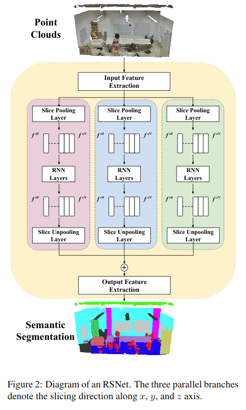
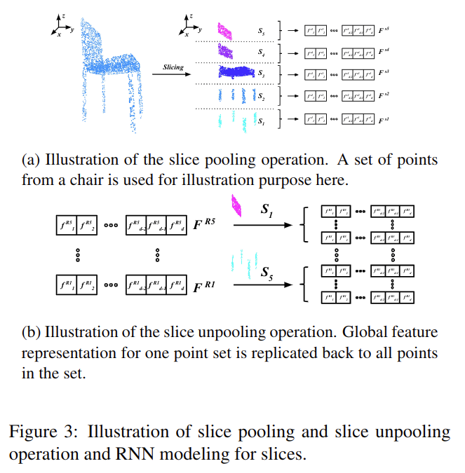
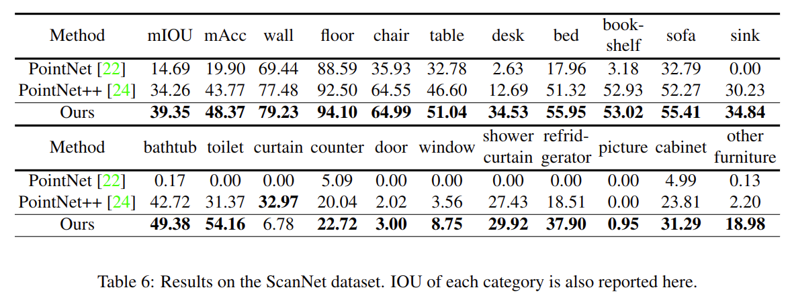
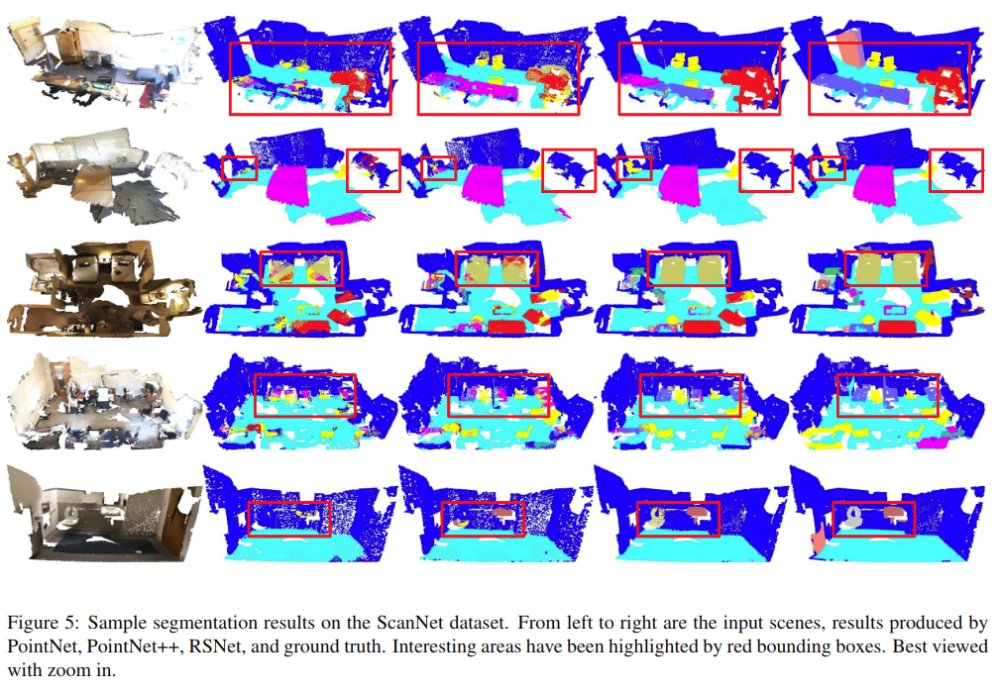

# Recurrent Slice Networks for 3D Segmentation of Point Clouds

元の論文の公開ページ : https://arxiv.org/abs/1802.04402

## どんなもの?
点群をスライスして、そのスライスごとの点を集約して処理するslice pooling層とRNN層を組み合わせたRSNetを提案した。

## 先行研究と比べてどこがすごいの?
PointNet++ではiterate farthest point samplingとボールクエリ、KD-networkではKD-treeによって計算効率がよろしく無く、これは点が増えれば増えるほど著しくなる。著者らはこれらの余分な計算を省きながらも点を直接消費するRSNetを提案した。

## 技術や手法のキモはどこ? or 提案手法の詳細
RSNetの概要図は図2の通り。生の点群を直接消費してセマンティックセグメンテーションを施した点群を出力する。提案のキモはLocal dependency moduleである。

### Independent Feature Extraction
この機構はInput Feature ExtractionとOutput Feature Extractionに組み込まれており、両方のブロックは、各点について独立した特徴表現を生成するために連続した多重$1\times 1$畳み込み層を使用する。

### Local Dependency Module
このモジュールはslice pooling層とRNN層、slice unpooling層によって成り立つ。

#### Slice Pooling Layer
図2に示すとおり、この層は最初に点群をスライスする。スライスする方向はx,y,zの3つ用意されておりそれぞれの方向で同じ処理を行う。この時、各スライスが順序付けられる。次に各スライスの点群ごとで点の特徴を集約(Maxpooling)し、各スライスのグローバル表現を生成する。スライスは図3(a)の通り。

#### RNN layer
生の点群は順序付けられた特徴のスライスに分けられため、これを時系列データとして扱うことができるようになる。そのため、bidirectional RNNsにスライスを順に入れて新たな特徴を得る。出力はbidirectional RNNsの再帰的な出力として出てくるスライスの個数分の特徴である。

#### Slice Unpooling Layer
図3(b)の通り、RNN層で生成された各スライスの特徴をそのスライス中の点群に反映する。

## どうやって有効だと検証した?
S3DIS、ShapeNet、ScanNetのセマンティックセグメンテーションができるデータセットを使って実験している。S3DISの結果は表1の通り、各カテゴリの値はIoUである。ScanNetの結果は表6の通り。ShapeNetのパーツセグメンテーションの結果は表7の通り。

また、ScanNetによる結果で差が出た部分を比較した。視覚的比較は図5の通り、左からPointNet、PointNet++、RSNet、ground truthである。RSNetは細かい部分も処理できることを示している。

表8では、スピードとメモリ消費について載せている。表の局所的特徴を捉えるモデルの中で最も効率が良い。

### 他の実験
切除実験もしている。

## 議論はある?
なし

## 次に読むべき論文は?
- なし

### 論文関連リンク
1. なし

### 会議
CVPR 2018

### 著者
Qiangui Huang, Weiyue Wang, Ulrich Neumann.

### 投稿日付(yyyy/MM/dd)
2018/02/13

## コメント
なし

## key-words
Point_Cloud, Semantic_Segmentation