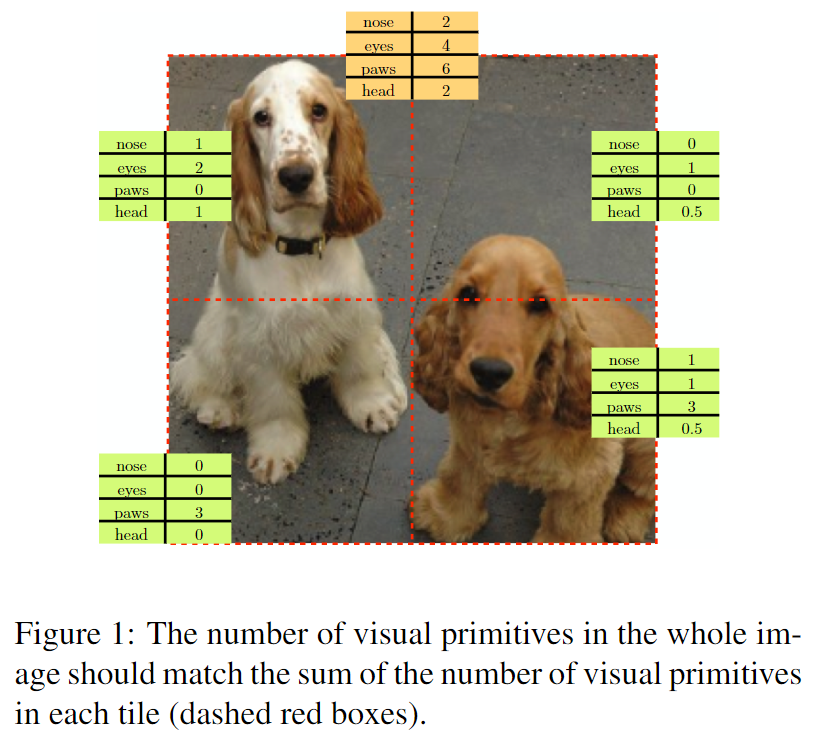
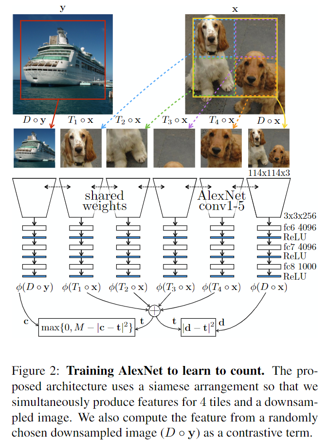
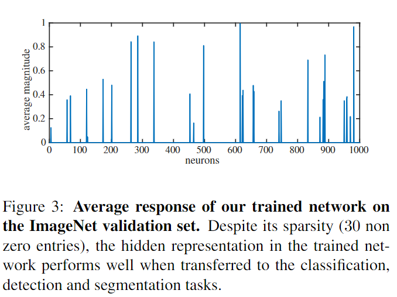
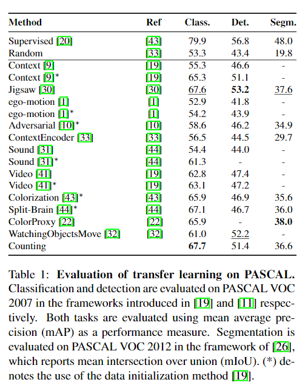
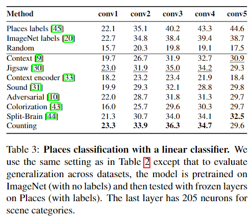

# Representation Learning by Learning to Count

元の論文の公開ページ : https://arxiv.org/abs/1708.06734

## どんなもの?
新たなpretext taskとして、visual primitiveを数えることを提案する。図1の様に元の画像を重ならないように分割しても各領域のvisual primitiveの総計と元画像のvisual primitiveの数は一致しなければならない。この図では、画像上のオブジェクト(nose、eyeなど)をvisual primitiveにして直接数えている様に見えるが、実際には画像中に含まれる特徴のベクトルをvisual primitiveとして使用している。

## 先行研究と比べてどこがすごいの?
画像間の特徴を直接比べているところかな?発想が面白い。

## 技術や手法のキモはどこ? or 提案手法の詳細
### **構造**
visual primitiveには以下の制約がある。
- 画像に含まれるvisual primitiveの数は縮小拡大、併進、回転に対して不変でなければならない。
- 画像全体に含まれるvisual primitiveの数は画像の一部分に含まれるvisual primitiveの数より多くなければならない。

これらの制約から、著者らは画像を重ならないように分割した各画像のvisual primitiveの数の総計と画像全体のvisual primitiveの数を一致させるpretext taskを提案した。著者らは元画像と分割した画像の複雑な関係が(足し算などの)単純な算術計算に変換できるよう(論文関連リンクの2と3)、そのモデルは画像を(深い表現などの)高レベルな因子に分解する必要があるという著者らの仮説を基にしてこのpretext taskを提案している。図2にこのpretext taskを解くためのモデルを示す。

### **Transforming Images to Transform Features**

このpretext taskを解くための具体的な定式を以下に示す。

- カラー画像を${\rm x}\in \mathbb{R}^{m \times n \times 3}$ ($m \times n \times 3 = 全ピクセル \times$RGB)として表す。
- 画像変換を定義する。$\mathcal{G} \overset{\Delta}{=} \{G_1,\ldots,G_J\}$は、$G_j:\mathbb{R}^{m \times n \times 3} \mapsto \mathbb{R}^{p \times q \times 3}$ $(j=1,\ldots,J)$として、画像${\rm x}$を受け取った後にそれらを$p \times q$ピクセルの画像にマッピングする。
- 特徴についても定義する。特徴$\phi:\mathbb{R}^{p \times q \times 3} \mapsto \mathbb{R}^k$は変換された画像がいくつかの$k$次元のベクトルに写像されたものである。
- 最後に特徴変換について定義する。特徴変換$g:\mathbb{R}^k\times \cdots \times \mathbb{R}^k \mapsto \mathbb{R}^k$は$J$個の特徴を受け取り、これらを別の特徴へ写像する。

以上の定義を使い、画像変換の一群$\mathcal{G}とg$が与えられたとき、教師ラベルとして以下の関係を使って特徴$\phi$を学習する。関係を式(1)に表す。

$$
g(\phi(G_1 \circ {\rm x}),\ldots,\phi(G_J\circ{\rm x}))=0 \qquad \forall {\rm x} \tag{1}
$$

これは$G_j({\rm x})で{\rm x}を写像したものを\phiで特徴に写像し、それらをさらに別の特徴へ写像したものである。$

このpretext taskを解くために、変換の一群はダウンサンプリング演算子$D$とtiling演算子$T_j$($j=1,\ldots,4$)を導入している(同じネットワークにこれらの画像を入力するため同じ画像サイズにする)。

- ダウンサンプリング演算子$D$は名前の通り画像を縮小する。
- tiling演算子は$j$番目のタイルを$2\times 2に分割されたタイル$から切り取る。
- この二つの演算子は同じサイズの画像を生成する。

これらより、$\mathcal{G}\equiv\{D,T_1,\ldots,T_4\}$となる。著者らは演算子で変換された画像の特徴の数の望ましい関係を$g{(\rm d, t_1, \ldots, t_4)=d-}\sum_{j=1}^4 {\rm t_j}$として定義する。このとき(理想的な関係として)式(2)の様に書くことができる。

$$
\phi(D \circ{\rm x})=\sum_{j=1}^4\phi(T_j\circ{\rm x}) \tag{2}
$$

著者らは式(2)をvisual primitivesを数えることができる特徴$\phi$を学習させるためのmain building blockとして使う。

### **Learning to Count**
式(3)の様にvisual primitiveの数の差を損失関数とする。

$$
\ell({\rm x}) = |\phi(D \circ {\rm x})-\sum_{j=1}^4 \phi(T_j\circ{\rm x})|^2 \tag{3}
$$

しかし、式(3)ではtrivial solutionとして$\forall z, \ \phi(z)=0$で簡単に最小値を取ることができる。そのため、図3の様に特徴マッピングの多くのentryが0になる(ImageNetとCOCOでそれぞれトレーニングした後の非ゼロのentryは1000個中30~44個しかなかった)。これを防ぐため、別の画像と違うような$\phi$の値を算出させるように式(3)に制約を加えたものを式(4)に示す。

$$
\ell_{con}({\rm x,y}) = |\phi(D \circ {\rm x})-\sum_{j=1}^4 \phi(T_j\circ{\rm x})|^2 + \max\{0,M-|\phi(D \circ {\rm y})-\sum_{j=1}^4 \phi(T_j\circ{\rm x})|^2\} \tag{4}
$$

## どうやって有効だと検証した?
### **Transfer Learning Evalution**
先にpretext taskとImageNetのデータセットを使って提案したネットワークを訓練する。
- **Fine-tuning on PASCAL**  
  PASCAL VOC 2007とVOC 2012を使った分類、検知、セグメンテーションタスクに対して訓練したネットワークをfine-tuningした結果は表1の通り。

  

- **Linear Classification on Places and ImageNet**  
  論文関連リンクの4で導入されている評価を取り入れた。ネットワークをpretext taskで訓練させ、固定させた層のtopとImageNetもしくはPlaceデータセットを使って線形分類器を学習させ、分類タスクを行う。結果は表2と表3の通り。placeの時、教師あり学習よりも良い結果を残している。

  

  

### **その他**
切除実験や近傍検索などの分析を行っている。

## 議論はある?
この提案手法は半教師あり学習に加えて、ほかの変換やタスクに拡張することが可能である。

## 次に読むべき論文は?
- なし

### 論文関連リンク
1. [鈴木智之. 教師なし画像特徴表現学習の動向 {Un, Self} supervised representation learning (CVPR 2018 完全読破チャレンジ報告会). pp.23. (アクセス:2019/03/03).](https://www.slideshare.net/cvpaperchallenge/un-self-supervised-representation-learning-cvpr-2018)
1. [Y. Bengio, G. Mesnil, Y. Dauphin, and S. Rifai. Better mixing via deep representations. InICML, 2013.](https://arxiv.org/abs/1207.4404)
2. [A. Radford, L. Metz, and S. Chintala. Unsupervised representation learning with deep convolutional generative adversarial networks. InICLR, 2016.](https://arxiv.org/abs/1511.06434)
4. [R. Zhang, P. Isola, and A. A. Efros. Colorful image colorization. InECCV, 2016.](https://arxiv.org/abs/1603.08511)

### 会議
ICCV 2017

### 著者
Mehdi Noroozi, Hamed Pirsiavash and Paolo Favaro.

### 投稿日付(yyyy/MM/dd)
2017/08/22

## コメント
論文関連リンク1様様。

## key-words
Self-supervised,2D_Image