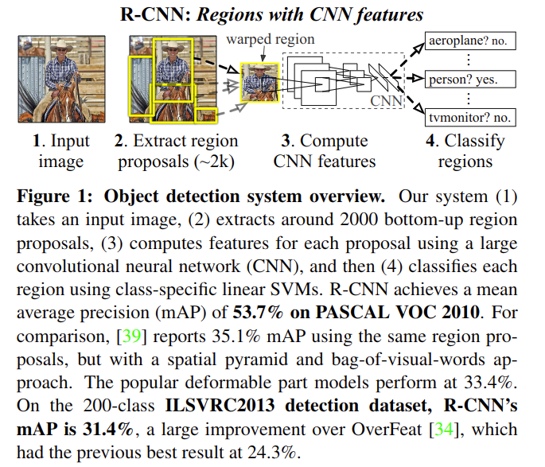

# Rich feature hierarchies for accurate object detection and semantic segmentation

元の論文の公開ページ : [arxiv](https://arxiv.org/abs/1311.2524)
Github Issues : [#59](https://github.com/Obarads/obarads.github.io/issues/59)

## どんなもの?
R-CNNと呼ばれる画像用のオブジェクト検出フレームワークを提案した。CNNとregion proposals(領域提案)を用いて検知を行う。

## 先行研究と比べてどこがすごいの?
省略

## 技術や手法のキモはどこ? or 提案手法の詳細
この物体検知システムは以下の3つのモジュールから成り立つ。

1. カテゴリに依存しない領域提案を生成するモジュール。提案はこの検知器で利用できる一連の検知候補を定義する。
2. それぞれの領域から固定長の特徴ベクトルを抽出するための大型畳み込みネットワークを含むモジュール。
3. 一連のクラスを特定する線形SVMを含むモジュール。

以下にそれぞれのモジュールやそれに関する設計を説明する。

### Module design
#### Region proposals
領域提案手法は既にいくつもある。R-CNNは特定の領域提案手法に依存しないため、比較のためにselective search(論文関連リンクの2,3)を使用する。

#### Feature extraction
CNNを使ってそれぞれの領域提案から4096次元の特徴を抽出する。特徴はmean-subtraced(前処理の一種) 227\*227RGB画像から5つの畳込み層と2つの全結合層から計算される。

  提案領域の特徴を計算するため、領域の画像データをCNNに適応可能な形に変換する。任意の形状の領域の大抵の可能な変換のうち、もっとも単純な方法を取る。図1のwraped regionの様に候補領域のサイズやアスペクト比に関係なく、求められるサイズに拡大縮小する。変形させる前に、オリジナルの領域の周りに変形画像コンテキストとしてpピクセル拡張する(変形前の領域の高さ,幅のそれぞれにpピクセル分足した領域を得る、論文ではp=16)。

  

### Test-time detection
テスト時の流れは図1の様になる。selective searchを使って約2000の領域提案を行い、領域は変形され、CNNを介して特徴となり、これらの特徴で訓練されたSVMに入力され分類される。画像内全ての領域に得点がつけられた後に、学習された閾値より大きな得点を持つ領域と重複するIoUを持つ領域をはじく、non-maximum suppression(論文関連リンクの4)(個別に各オブジェクトに対して)を適応する。

#### Run-time analysis
  2つの高膣的な検知の提案をする。

1. 全てのCNNパラメータは全てのカテゴリー間で共有される(計算の高速化)。
2. 他の一般的なアプローチと比べて、CNNによって計算された特徴ベクトルは低次元とする(メモリの節約)。

以降省略  
他にも事前学習やfine-tuningについて書かれている。

## どうやって有効だと検証した?
省略

## 議論はある?
省略

## 次に読むべき論文は?
- [R. Girshick, “Fast R-CNN,” inIEEE International Conference on Computer Vision (ICCV), 2015.](https://arxiv.org/abs/1504.08083)

## 論文関連リンク
1. [最新のRegion CNN(R-CNN)を用いた物体検出入門 ~物体検出とは? R-CNN, Fast R-CNN, Faster R-CNN, Mask R-CNN~ - Qiita](https://qiita.com/arutema47/items/8ff629a1516f7fd485f9)
2. [J. Uijlings, K. van de Sande, T. Gevers, and A. Smeulders. Selective search for object recognition. IJCV, 2013.](http://www.huppelen.nl/publications/selectiveSearchDraft.pdf)
3. [X. Wang, M. Yang, S. Zhu, and Y. Lin. Regionlets for generic object detection. InICCV, 2013.](http://users.eecs.northwestern.edu/~mya671/mypapers/ICCV13_Wang_Yang_Zhu_Lin.pdf)
1. [物体検出におけるNon-Maximum Suppressionのアルゴリズム | meideru blog](https://meideru.com/archives/3538)

## 会議
CVPR 2014

## 著者
Ross Girshick, Jeff Donahue, Trevor Darrell, Jitendra Malik

## 投稿日付(yyyy/MM/dd)
2013/11/11

## コメント
こんな説明より論文関連リンクの1を見たほうが早い。また、アーキテクチャの把握のためだけに読んでいるため、省略多め。

## key-words
RGB_Image, Detection

## status
省略