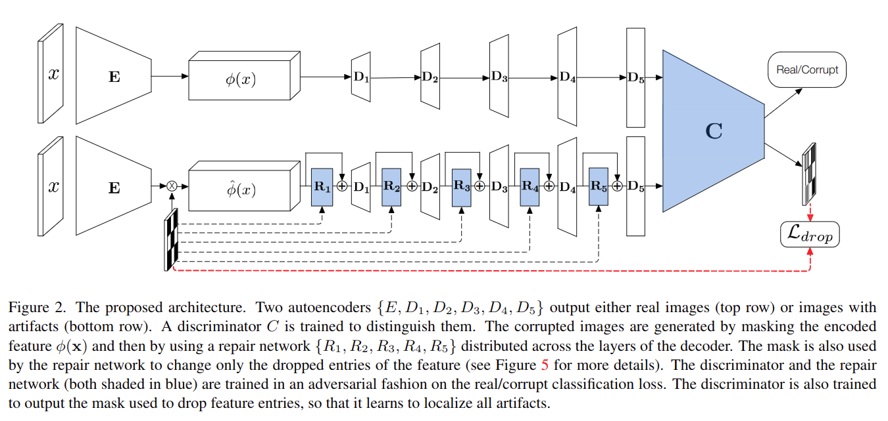

# Self-Supervised Feature Learning by Learning to Spot Artifacts

元の論文の公開ページ : https://arxiv.org/abs/1806.05024

## どんなもの?

## 先行研究と比べてどこがすごいの?

## 技術や手法のキモはどこ? or 提案手法の詳細
提案手法のモデル図は図2の通り。このモデルは$x$を入力とするエンコーダー$E$とデコーダー$\{ D_1, D_2, D_3, D_4, D_5 \}$で構成された2つのオートエンコーダーと、$E$の特徴出力に適応される空間マスク$\Omega$、本物の画像$\bf{x}$と偽物の画像${\hat{\bf x} }$を見分ける識別器$C$、リペアネットワーク$\{R_1, R_2, R_3, R_4, R_5\}$によって成り立っている。  
このリペアネットワークと識別器は本物もしくは偽物画像の分類損失による敵対的手法で訓練される。

### Learning to Spot Artifacts
この研究では、偽物の画像の破損レベルを制御する方法を活用する。よって、本物の画像と破損した画像を識別できるように分類器を訓練する(このタスクを解くことで分類器がオブジェクト分類などの他タスクで有用になるような特徴を学習することを願いながら)。また、自明な特徴(trivial feature)についての学習の回避方法についても述べる。

#### The Damage & Repair Network
著者らのアプローチは、あまり非現実的ではないが破損している画像を作成することを目標としており、そうしなければ、低レベルな統計値(多分、trivial solution)を検知するだけで本物かそうでないかを見分けることができるようになる。また、分類器の堅牢性を高めるために可変的な画像作成も行えるようにする。  
この後者の問題に対処するため、既存のデータセットの本物の画像をランダムに破損させる。そして以下の手順を踏む。
1. 特徴表現破損後、低レベルな細部だけを修復する。

## どうやって有効だと検証した?

## 議論はある?

## 次に読むべき論文は?
- なし

## 論文関連リンク
1. [鈴⽊智之. Self-supervised Learningによる特徴表現学習. (アクセス日時 2019/04/22)](http://hirokatsukataoka.net/temp/cvpaper.challenge/SSL_0929_final.pdf)

## 会議
CVPR 2018

## 著者
Simon Jenni, Paolo Favaro.

## 投稿日付(yyyy/MM/dd)
2018/07/13

## コメント
なし

## key-words
2D_Image, Self-supervised

## status
未完