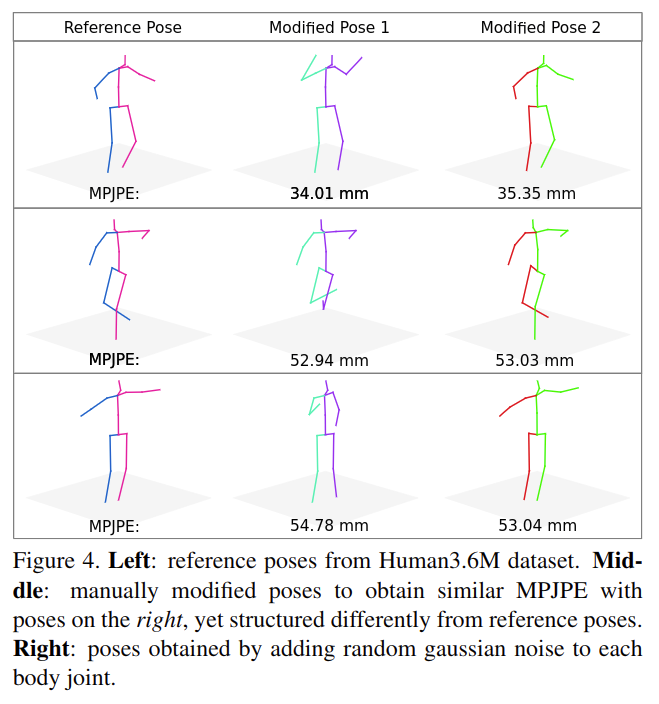

# Self-Supervised Learning of 3D Human Pose using Multi-view Geometry

元の論文の公開ページ : [arxiv](https://arxiv.org/abs/1903.02330)  
Github Issues : [#125](https://github.com/Obarads/obarads.github.io/issues/125)

## どんなもの?
3D ground truthデータとカメラの外部パラメータを使用せずに、マルチビュー画像(複数の視点からの画像)と事前訓練された2D人姿勢推定器を用いて3D人姿勢推定器を訓練する手法を提案した。この手法を著者らはEpipolarPoseと呼ぶ。また、姿勢推定モデルの評価基準としてPose Structure Score (PSS)を提案した(ただし、この評価基準は損失関数に導入できない)。

貢献は以下の通り。

- 著者らが提案したEpipolarPoseは1枚の画像から3D人姿勢推定を行うことができる手法である。EpipolarPoseは3D教師データやカメラの外部パラメータを必要としない。この手法はエピポーラ幾何学と2D教師データを用いて3D教師データを作成する。
- 著者らは3D人姿勢推定の弱/自己教師あり学習手法においてSOTAを達成した。
- 著者らが提案したPose Structure Score (PSS)は3D人姿勢推定における新しい評価基準である。

[※　一枚の画像から推定を行える方法...? 複数では?]

## 先行研究と比べてどこがすごいの?
3D人姿勢推定において、大半の既存の手法は3D教師データを使う、もしくは2D教師データと追加のデータ(カメラ外部パラメータなど)を必要とする。弱/自己教師あり学習の中で唯一、Droverらの手法[1]は本提案と同じく、3D教師データも追加のデータも使わずに2D教師データだけで3D人姿勢推定を行えるようにしている。本提案ではDroverらの手法よりも精度が改善された手法を提案する。

既存の3D人姿勢推定評価手法については、MPJPE(関節位置誤差の平均)やPCK(正しいキーポイントのパーセンテージ)があるが、これらは各関節を個々に扱っている影響で全体的な姿勢に着目した評価を行うことができていない。図4はMPJPEによる評価を行っているが、姿勢がかなり異なるにもかかわらずあまり評価が変わらない。

[※ 1と2章で既存研究の話が読みやすかった]

## 技術や手法のキモはどこ? or 提案手法の詳細

## どうやって有効だと検証した?

## 議論はある?

## 次に読むべき論文は?
- なし

## 論文関連リンク
1. [Dylan Drover, Rohith MV, Ching-Hang Chen, Amit Agrawal, Ambrish Tyagi, and Cong Phuoc Huynh. Can 3d pose be learned from 2d projections alone? European Con-ference on Computer Vision Workshops, 2018.](http://openaccess.thecvf.com/content_ECCVW_2018/papers/11132/Drover_Can_3D_Pose_be_Learned_from_2D_Projections_Alone_ECCVW_2018_paper.pdf)

## 会議
CVPR 2019

## 著者
Muhammed Kocabas, Salih Karagoz, Emre Akbas

## 投稿日付(yyyy/MM/dd)
2019/03/06

## コメント
なし

## key-words
3D_Estimation, Self-Supervised_Learning, CV, Paper, Multi-View

## status
導入

## read
A, I, R

## Citation
