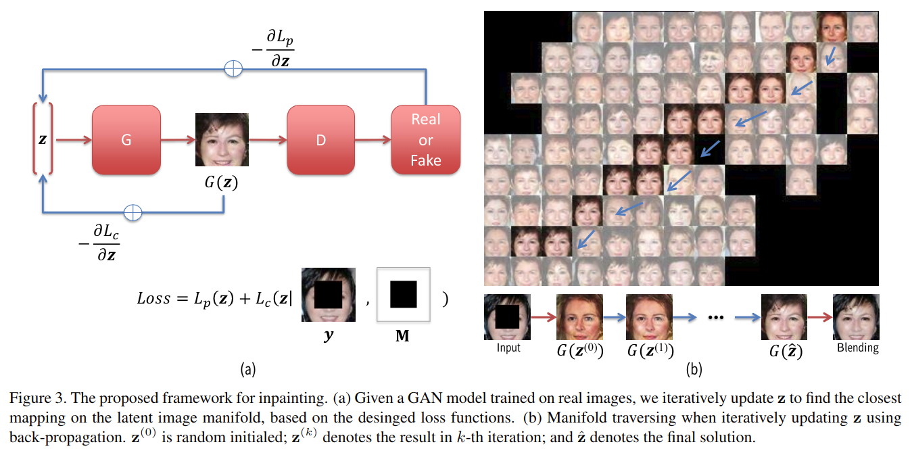

# Semantic Image Inpainting with Deep Generative Models

元の論文の公開ページ : [arxiv](https://arxiv.org/abs/1607.07539)  
Github Issues : 

## どんなもの?
画像に大きな欠損があるとき、その欠損の周囲のピクセルコンテキストに基づいてその欠損を意味的に修復するGANを提案した。

本提案では深層生成モデル(実装はGAN)を訓練した後に、潜在空間中の

## 先行研究と比べてどこがすごいの?

## 技術や手法のキモはどこ? or 提案手法の詳細
提案手法では、損傷していない画像を用いて識別器$D$と生成器$G$を訓練する。訓練後は、生成器$G$は$p{\mathbf{z}}$から引き出された点$\mathbf{z}$を取り、$p_ {data}$から画像の模倣サンプルを生成する。
このとき本提案手法において、$G$が表現において効率化されているのであるなら、$p_{data}$上に存在しない画像(破損した画像など)は学習された符号化多様体$z$上に存在するべきではないと仮定する。そのため、図3に示すように著者らは多様体に制限されながら破損した画像に近い符号$\hat{z}$を回復することを目的とする。

## どうやって有効だと検証した?

## 議論はある?

## 次に読むべき論文は?
- なし

## 論文関連リンク
1. なし

## 会議
CVPR 2017

## 著者
Raymond A. Yeh, Chen Chen, Teck Yian Lim, Alexander G. Schwing, Mark Hasegawa-Johnson, Minh N. Do

## 投稿日付(yyyy/MM/dd)
2016/07/13

## コメント
なし

## key-words
2D_Image, GAN

## status
未完

## read
A, I

## Citation
