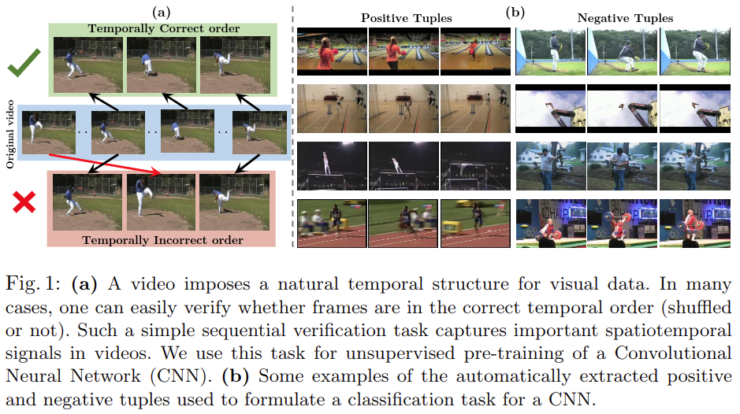

# Shuffle and Learn: Unsupervised Learning using Temporal Order Verification

元の論文の公開ページ : [arXiv](https://arxiv.org/abs/1603.08561)  
Github Issues : 

## どんなもの?
ビデオのフレームを並べたタプルを用意し、そのタプル内のフレームが入れ替えられていないかどうか判定することでネットワークを訓練するSelf-Supervised Learning手法を提案した。

## 先行研究と比べてどこがすごいの?

## 技術や手法のキモはどこ? or 提案手法の詳細
入力されるタプルは図1の通り。元のビデオからいくつかのフレームを抜き取り、それをただ並べたもの(ポジティブタプル)と入れ替えたもの(ネガティブタプル)を用意する。

一つのタプルにつき3つのフレームを使う。視覚的な変化があまりないフレームの組み合わせは曖昧な訓練データとなるため、オプティカルフロー[1]を用いてフレーム間の変化が激しい部分を使用する。  
また、データもただ無作為に並べ替えるわけではなく

## どうやって有効だと検証した?

## 議論はある?

## 次に読むべき論文は?
- なし

## 論文関連リンク
1. [Farneback, G.: Two-frame motion estimation based on polynomial expansion. In: Image analysis. Springer (2003)](http://www.diva-portal.org/smash/get/diva2:273847/FULLTEXT01.pdf)

## 会議
ECCV 2016

## 著者
Ishan Misra, C. Lawrence Zitnick, Martial Hebert.

## 投稿日付(yyyy/MM/dd)
2016/03/28

## コメント
なし

## key-words
Video, Self-Supervised_Learning

## status
未完

## BibTex
