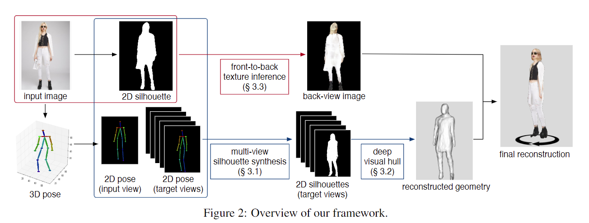
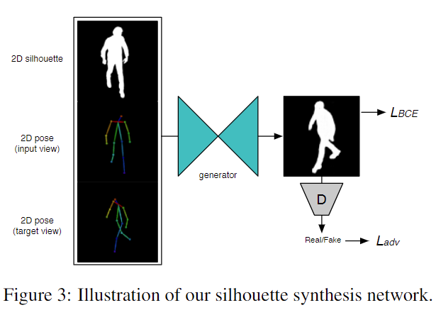

# SiCloPe: Silhouette-Based Clothed People

元の論文の公開ページ : https://arxiv.org/abs/1901.00049

## どんなもの?
正面像が映った1枚の2D画像から3Dの服を着た人の形状を推定するモデルを提案した。

## 先行研究と比べてどこがすごいの?

## 技術や手法のキモはどこ? or 提案手法の詳細
### **構造**
提案モデルの構造は図2の通り。はじめに与えられた2D画像から2Dシルエットと3D joint locations(複数の関節位置)からなる3Dポーズを抽出する。

### **Multi-View Silhouette Synthesis**
変形や異なる服のタイプ等を起因とする形状の複雑さを対処することができる効果的な人間形状表現を見つける。そこで、入力の視点とは別の視点からの合成2Dシルエットを生成する、silhouette synthesis networkを提案する。概要図は図3の通り。このシルエットは、3D推定のために潜在的な中間表現として使われる。入力には入力画像のシルエット${\bf S}_ s$と推定した3Dポーズを入力画像に反映させた2Dポーズ${\bf P}_ s$、推定した3Dポーズを元に入力とは違う別の視点から被写体を映した2Dポーズ群${\bf P}_ t$を用いる。この時、$P_ t$に対応する2Dシルエット群${\bf S}_ t$はsilhouette synthesis networkにより式(1)のようにあらわされる。

$$
{\bf S}_ t = \mathcal{G}_ s({\bf S}_ s,{\bf P}_ s,{\bf P}_ t) \tag{1}
$$

この時、$\mathcal{G}_ s$の

## どうやって有効だと検証した?

## 議論はある?

## 次に読むべき論文は?
-
-

### 論文関連リンク
1.
2.

### 会議
CVPR 2019

### 著者
Ryota Natsume, Shunsuke Saito, Zeng Huang, Weikai Chen, Chongyang Ma, Hao Li, Shigeo Morishima.

### 投稿日付(yyyy/MM/dd)
2018/12/31

## コメント
なし

## key-words
2D_Image, 3D_Estimation, 