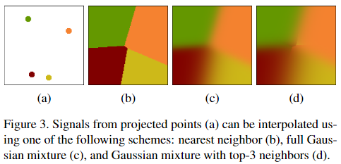
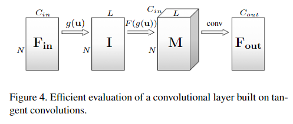
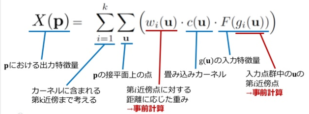
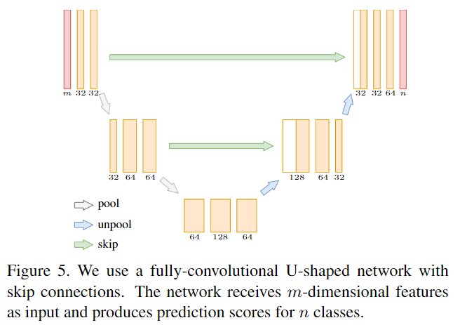
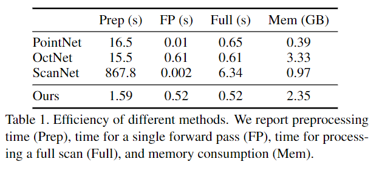

# Tangent Convolutions for Dense Prediction in 3D

## どんなもの?
tangent convolutionの概念に基づいて表面の畳み込みネットワークのための代替構成を開発した。隠れている表面を必要とせず、近似的な法線ベクトル推定をサポートしている任意の形式(点群、メッシュ、polygon soup)で扱える。
tangent convolutionは点の周りの接平面に局所表面形状を映すことに基づいている。これにより接平面画像を作れる。これらの接平面画像は通常の2Dの畳み込みとして扱われる。tangent convolutionを基礎構成として、U-type networkを設計した。

## 先行研究と比べてどこがすごいの?
大規模点群を含む現実世界で取ったデータを処理できる。

## 技術や手法のキモはどこ?

接平面画像と呼ばれる点の配置から形成されるおおよその平面を画像とみなし、処理する。処理の仕方は以下の様になっている。

- **連続したカーネルを用いた畳み込み**  
    P={p}が点群、F(p)がP上のシグナル(点を別の形に変換したもの)で表された離散スカラー関数(点を別の形に変換しただけで、点と点はつながっていないため、詳しくは後述)である。F(p)は色や配置、抽象化した特徴(例えばPPFとか?)を中間層から符号化できる。Fを畳み込むためにこれを連続した関数に拡張する必要がある。なぜかというと、このtagent convolutionは点の配置から接平面を生成し、それを接平面画像(点の位置やその他方法を投影した2D画像)として扱う際に、そのままだと下のfig3の(a)の様に離散的な状態でしか表されず空白の部分がほとんどとなる。これをfig3の(b)や(c)、(d)の様に連続した表現にしてやることで空白の部分が埋まるようになるためである。  
    接平面の法線npがpから伸びており、連続化させたシグナルをS(u)、u∈R**2をπp上の点とし、Sを接平面画像とするとpについてのtangent convolutionは式(1)のようになる。

    
    
- **接平面推定**  
    まずは各点pについて、局所共分散分析を使ったカメラ画像の向きを推定する。
    ||p-q||<Rに当てはまるpを中心とする球内にある近隣点qがあるとき、接平面の向きは共分散行列Cの固有ベクトルによって決定される。Cは以下の通り。  

    

    最小固有値の固有ベクトルは推定された法線平面を定義し、他の固有ベクトルiとjは接平面画像をパラメータ化する2D画像軸を定義する。

- **補完**  
    次にpの近隣点qを接平面画像に投影する。fig2の様にqはFを介して接平面画像に投影され、投影されたqをv、接平面画像S(v)とすると式(2)となる。

    

    

    次は接平面画像の保管である。fig3の(a)は何の補完もしていない接平面画像である。(a)のままだと空白の部分がほとんどなので、補完を行う。

    

    補完を行う式は式(3)である。補完はnearest neighbor(以下NN)とGussian kernel mixtureの2種類を考えた。式(4)はNNでありfig3では(b)の様になり、式(5)はGaussian kernel mixtureでありfig3では(c)のようになる。なお、Σ_v w=1となるように正規化する。

    

    

    提案した補完形式以外のより優位な形式については、特に考察していない。また、大抵の場合は単純な形式であるNNを使うと述べている。  
    式(1)に式(2)と(3)をまとめ合わせた最終的なtagent convolutionの式は式(6)のようになる。

    

大規模点群を扱う以上、効率性も上げなければならない。

- **効率化**  
    式(4)を使うとして、畳み込みカーネルcを画像に適応するカーネルとして、g(u)は画像上にあるuの最近傍に投影する点(?)を返すとすると、式(6)は以下の式(7)の様に書き直せる。なお、gは点群の配置のみに依存する。そのため、事前計算が可能である。

    

    ここでC_inチャンネルとN個の点群入力が行われ、l*lの接平面画像が生成され且つL=l**2であるとき、tangent convolutionの効率的な畳み込み層の構造は下のfig4の通りであり、目的はF_inをF_outに変換することである。

    

    ここで効率的な計算を行うために、fig3の(d)のGaussian mixture with top-3 neighborsを定義、使用する。これは式(4)と(5)を合体させたものであり定義は式(8)の通り。当然、Σ_v w=1となるように正規化する。

    

    Gaussian mixture with top-3 neighborsを使った(7)の式は式(9)、式(10)へと書き換えることができる。

    

    式(10)の内訳は論文参考リンクの1がわかりやすい。下の図は論文参考リンクの1の図の引用。

    

- **アーキテクチャ**  
    点群はグリッドにそって分けられ、分けられた区間内に複数の点がある場合はそれらの点の平均点を取り、複数の点を平均点に置き換える(多分ボクセルダウンサンプリングと同じ)。これはpoolを得るごとに解像度(グリッドの長さ)は2倍荒くなる(5cm->10cm->20cm)。unpoolはpoolと逆のことをする。これらの図はfig5である。

    

## どうやって有効だと検証した?
S3DIS、ScanNetとSemantic3Dを使い測定した。効率性も測定している。結果は以下の通り。

## 議論はある?
なし

## 次に読むべき論文は?
- 
-

### 論文関連リンク
1.https://www.slideshare.net/naoyachiba18/ss-120302579

### 会議

### 著者/所属機関
Maxim Tatarchenko, Jaesik Park, Vladlen Koltun, Qian-Yi Zhou

### 投稿日付(yyyy/MM/dd)
2018/12/21

## コメント
IとM、アーキテクチャがわかりませんでした...