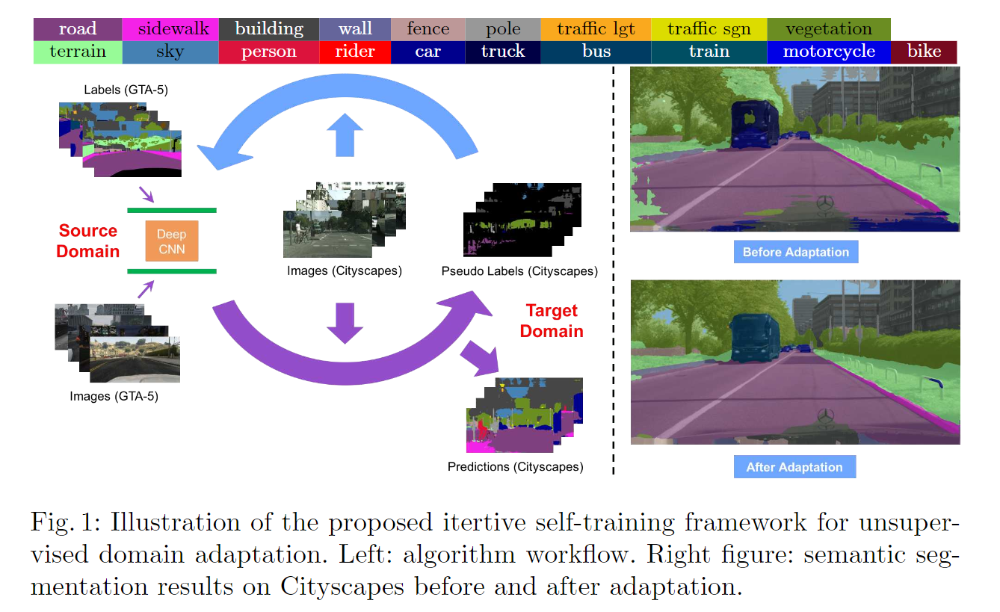
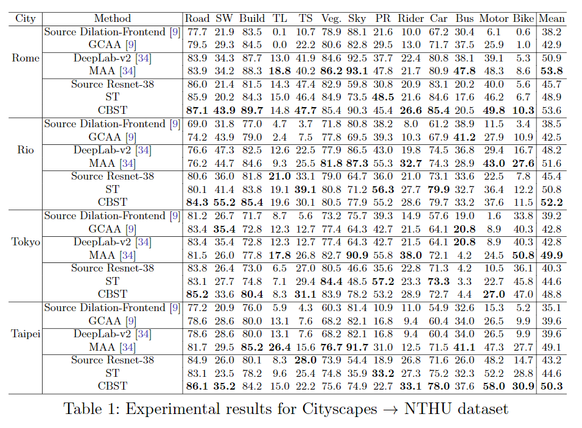
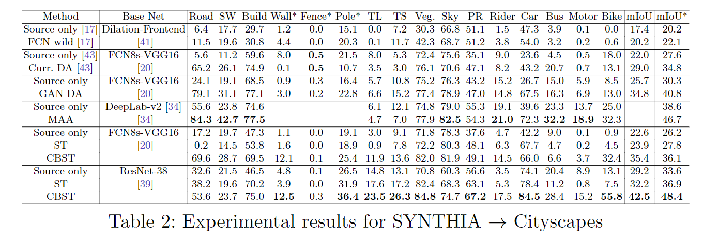
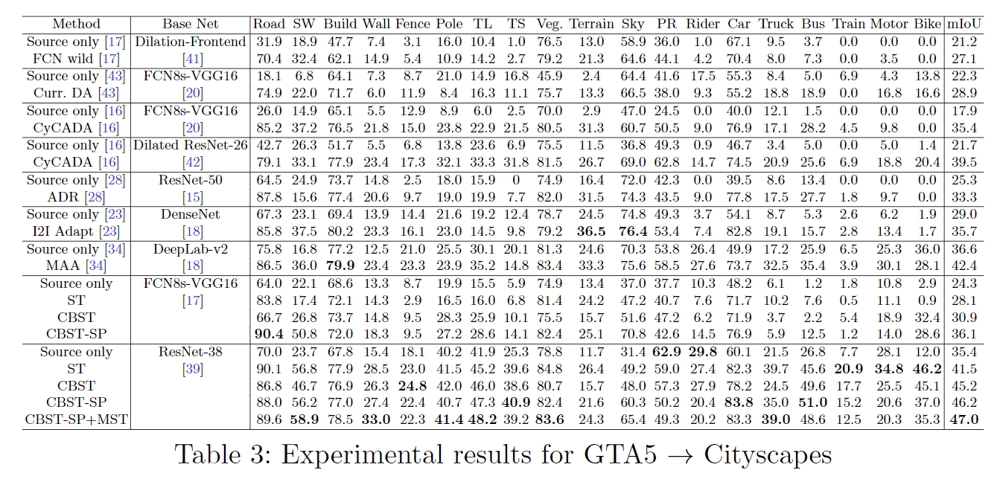
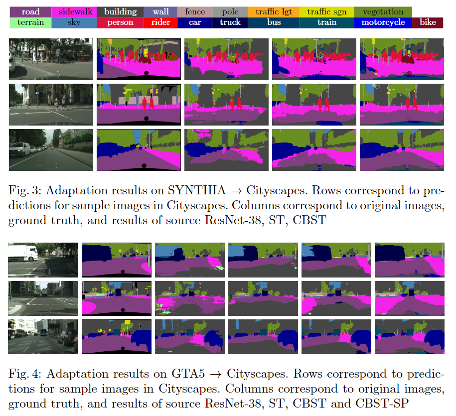

# Unsupervised Domain Adaptation for Semantic Segmentation via Class-Balanced Self-Training

元の論文の公開ページ : [cvf](http://openaccess.thecvf.com/content_ECCV_2018/html/Yang_Zou_Unsupervised_Domain_Adaptation_ECCV_2018_paper.html
)  
Github Issues : [#34](https://github.com/Obarads/obarads.github.io/issues/34)

## どんなもの?
教師なし学習によるセマンティックセグメンテーションのためのドメイン適応を行う。論文では、自動運転関係のデータセットに関するドメイン問題に対して、GANを使わない教師なしドメイン適応手法を提案している。

## 先行研究と比べてどこがすごいの?
手間(ラベル付け)の問題より、本研究では教師なしドメイン適応について研究する。教師なしドメイン適応ではGANを用いた手法が最近成功を収めているが、本研究ではGANを使用せず、それらと同等かそれ以上の結果を出すself-trainingを導入したセマンティックセグメンテーションのための学習手法を提案する。

## 技術や手法のキモはどこ? or 提案手法の詳細
### Self-training (ST) with self-paced learning
ソースドメイン(モデルが学習したドメイン)をターゲットドメイン(目標のドメイン)に適合させるために必要となるターゲットドメインの教師ラベルの代わりに疑似ラベルを生成する。しかし、疑似ラベルは教師ラベルと比べてラベルが正確なものであるかどうか保証が取れないため、問題がある。  
そこで、最も信頼性が高い予測から疑似ラベルを生成し、その疑似ラベルが正しいことを願って、「簡単から徐々に難しく」なるスキームであるカリキュラム学習[1]に従う。このモデルが更新されよりターゲットドメインに適合すると、スキームは残った疑似ラベルを先ほどよりも信頼性の低いものから探す。これらの要素を含むself-training(ST) formulationは式(3)のようになる。

$$
\min_{\bf w, \hat{y}}\mathcal{L}_ {ST}({\bf w,\hat{y} })=-\sum_ {s=1}^S\sum_ {n=1}^N {\bf y}_ {s,n}^{\mathrm T}\log({\bf p}_ n({\bf w},{\bf I}_ s))
-\sum_ {t=1}^T\sum_ {n=1}^N [{\bf \hat{y} }_ {t,n}^{\mathrm T}\log({\bf p}_ n({\bf w},{\bf I}_ t))+k|\hat{y}_ {t,n}|_ 1] \tag{3}
$$

$$
s.t. \ \hat{y}_ {t,n} \in \{\{e^{(i)}|e^{(i)}\in\mathbb{R}^C\}\cup 0\}, \forall t,n \\
k>0
$$

ここで、${\bf y}_ {s,n}$と$\hat{\bf y}_ {t,n}$はそれぞれソースドメインの教師ラベルとターゲットドメインの疑似ラベルの集合、${\bf I}_ s$はソースドメイン内の画像のインデックス$s=1,2,\ldots , S$、$\bf w$はネットワークの重み、${\bf p}_ n(・,・)$はピクセル$n(n=1,2,\ldots , N)$ごとのクラス確率を含むソフマックス出力である。  
この式の第1項はソースドメインの損失、第2項は疑似ラベルを使ったターゲットドメインの損失である。$\hat{y}_ {t,n}$(論文中では$y_ {s,n}$とあるがおそらくミス)をモデルトレーニング中の疑似ラベル無視を誘発する0として割り振るとき、全ての疑似ラベルを無視するという単純な解決を回避するために$L_ 1$正則化($k$はその調節値)が第2項に含まれている。  
また、式(3)で最小値を得るために以下2つのステップを踏む。

1. wを固定(初期化)し、式(3)の$\hat{\bf y}_ {t,n}$について損失を最初化する。
2. $\hat{\bf y}_ {t,n}$を固定し、式(3)の$\bf w$について最適化する。

著者らはこの1と2のステップを1ラウンドとして、ラウンドを繰り返し行うSTアルゴリズムを提案する。直感的に、1はターゲットドメインからの疑似ラベルの選択、2は1で与えられた疑似ラベルによるネットワークの訓練である。  
このアルゴリズムによってGTA5->Cityscapesに適応したものを図1に示す。

また、ステップ1で必要となるnonlinear integer programmingや$\hat{\bf y}_ {t,n}$の条件分岐(この時、$k$は疑似ラベルの最適化で閾値として使われる)などについて書かれている(省略)。

### Class-balanced self-training (CBST)
STをそのまま適応すると、他ドメインでも判別しやすい(信頼性が高い)ようなクラスの疑似ラベルが生成されていき、クラスの偏りが生まれてしまう。そこで、クラスの信頼度のバランスをとるためにクラス$c$で選択された疑似ラベルの割合を決定するパラメーター$k_ c$を導入し、Class-balanced self-training(CBST)を定義する。疑似ラベル生成にも、正規化するために$k _c$が影響してくる。

### Self-paced learning policy design
#### Determination of k in ST
各ラウンドにおける疑似ラベルの割合をコントロールするために、ST内で使われている$k$の値の決定アルゴリズムを導入している。

#### Determination of kc in CBST
ST同様に、CBSTにも$k_ c$の値を決定するためのアルゴリズムを導入する。

### Incorporating spatial priors
舗装道路の情報をモデルに適応させるために、空間的な事前知識を使う。ターゲットドメインとソースドメインの内容がよく似ている(例:空が上にあり、道路が下にあるという情報)場合、これらがモデルの適合に役に立つと考えられる。よって、[2]と同様に空間事前分布を導入する。事前空間分布は提案されたCBSTに組み込まれ、CBST-SPとして扱われる。

## どうやって有効だと検証した?
### Small shift: cross city adaptation
現実世界の都市のデータセットを使った適応実験を行う。表1はCityspcapesデータセットからNTHUデータセットへの適応。どちらも都市風景のデータセットであり、NTHUにはローマ、リオ、東京、台北のデータのデータが含まれている。数値はクラスごとのIoU値とそれらの平均IoU値である。

### Large Shift: synthetic to real adaptation
合成(非現実)データセットから現実のデータセットへの適応実験を行う。表2はSYNTHIAデータセットからCityspcapesデータセットへの適応。表2のmIoUはIoUの平均値を示す。表3はGTA5からCityscapesへの適応結果を示す。図3,4は合成データからの現実データへの適応結果の視覚化。

## 議論はある?
なし

## 次に読むべき論文は?
- [Bousmalis, K., Trigeorgis, G., Silberman, N., Krishnan, D., Erhan, D.: Domain separation networks. In: Advances in Neural Information Processing Systems. pp. 343–351 (2016)](https://arxiv.org/abs/1608.06019)

## 論文関連リンク
1. [祥孝 牛久, Curriculum Learning (アクセス日時:2019/03/16).](https://www.slideshare.net/YoshitakaUshiku/20150530-kantocv-curriculumlearning)
2. [Silberman, N., Fergus, R.: Indoor scene segmentation using a structured light sen-sor. In: Computer Vision Workshops (ICCV Workshops), 2011 IEEEInternational Conference on. pp. 601–608. IEEE (2011)](http://citeseerx.ist.psu.edu/viewdoc/download?doi=10.1.1.365.9764&rep=rep1&type=pdf)
3. [Chen, Y.H., Chen, W.Y., Chen, Y.T., Tsai, B.C., Frank Wang, Y.C., Sun, M.: No more discrimination: Cross city adaptation of road scene segmenters. In: The IEEE International Conference on Computer Vision (ICCV) (Oct 2017)](https://yihsinchen.github.io/segmentation_adaptation/)

## 会議
ECCV 2018

## 著者
Yang Zou, Zhiding Yu, B.V.K. Vijaya Kumar, and Jinsong Wang.

## 投稿日付(yyyy/MM/dd)
2018/10/18

## コメント
なし

## key-words
Unsupervised_Learning, Domain_Adaptation, RGB_Image, CV, Paper

## status
更新済