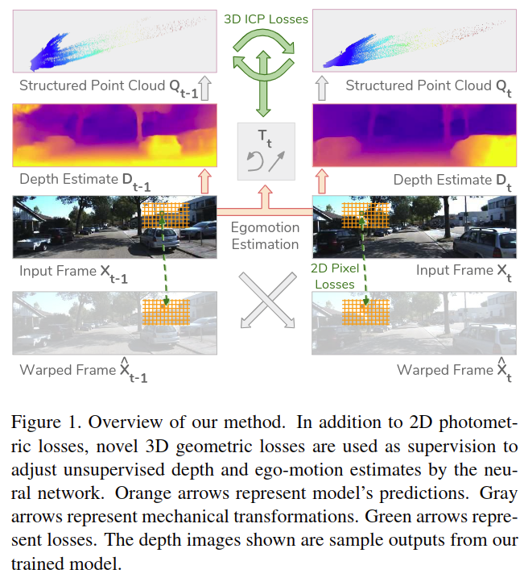

# Unsupervised Learning of Depth and Ego-Motion from Monocular Video Using 3D Geometric Constraints

元の論文の公開ページ : [arxiv](https://arxiv.org/abs/1802.05522)  
Github Issues : [#111](https://github.com/Obarads/obarads.github.io/issues/111)

## どんなもの?
単眼カメラで取ったビデオを用いて、深度と自己運動推定を教師なし学習で行う手法を提案した。貢献は以下の通り。

1. **新規損失関数** : 画像再構築による逆伝播を利用せず、推定された深度の矛盾を見つける損失関数を提案する。
2. **Principled masking** : フレームの変換の際にシーンの一部が学習に悪影響を及ぼす。それに対処するため、Principled Maskを適応する。
3. **調節されていないビデオストリームから学習する** : 著者らは自転車に乗りながら、一般的な携帯電話のカメラを用いて単眼ビデオを撮った。このビデオデータを含む新規のデータセットと提案手法を用いてKITTIデータセットでベンチマークを行う。

## 先行研究と比べてどこがすごいの?

## 技術や手法のキモはどこ? or 提案手法の詳細
図1に著者らの提案手法の概要を示す。この提案手法の中核は損失関数である。

### Problem Geometry
連続的なフレーム$X_ {t-1}$と$X_ {t}$のペアを得るとき、$t-1$時の深度$D_ {t-1}$と$t$時の深度$D_ t$、$t-1$から$t$までのカメラの自己運動$T_ t$を推定することを目的とする。
このとき、画像上のピクセル座標$(i,j)$の深度を3D点群$Q_ t$に投影すると式(1)のようになる。式(1)の$K$はカメラの内部行列である。

$$
Q_{t}^{i j}=D_{t}^{i j} \cdot K^{-1}[i, j, 1]^{T} \tag{1}
$$

ここで、$t-1$から$t$へのカメラの動き$T_ t$の推定値から前のフレームの点群$\hat{Q}_ {t-1}=T_ {t} Q_ {t}$を得られる。
また、$\hat{Q}_ {t-1}$は$K\hat{Q}_ {t-1}$とすることで、フレーム$t-1$時のカメラ上に投影することができる。
これらの変換と式1を組み合わせることで、$t$時の画像の座標を$t-1$時の画像の座標へ写像することが可能な式を構築できる。この写像は式(2)に示すように、$D_ t,T_ t$に基づいて$X_ {t-1}$を変形させることで$K\hat{X}_ {t}$へ再構築することができる。

$$
\hat{X}_{t}^{i j}=X_{t-1}^{\hat{i} \hat{j}},[\hat{i}, \hat{j}, 1]^{T}=K T_{t}\left(D_{t}^{i j} \cdot K^{-1}[i, j, 1]^{T}\right) \tag{2}
$$

[2,3]に従い、$(\hat{i},\hat{j})$と重複する$X_ {t-1}$の座標の4つのピクセル(?)からソフトサンプリングを行うことで$\hat{X}_ {t}^{i j}$を計算する。
このプロセスは点群$Q_ {t-1}$に$D_ {t-1}$を投影し、$D_ {t-1}$と$T_ t^{-1}$に基づいて$X_ t$を変形させることでフレーム$\hat{X}_ {t-1}$を再構築するため、他の方向($t-1$から$t$だけでなく$t$から$t-1$もするということ)でも繰り返される。

### Principled Masks
式(2)を使って画像座標の写像を行いたいが、実際はカメラの動きにより、$X_ {t-1}$の画像の外側に$X_ t$のピクセル座標が写像される恐れがある。そのようなピクセルを損失に含むことで、パフォーマンスも低下してしまう。それに対応するため、principled maskingを使用する。図3に示すように、マスクは深度と自己運動推定から計算される。フレーム$X_ {t-1}$と$X_ t$のペアから、対となるマスクのペア$M_ {t-1}$,$M_ t$を作成でき、マスクは$X_ {t-1}$と$X_ t$における計算可能なピクセル座標を示す[1]。

### Image Reconstruction Loss
再構築画像$\hat{X}_ {t}, \hat{X}_ {t-1}$と入力フレーム$X_ t,X_ {t-1}$をそれぞれ比較することでphotometric consistency[2]に基づく微分可能な画像再構築損失を導き出せる。損失は式(3)の通り。式(3)を最小化させていく。

$$
L_{\mathrm{rec}}=\sum_{i j}\left\|\left(X_{t}^{i j}-\hat{X}_{t}^{i j}\right) M_{t}^{i j}\right\| \tag{3}
$$

しかし、この手の損失はnoisyであるため、結果としてアーティファクト(悪い副作用)を生んでしまう(理由っぽいものはあるが、よく理解できなかった)。アーティファクトを軽減するためには強い正則化が必要となる。  
なお、隣接するフレームを直接予測することを学習することでこの問題を回避できると思われるが、その手法では自己運動と深度推定が不可能になる。

### A 3D Point Cloud Alignment Loss
推定点群$\hat{Q}_ {t-1}$や$\hat{Q}_ {t}$を使用して隣接するフレームの座標のマッピングを行う代わりに、著者らは$\hat{Q}_ {t-1}$から$Q_ {t-1}$もしくは$\hat{Q}_ {t}$から$Q_ {t}$
への点群を直接比較する損失関数を作成する。比較にはレジストレーションタスクでよく知られているIterative Closest Point (ICP)を使用する。損失関数ではICPの最小化後の損失と計算された変換を利用する。  

~~ただし、ICPは対応計算の組み合わせの性質(?)的に微分可能ではない。そこで、以下に示すようにアルゴリズムの一部分として計算された積を使い勾配を近似する(??)。点群$A$と$B$が与えられたとき、$A$と$B$間の対応距離を最小化する変換$T'$を出力するICPは式(4)の通り。式(4)の$c(\cdot)$はICPによって見つけた点と点との対応関係を示す。~~

$$
\underset{T^{\prime}}{\arg \min } \frac{1}{2} \sum_{i j}\left\|T^{\prime} \cdot A^{i j}-B^{c(i j)}\right\|^{2} \tag{4}
$$

また、このICPの各点の損失は以下の式となる。

$$
r^{i j}=A^{i j}-T^{\prime-1} \cdot B^{c(i j)}
$$

図4に沿って説明する。ICPによる点群$Q_ {t-1}$と$\hat{Q}_ {t-1}$の位置合わせが完璧である場合、ニューラルネットワークは適切な$T_ t$と$D_ t$を推定したということになる。そうでない場合、ICPによる$Q_ {t-1}$と$\hat{Q}_ {t-1}$の位置合わせは変換$T_ {t}^{\prime}$と残差$r_ {t}$を生成し、これらの生成物を用いて$T_ t$と$D_ t$をより良くなるように調節する(具体的な話は省略)。これらの損失は式(5)のように表される。式(5)の$||\cdot||$はL1ノルム、$I$は単位行列を指す。

$$
L_{3 \mathrm{D}}=\left\|T_{t}^{\prime}-I\right\|_{1}+\left\|r_{t}\right\|_{1} \tag{5}
$$

### Additional Image-Based Losses
Structured similarity (SSIM)は画像予測の質を評価することができ、著者らはこれを損失項として訓練に導入する。2つの画像パッチ$x$と$y$間の類似度を計測するとおくと、SSIMを以下のように定義できる。以下の式の$\mu_ x$と$\sigma_ x$はそれぞれ局所平均と分散を示す。

$$
\operatorname{SSIM}(x, y)=\frac{\left(2 \mu_{x} \mu_{y}+c_{1}\right)\left(2 \sigma_{x y}+c_{2}\right)}{\left(\mu_{x}^{2}+\mu_{y}^{2}+c_{1}\right)\left(\sigma_{x}+\sigma_{y}+c_{2}\right)}
$$

実装ではsimple (fixed) poolingによって$\mu,\sigma$を計算し、$c_ 1=0.01^2$、$c_ 2=0.03^2$とする。  
SSIMは上限1であり、最大化する必要性があるため、著者らは式(6)のように最小化するように定める。

$$
L_{\mathrm{SSIM}}=\sum_{i j}\left[1-\operatorname{SSIM}\left(\hat{X}_{t}^{i j}, X_{t}^{i j}\right)\right] M_{t}^{i j} \tag{6}
$$

深度平滑化損失は深度推定値を正規化するために使われる。著者らは式(7)のようにこれらを損失に組み込む([2]を調整している)。

$$
L_{\mathrm{sm}}=\sum_{i, j}\left\|\partial_{x} D^{i j}\right\| e^{-\left\|\partial_{x} X^{i j}\right\|}+\left\|\partial_{y} D^{i j}\right\| e^{-\left\|\partial_{y} X^{i j}\right\|} \tag{7}
$$

### Learning Setup
全ての損失関数には4つの異なるスケール$s$が適応される。最終的な損失は式(8)の通り。実装では$\alpha, \beta, \gamma, \omega$の値はそれぞれ0.85、0.1、0.05、0.15とした。

$$
L=\sum_{s} \alpha L_{\mathrm{rec}}^{s}+\beta L_{3 \mathrm{D}}^{s}+\gamma L_{\mathrm{sm}}^{s}+\omega L_{\mathrm{SSIM}}^{s} \tag{8}
$$

著者らはDispNetに基づくSfMLearnerアーキテクチャを使用する(?)。この２つのニューラルネットワーク(tower, タワー)は互いに接続されていない。タワーは以下の説明は以下の通り。(この後にある3D損失の話は[2]に従う話っぽいので省略)

- 深度タワーは$128\times 416$の単体画像を入力として受け取り、入力の深度マップを出力する。
- 自己運動タワーは入力として大量のビデオフレームを受け取り、全ての隣接2フレーム間の自己運動推定値を出力する。推定値は相対的な3D回転と並進で表される(合計6つの値で扱われる)。

実装はTensorFlow、Adam optimizer、$\beta_{1}=0.9, \beta_{2}=0.999, \alpha=0.0002$である。エポックは20で行われる。(このあとのチェックポイントの話がよくわからん)

## どうやって有効だと検証した?

## 議論はある?

## 次に読むべき論文は?
- なし

## 論文関連リンク
1. [望月紅葉さんと幸せな家庭を築きたい. unsupervised-learning-of-depth-and-ego-motion-from-monocular-video-using-3d-geometric-constraints - Speaker Deck. 2018. (アクセス:2019/06/09)](https://speakerdeck.com/momiji_fullmoon/unsupervised-learning-of-depth-and-ego-motion-from-monocular-video-using-3d-geometric-constraints)
2. [T. Zhou, M. Brown, N. Snavely, and D. Lowe. Unsupervised learning of depth and ego-motion from video. CVPR, 2017.](https://arxiv.org/abs/1704.07813)
3. [M. Jaderberg, K. Simonyan, A. Zisserman, et al. Spatial transformer networks. In Advances in Neural Information Processing Systems, pages 2017–2025, 2015.](https://arxiv.org/abs/1506.02025)

## 会議
CVPR 2018

## 著者
Reza Mahjourian, Martin Wicke, Anelia Angelova.

## 投稿日付(yyyy/MM/dd)
2018/02/15

## コメント
なし

## key-words
Unsupervised_Learning, Video, Depth_Estimation, Point_Cloud, Depth_Image, CV, Paper

## status
省略

## read
A, I, M

## Citation
