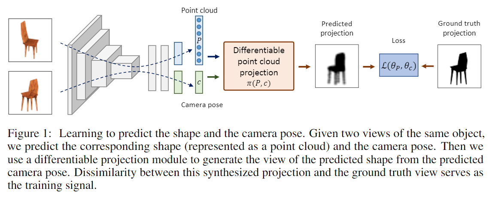
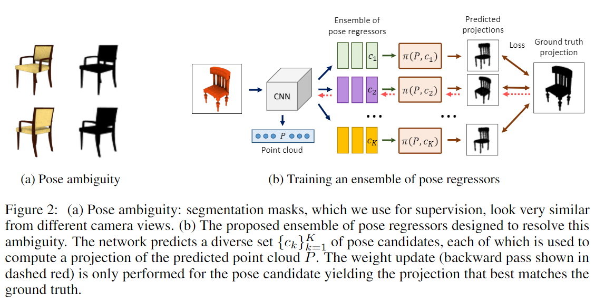
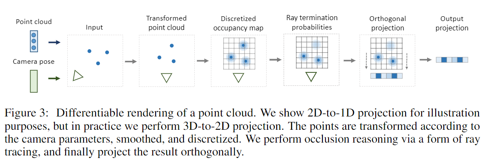
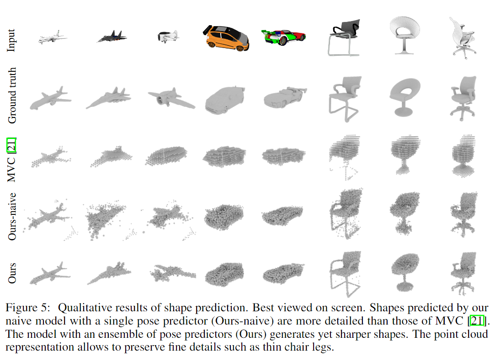

# Unsupervised Learning of Shape and Pose with Differentiable Point Clouds

元の論文の公開ページ : [arxiv](https://arxiv.org/abs/1810.09381)
Github Issues : [#33](https://github.com/Obarads/obarads.github.io/issues/33)

## どんなもの?
同じオブジェクトが映っている2枚の画像からカメラの向きと点群表現を予測し、画像から3D表現を生成するモデルを提案した。

## 先行研究と比べてどこがすごいの?
この研究と似た既存の研究では、訓練するのにカメラ位置の教師ラベルが必要であった。しかし、実際に用いるとなると、そのような教師ラベルが存在することはない可能性が高い。著者らは、ラベルなしでも学習が行えるモデルを提案した。

## 技術や手法のキモはどこ? or 提案手法の詳細
### 構造
モデルは図1の通り。入力$x_　1$と$x_2$が与えられたとすると、点群表現の3D形状 $\hat{P}_ 1$ とカメラの位置$\hat{c}_ 2$を予測する。予測した3D形状と予測したカメラの位置から画像$\hat{p}_{1,2}=\pi(\hat{P}_1, \hat{c}_2)$を生成する($\pi$はdifferentiable point cloud render(もしくはprojection))。このとき、Ground truth projection(カメラ位置の予測で使った入力画像のシルエット)と生成された画像の比較を行い、それの差を損失関数とする。

### Estimating pose with a distilled ensemble
上記の実装だけではうまく形状予測ができないことが分かった。原因はlocal minima(局所極小値)によって引き起こされる。位置推定ですべてのオブジェクトのカメラの位置が後ろもしくは前に収束するためである。実際、図2の(a)を見ての通り、シルエットではどの方向から見ているか判別しづらい。  
この問題を緩和するため、カメラ位置を出力する関数をsingle pose regressor $F_c(・,\theta_c)$から、$K$ pose regressors $F_c^k(・,\theta_c^k)$のアンサンブル\[3\](図2の(b))に変更し、hindsight損失[1]を用いた損失関数を用いて訓練する。
このアイデアは各予測子はカメラ位置のサブセットに特化し、一緒に様々なカメラの位置をカバーできるようになるというものである(イメージとしては、ある予測子はオブジェクトを横から見るの専門、別の予測子は前から見る専門というものか)。  
アンサンブルのトレーニングを行いながら、アンサンブルから最良のモデルを教師モデルとして使用することでアンサンブルをsingle regressorに蒸留する。最良のモデルは損失に基づいて決められる。  
テスト時はアンサンブルを切除して蒸留されたregressorを使いカメラ位置を推定する。

### Differentiable Point Clouds
点群から二次元への投影は図3の流れの通り。図3では2次元から1次元にしているが、これは説明の都合上であり、実際は3次元から2次元にしている。  
最初に、変換行列を用いて点群をカメラの位置に対応する標準座標系に変換し、碁盤目状に離散化される。このとき、点のによる各碁盤目内の占有率を算出するために関数が用意される(微分可能にするためそれぞれの点は平滑関数によって表現されている)。先ほどの碁盤目状に区切ったものを平面上に投影する際に、視界から遮られている点が前景の点に干渉しないようにするため、[2]と同様に微分可能なray tracing定式化を使ってオクルージョンの推定を行う。  
そして最後に平面へ投影する。

## どうやって有効だと検証した?
ShapeNetを使って定量的、視覚的な実験を行っている。形状の評価はChamfer距離に基づいたものを使っている。姿勢誤差の測定は[2]と同様の方法である。下の図と表は形状とカメラの位置を予測したときの結果である。他にもいくつか測定を行っている。

## 議論はある?
1. オクルージョン推定の方法を改造したレンダリングプロセスに変更すること
2. 現実世界で使うのであれば、背景と同様に陰影と照明について対処しなければならない
3. 点群を生成するためのAutoEnocderを高度なものに変換する
4. GANの使用

## 次に読むべき論文は?
なし

## 論文関連リンク
1. [A. Guzmán-rivera, D. Batra, and P. Kohli. Multiple choice learning: Learning to produce multiple structured outputs. In NIPS. 2012.](https://papers.nips.cc/paper/4549-multiple-choice-learning-learning-to-produce-multiple-structured-outputs)
2. [S. Tulsiani, T. Zhou, A. A. Efros, and J. Malik. Multi-view supervision for single-view reconstruction via differentiable ray consistency. In CVPR, 2017.](https://arxiv.org/abs/1704.06254)
3. [蒸留 第2回 | DeepX AI Blog (2019/03/17アクセス)](http://ai.deepx.co.jp/2018/09/25/%E8%92%B8%E7%95%99-%E7%AC%AC2%E5%9B%9E/)

## 会議
NIPS 2018

## 著者
Eldar Insafutdinov and Alexey Dosovitskiy.

## 投稿日付(yyyy/MM/dd)
2018/10/22

## コメント
アンサンブルについて詳しくないから意味あってるのかよくわからん。

## key-words
Unsupervised_Learning, RGB_Image, Point_Cloud, 3D_Estimation

## status
更新済