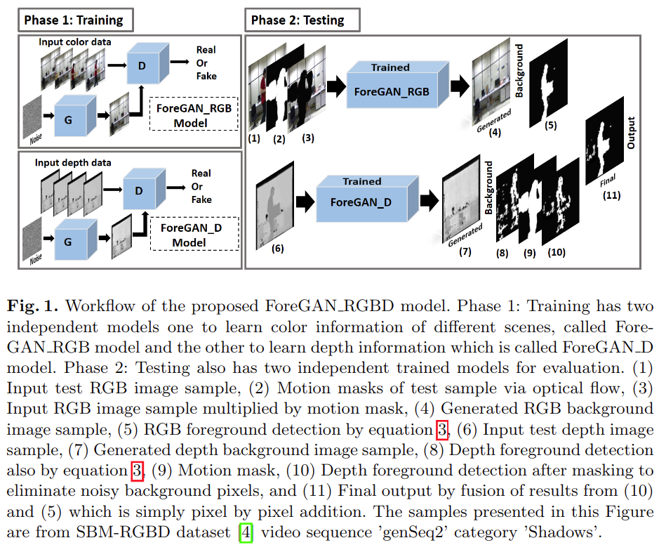

# Unsupervised RGBD Video Object Segmentation Using GANs

元の論文の公開ページ : [arxiv](https://arxiv.org/abs/1811.01526)  
Github Issues : [#122](https://github.com/Obarads/obarads.github.io/issues/122)

## どんなもの?
照明の変動、影、色彩の変化などの要素がタスクに含まれる場合、そのタスクに対するパフォーマンスは低下する。これらの問題に対処してより良い精度を達成するために、著者らは色と深度情報を利用したGANによるフュージョンベースの(?)移動体セグメンテーションアルゴリズムを提案する。

本研究の最終的な目標は実環境で背景から移動体を分割することである。

## 先行研究と比べてどこがすごいの?

## 技術や手法のキモはどこ? or 提案手法の詳細
提案手法は図1の通り。本提案は以下の2段階で構成されている。

1. 2つの独立したモデルはRGBと深度のビデオシーケンスを用いて訓練される(図1左)。
2. 逆伝播を介して背景 or 前景を含むビデオシーケンスで訓練されたモデルをテストする(図1右)。

## どうやって有効だと検証した?

## 議論はある?

## 次に読むべき論文は?
- なし

## 論文関連リンク
1. なし

## 会議
ACCV Workshop

## 著者
Maryam Sultana, Arif Mahmood, Sajid Javed, and Soon Ki Jung

## 投稿日付(yyyy/MM/dd)
2018/11/05

## コメント
なんか説明するたびにベースとなるGANの種類が変わっているように思える。

## key-words
RGB_Image, Depth_Image, GAN, Video

## status
導入

## read
A, I

## Citation
