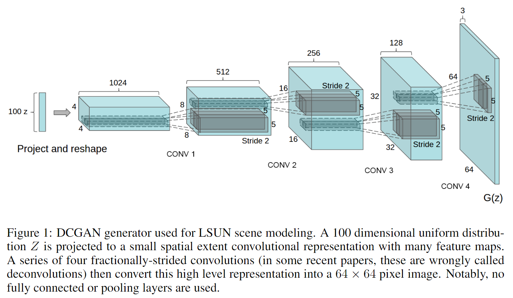
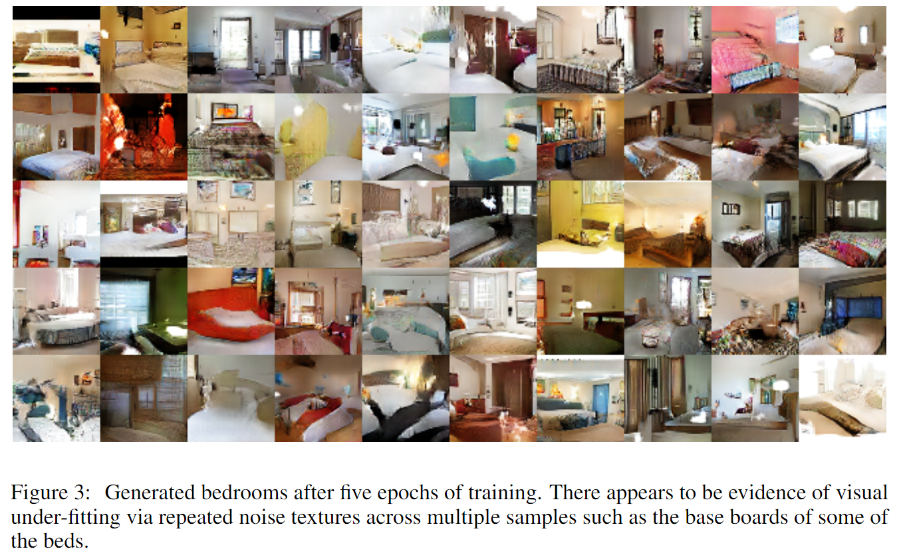
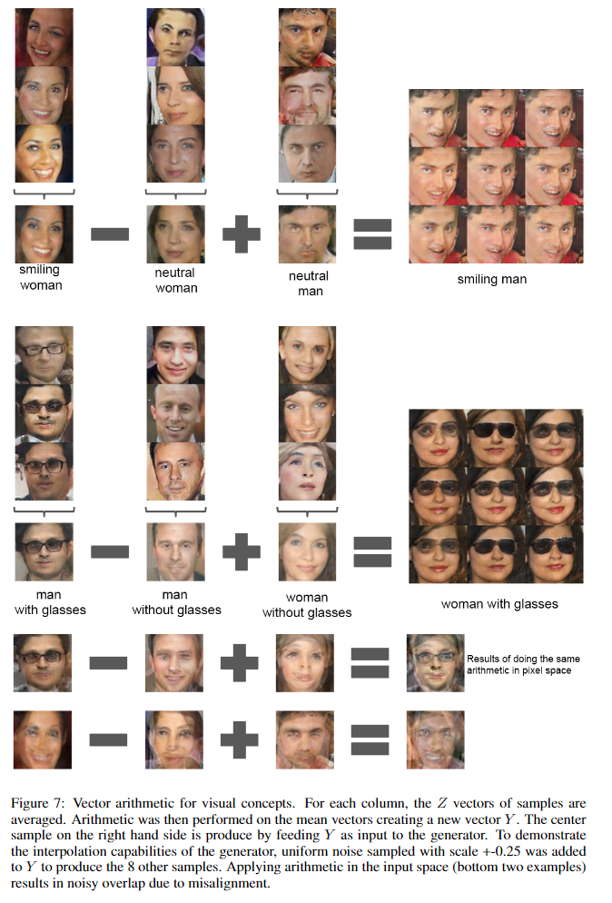

# Unsupervised Representation Learning with Deep Convolutional Generative Adversarial Networks

元の論文の公開ページ : [arxiv](https://arxiv.org/abs/1511.06434)
Github Issues : [#35](https://github.com/Obarads/obarads.github.io/issues/35)

## どんなもの?
DGCNNと呼ばれるGANを提案した。GANに畳み込みを適応している代表例であり、ベクトル算術演算を画像に反映できることを示したモデルでもある。

## 先行研究と比べてどこがすごいの?
GANはノイズと理解できない表現を含む画像を生成することに苦闘していたが、最近の研究[1]で高品質なものを作れるようになった。しかしこの手法は複数のモデルをつなぐことで途中からノイズが入ってくるため、画像のオブジェクトがぶれて見える。DGCNNはモデルを連結せずに自然な画像を出力する。recurrent network[2]やdeconvolution network[3]によるアプローチは自然な画像を生み出すことに成功しているが、これらは教師ありタスクのために生成器(多分GANの部品である生成器を指しているわけではない)を活用していない(この論文では弁別器を活用しているような...)。また、意味的なものを操作できるベクトル算術特性を紹介する。

## 技術や手法のキモはどこ? or 提案手法の詳細
説明全般は[6]が分かりやすく、ここの説明もこちらを参考にしている。GANに以下の内容を適応したものをDCGANとして扱う。後述するLSUNで使った生成器の図は図1の通り。
- 全畳み込みネット[4]のmax pooling等の決定論的空間プーリング関数をstrided convolutionsに変更する。このstrided convolutionsはネットワーク自身が独自の空間的なダウンサンプリングを学習する。この畳み込みを利用し、弁別器を学習する。また、生成器にも空間的なアップサンプリングを学習するためのfractional-strided convolutions(他の論文ではdeconvolutionと呼ばれる)を導入する。
- 畳み込み特徴のトップにある全結合層を排除する。代わりにglobal average poolingを使う。global average poolingの利用は[5]が代表例であり、収束速度と引き換えにモデルの安定性を高める。[6]によると弁別器のものを入れ変える(論文のここの説明が分かりにくかった)。
- バッチ正規化を導入する。初期化が不十分なときに発生する訓練の問題やより深いモデルの勾配流の助けとして役に立つ。また、学習の安定化やGANの崩壊対策にも役に立つ。ただし、全ての層に直接バッチ正規化を適応すると不安定になるため、生成器と弁別器にバッチ正規化を施さないようにした。
- Tahn関数を使う出力層を除いて、ReLUが生成器で使われる。(理由は[7]にある?)
- 弁別器では全ての層でLeaky ReLUを使う。弁別器内でleaky ReLUを使うことで高解像度のモデル化に対して良い動きをするからである。

## どうやって有効だと検証した?
### LSUN
Large-scale Scene Understanding (LSUN)データセットを使用して生成したベッドルームの例を図3に示す。また、画像の重複排除プロセスについても検証している。

### CLASSIFYING CIFAR-10 USING GANS AS A FEATURE EXTRACTOR
教師付きタスクについてDCGANの識別性能を図る。DCGANをImagenet-1Kで訓練したのち、全ての層から弁別器の畳み込み特徴を使い、$4\times 4$の空間グリッドを生成するためにそれぞれの層表現をmax-poolingする。特徴は28672次元ベクトルから平坦化、連結され、そして規則化された線形L2-SVM分類器を訓練するために使われる。

### VECTOR ARITHMETIC ON FACE SAMPLES
生成器の入力であるZベクトルを使い、word2vecの様にベクトル演算が可能である。この演算により図7の様にベクトル演算の結果が反映される。

### その他
他にもいろいろ行っている。

## 議論はある?
ドメインの種類を画像に限らず別のものに応用するべきとのこと。

## 次に読むべき論文は?
- [(論文じゃない)片岡裕雄. 敵対的生成ネットワーク（GAN）. (アクセス:2019/03/21)](https://www.slideshare.net/cvpaperchallenge/gan-133159239)
- [Phillip Isola, Jun-Yan Zhu, Tinghui Zhou, Alexei A. Efros. Image-to-Image Translation with Conditional Adversarial Networks. 2016.](https://arxiv.org/abs/1611.07004)
- [Augustus Odena, Christopher Olah, Jonathon Shlens. Conditional Image Synthesis With Auxiliary Classifier GANs. 2016.](https://arxiv.org/abs/1610.09585)

## 論文関連リンク
1. [Denton, Emily, Chintala, Soumith, Szlam, Arthur, and Fergus, Rob. Deep generative image models using a laplacian pyramid of adversarial networks. arXiv preprint arXiv:1506.05751, 2015](https://arxiv.org/abs/1506.05751)
2. [Gregor, Karol, Danihelka, Ivo, Graves, Alex, and Wierstra, Daan. Draw: A recurrent neural network for image generation. arXiv preprint arXiv:1502.04623, 2015.](https://arxiv.org/abs/1502.04623)
3. [Dosovitskiy, Alexey, Springenberg, Jost Tobias, and Brox, Thomas. Learning to generate chairs with convolutional neural networks. arXiv preprint arXiv:1411.5928, 2014.](https://arxiv.org/abs/1411.5928)
4. [Springenberg, Jost Tobias, Dosovitskiy, Alexey, Brox, Thomas, and Riedmiller, Martin. Striving for simplicity: The all convolutional net. arXiv preprint arXiv:1412.6806, 2014.](https://arxiv.org/abs/1412.6806)
5. [Mordvintsev, Alexander, Olah, Christopher, and Tyka, Mike. Inceptionism : Going deeper into neural networks. http://googleresearch.blogspot.com/2015/06/inceptionism-going-deeper-into-neural.html. Accessed: 2015-06-17.](http://googleresearch.blogspot.com/2015/06/inceptionism-going-deeper-into-neural.html)
6. [Shinya Yuki. はじめてのGAN (アクセス日時:2019/3/21).](https://elix-tech.github.io/ja/2017/02/06/gan.html)
7. [Nair, Vinod and Hinton, Geoffrey E. Rectified linear units improve restricted boltzmann machines. InProceedings of the 27th International Conference on Machine Learning (ICML-10), pp. 807– 814, 2010.](http://citeseerx.ist.psu.edu/viewdoc/download?doi=10.1.1.165.6419&rep=rep1&type=pdf)

## 会議
ICLR 2016

## 著者
Alec Radford, Luke Metz, Soumith Chintala.

## 投稿日付(yyyy/MM/dd)
2015/11/19

## コメント
なし

## key-words
Unsupervised_Learning, GAN, RGB_Image, CV, Paper, 修正

## status
修正
