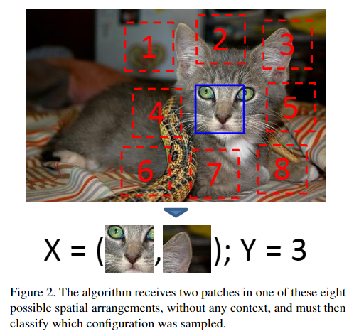
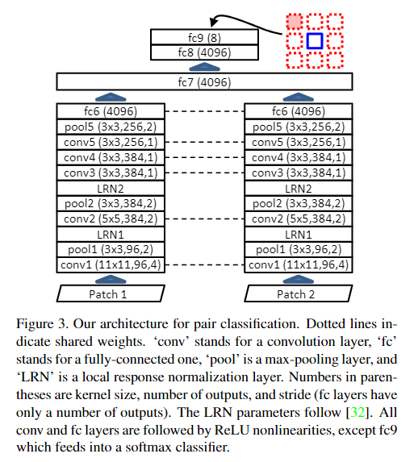

# Unsupervised Visual Representation Learning by Context Prediction

## どんなもの?
self-supervisedモデルの考案。画像の一部を3*3の碁盤目に分け、そのうちの「中央画像」と「中央画像以外の画像」をネットワークに入力し、中央画像以外の画像が碁盤目の中のどこに位置するか予測する。

## 先行研究と比べてどこがすごいの?
初めてself-supervisedな表現学習手法を提案した。事前に何かしらのタスク(pretext task)を行い、汎用性の高い特徴抽出器を作成する。

## 技術や手法のキモはどこ?
画像の構造を利用する、自然言語処理の共起表現を画像処理に応用したアイデア。図2の様に分割した画像(パッチ)のうち、中央のパッチと中央パッチ以外のパッチを一つをXに入力し、配置番号を出力する。構造の単調なパターン捉えるもしくはパッチの境界に近いテクスチャへの注目などの低レベルな情報でもpretext taskをこなすことができ、これは検知したい物体の形状等の意味的で高レベルな情報を捉えることの妨げになる。この論文ではその傾向を改善するためのテクニックを提示している。図2の様に、ギャップ(パッチとパッチの間の隙間)とジッタリング(ブレ、不規則な位置)を導入することで、低レベルなpretext taskの解決方法を避けることができる。また、色収差によりConvNetは緑とマゼンタの分離の検知によってパッチの位置を特定できるため、2種類の前処理を用意した。一つは緑とマゼンタを灰色にシフトすること(projection)、もう一つは3つのカラーチャンネルのうち2つをランダムに削除し、削除した色をガウスノイズに置き換える(color-dropping)。実験ではcolor-droppingの手法を取ったが、どちらの手法も同じような結果を示す。

提案モデルは図3の通り。はじめに中央の画像が与えられ、その次に中央以外の画像が与えられる。モデル自体はAlexNetをできるだけ模倣したものを使っている。

## どうやって有効だと検証した?
最近傍マッチング、VOC 2007等を使って検証している。

## 議論はある?
無し

## 次に読むべき論文は?
- Unsupervised Learning of Visual Representations by Solving Jigsaw Puzzles

### 論文関連リンク
1. http://hirokatsukataoka.net/temp/cvpaper.challenge/SSL_0929_final.pdf

### 会議
ICCV 2015

### 著者
Carl Doersch, Abhinav Gupta and Alexei A. Efros.

### 投稿日付(yyyy/MM/dd)
2015/05/19

## コメント
無し