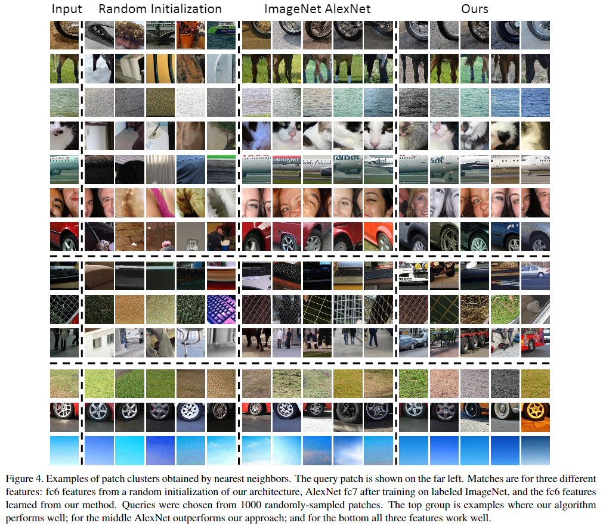
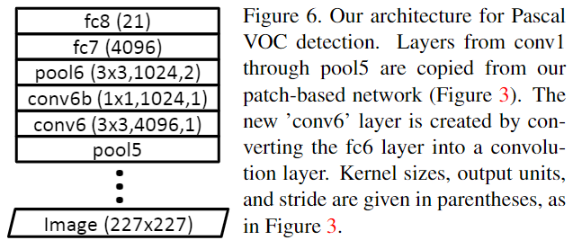
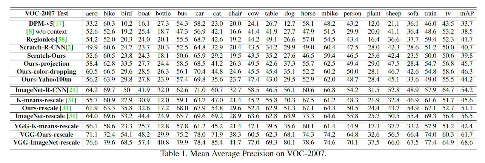
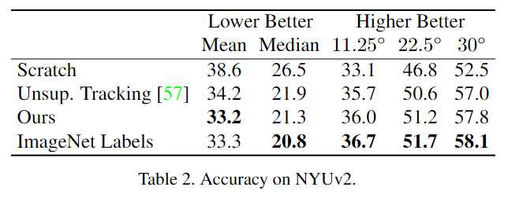

# Unsupervised Visual Representation Learning by Context Prediction

元の論文の公開ページ : https://arxiv.org/abs/1505.05192

## どんなもの?
self-supervisedモデルの考案。画像の一部を3*3の碁盤目に分け、そのうちの「中央画像」と「中央画像以外の画像」をネットワークに入力し、中央画像以外の画像が碁盤目の中のどこに位置するか予測する。

## 先行研究と比べてどこがすごいの?
初めてself-supervisedな表現学習手法を提案した。事前に何かしらのタスク(pretext task)を行い、汎用性の高い特徴抽出器を作成する。

## 技術や手法のキモはどこ? or 提案手法の詳細
画像の構造を利用する、自然言語処理の共起表現を画像処理に応用したアイデア。図2の様に分割した画像(パッチ)のうち、中央のパッチと中央パッチ以外のパッチを一つをXに入力し、配置番号を出力する。構造の単調なパターン捉えるもしくはパッチの境界に近いテクスチャへの注目などの低レベルな情報でもpretext taskをこなすことができ、これは検知したい物体の形状等の意味的で高レベルな情報を捉えることの妨げになる。この論文ではその傾向を改善するためのテクニックを提示している。図2の様に、ギャップ(パッチとパッチの間の隙間)とジッタリング(ブレ、不規則な位置)を導入することで、低レベルなpretext taskの解決方法(“trivial” solutionsまたは“trivial” shortcuts)を避けることができる。また、色収差によりConvNetは緑とマゼンタの分離の検知によってパッチの位置を特定できるため、2種類の前処理を用意した。一つは緑とマゼンタを灰色にシフトすること(projection)、もう一つは3つのカラーチャンネルのうち2つをランダムに削除し、削除した色をガウスノイズに置き換える(color-dropping)。実験ではcolor-droppingの手法を取ったが、どちらの手法も同じような結果を示す。

提案モデルは図3の通り。はじめに中央の画像が与えられ、その次に中央以外の画像が与えられる。モデル自体はAlexNetをできるだけ模倣したものを使っている。

## どうやって有効だと検証した?
### 最近傍マッチング
意味的な特徴を捉えることができるのであれば，出力した特徴量に最近傍を使えば意味的な特徴が同じ=似たような画像を選ぶはずである。そこで画像から96*96サイズのランダムサンプリング(画像の一部を切り抜き)によってパッチを作成し、1000のランダムクエリを実施した．比較モデルはImageNetを学習させたAlexNetのfc7の特徴量、提案手法のfc6、提案手法のランダム重み付け(つまり訓練なし)のfc6を使用した。結果は図4である。提案手法が意味のある特徴量を取っている。

#### 余談: 色収差の学習可能性"
初期の最近傍実験において、コンテンツに関わらず、取り出された(近傍実験で選ばれた?)いくつかのパッチが画像内の同じ絶対位置(理想的な位置はパッチ同士の相対位置)からのパッチと一致した。これらのパッチが似た収差を持ち合わせていたからである。そこでこの色収差に対する検証するために、ImageNetｋらサンプリングしたパッチの絶対座標(x,y)を予測するネットワークをトレーニングした。全体的な精度は低いものの、上位10%の画像はRMSE(root-mean-square error、少なければ誤差が少ない)が.255であった。図5はその結果の1例を示し、提案したprojectionの手法をとると上位10%の画像のRMSEは.321に増加しており、期待通りの結果が得られた。尚、常に画像の中心を予測する(図5の右のような状態?)とき、RMSEは.371になる。

### オブジェクト検知
Pascal VOCの課題以前の研究でImageNetの事前トレーニング(ImageNetの課題を解決するためのトレーニング)とその後のネットワークのfine-tuningによってPascalトレーニングセットだけの時よりも大幅に向上する。しかし、少なくとも著者が知る限りでもデータがいくらあろうが教師なしでの画像の事前トレーニングが上記のような性能向上を示すような研究はない。このタスクでは、R-CNNのパイプラインを使う。R-CNNでは227\*227の画像を使用しており、実際96\*96では情報のロスが多いので図6の形式に変更する。Image(227\*227)とpool5の間は図3のconv1からconv5で構成される。尚、pool5は7*7になるため参考文献リンクの3に従ってfc6をconv6に変換する必要がある。この後、FC層で4096を処理していくのは重いのでconv6bで1024次元に畳み込む。このタスクでは論文関連リンクの2に従ってfine-tuningを行う(conb6bとfc7とfc8はランダムな重みで始める。fc6とpool6は学習するの?(論文関連リンクの2と3は見ていないので理解しきれていない))。

結果は表1の通り。

scratch-Ours(pretext task無しのランダム初期化)はScrath R-CNN(中身AlexNet?のランダム初期化)にわずかに劣るが、pretext taskによって最大約6%の精度向上が見られた。これにより、ImageNetのによるラベルあり事前トレーニングをしたR-CNNより約8%遅れをとった。これはデータセット外のラベルなし事前トレーニングでVOC 2007をこなす最高の結果である。私たちはbatch normalizationで初期化した追加のベースラインを実行したが、示したものより性能が悪かった(何の話?)。
さらなる理解のためにYahoo/Flickr 100-million Datasetの2M分を使った。ImageNetのものより精度は下がるものの、pretext taskの効果は得られた。上記のfine-tuningの実験ではbatch normalization層を削除して代わりにFCとConv層の出力を各チャンネルで平均0、分散1になるよう重みとバイアスを再スケーリングした。fine-tuning前の重みのスケーリングがテスト時のパフォーマンスに大きな影響を与えている可能性があり(論文関連リンクの4)、batch normalization削除以前の自分たちの手法はスケーリングが不十分であった。論文関連リンクの4はネットワークが計算する関数を変えることなく、ネットワークの重みの再スケーリングを行うためのfine-tuning向けのシンプルな手法を提案している。この方法によって自分たちの提案手法であるOurs-rescaleの改善が見られた。

また、教師なしであるが故に無限大のデータを使える自分たちのモデルは、このモデルは例えばVGGの様な高性能モデルの可能性を押し上げるかもしれない。そこで、VGGの16層構造を参考にしたモデルをトレーニングした(最後のfc6-fc9層は図3と同様)。論文関連リンクの4に従って再度Pascal VOCの表現をfine-tuningした。結果は表1の通り。

### 形状評価
自分たちの表現がnon-object-based taskの様な別の目的でも有用なものになりえるか、NYUv2のデータセットで表面法線推定のタスクをfine-tuningで試した。結果は表2の通り。

### 視覚データマイニング
わからないんで一時飛ばす

### 相対予測タスクの精度の課題
自分たちのpretext taskにより更なる表現の改善は見込めるのか?そこでPascal VOC 2007から500個分ランダムにサンプリングし、それぞれから256ペアのパッチをサンプリングし、図2の様に8つの相対位置カテゴリに分類した。結果は38.4%であり、結果の変動値(?)は12.5%、提案したpretext taskは難しいことが分かった(人間でも似たような結果になる)。過剰適合を考え、バリデーションセットで調査したがトレーニングセットと似た結果になった(つまり過剰適合は考えられない)。この難易度の原因として、そのタスクがそもそも不可能であるということ(つまり映っているオブジェクトに考慮されたサンプリングがなされていない?)が考えられる。そこで、Pascalオブジェクトのground-truthの境界ボックスを参考にしてサンプリングされたパッチのみで実験した。この時、わかりやすい画像を使う。驚くことに結果は39.2%となった。尚、自動車のみで試した場合45.6%となった。これらの結果より、このpretext taskはオブジェクトに敏感であるがそれと同じくらい残りのレイアウトに敏感である。

## 議論はある?
無し

## 次に読むべき論文は?
- Unsupervised Learning of Visual Representations by Solving Jigsaw Puzzles

## 論文関連リンク
1. [鈴⽊智之. Self-supervised Learningによる特徴表現学習. (アクセス日時 2019/02/06)](http://hirokatsukataoka.net/temp/cvpaper.challenge/SSL_0929_final.pdf)
1. [R. Girshick, J. Donahue, T. Darrell, and J. Malik. Rich feature hier-archies for accurate object detection and semantic segmentation. In CVPR, 2014.](https://arxiv.org/abs/1311.2524)
1. [J. Long, E. Shelhamer, and T. Darrell. Fully convolutionalnetworks for semantic segmentation. arXiv preprint arXiv:1411.4038, 2014.](https://arxiv.org/abs/1411.4038)
1. [P. Krähenbühl, C. Doersch, J. Donahue, and T. Darrell. Data-dependent initializations of convolutional neural networks. arXiv preprint arXiv:1511.06856, 2015.](https://arxiv.org/abs/1511.06856)

## 会議
ICCV 2015

## 著者
Carl Doersch, Abhinav Gupta and Alexei A. Efros.

## 投稿日付(yyyy/MM/dd)
2015/05/19

## コメント
Self-learning分野のはじまり。図4をのランダムサンプリングが選んだタイヤと人の顔、地面と空を見ると適当に重みづけされたネットワークを使っているにも関わらす特徴をとらえている。ほかにも、渡されたクエリとは違うものの上のキーボード(画像に明確な線が映っているもの)や上のタイヤ(右下に全体とは異なる何か目立つものが置かれている)の回答内で似たような画像を回答している。つまり、ネットワークは訓練をせずとも何かしら特徴を捉えることができる。このことに着目したものがDeep Clustering for Unsupervised Learning of Visual Featuresである。

## key-words
2D_Image, Classification, Self-supervised

## status
更新済