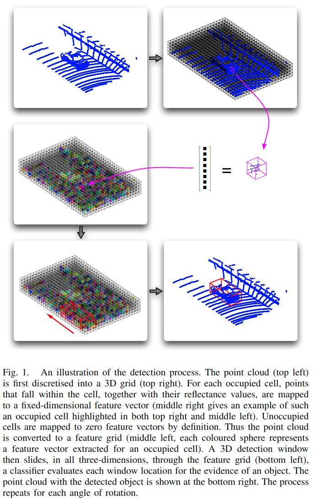

# Voting for Voting in Online Point Cloud Object Detection

元の論文の公開ページ : [robots.ox.ac.uk](http://www.robots.ox.ac.uk/~mobile/Papers/2015RSS_wang.pdf)  
Github Issues :   

## どんなもの?
点群をボクセル化した後に、スライディングウィンドウアプローチを適応してオブジェクトの検出を行う手法を提案した。
- 通常、そのまま3Dボクセル空間にスライディングウィンドウを組み込む場合、膨大な時間がかかってしまうが、本提案アルゴリズムはかなりの速度でその処理をこなせる。

## 先行研究と比べてどこがすごいの? or 関連事項
省略

## 技術や手法のキモはどこ? or 提案手法の詳細
3D上のスライディングウィンドウ検出器は、画像の場合とよく似ている。図1は本提案を車が写った点群に対して用いた場合の一例である。

本手法は点群を入力として扱う。入力する際に、点群に事前処理を加える。
- 点群をfeature grid[離散化された点群の特徴量]に変換する。処理は以下の通り。
    - 3D空間は固定解像度のグリッドへ離散化される。
    - 次に各占有セルは固定次元の特徴ベクトルに変換される。[ここの「占有」とは、点を含むものと言う意味。]占有されていないセルはゼロの特徴ベクトルとして扱われる。
        - 図1の中段左の色付き立方体は特徴ベクトルを含み、そうでないものはゼロの特徴ベクトルとなっている。
    - 特徴ベクトル化された後に、固定サイズのウィンドウをスライドさせる。スライドは3次元に下ってスライドする。[slide down all three dimensions=3次元に下ってスライド、徐々にウィンドウをスライドさせるという意味で問題なし]
    - 各ウィンドウの位置でウィンドウ内のセルたちに含まれる特徴ベクトルを一つの長い特徴ベクトルにまとめ上げ、それを分類器(SVMなど)に入力する。
    - 分類器は検出スコアを返すことでウィンドウの現在位置がオブジェクトの境界を示しているかどうかを示す。
    - この過程で画像ベースに存在するスケール問題は考慮しなくて良い(実サイズで処理するため)。

## どうやって有効だと検証した?

## 議論はある?

## 次に読むべき論文は?
- なし

## 論文関連リンク
1. なし

## 会議, 論文誌, etc.
Proceedings of Robotics: Science and Systems

## 著者
Dominic Zeng Wang and Ingmar Posner

## 投稿日付(yyyy/MM/dd)
2015/??/??

## コメント
なし

## key-words
Paper, CV, Detection, Point_Cloud

## status
未完

## read

## Citation
