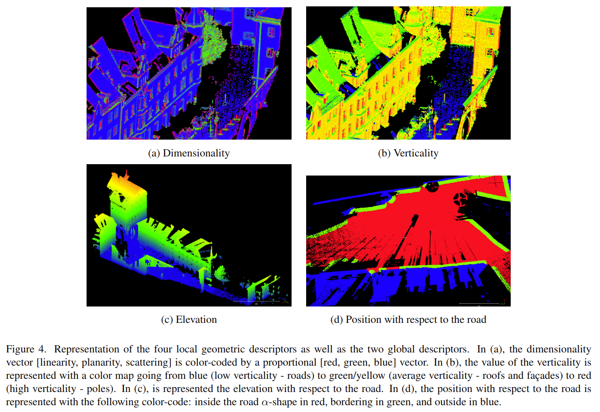

# Weakly supervised segmentation-aided classification of urban scenes from 3D LiDAR point clouds

元の論文の公開ページ : [www.int-arch-photogramm-remote-sens-spatial-inf-sci.net](https://www.int-arch-photogramm-remote-sens-spatial-inf-sci.net/XLII-1-W1/151/2017/isprs-archives-XLII-1-W1-151-2017.pdf)  
Github Issues : [#138](https://github.com/Obarads/obarads.github.io/issues/138)

## どんなもの?
サイズパラメータ(最大半径、点の最大数等)を必要としないセグメンテーションを用いて、少数の注釈付き点から得た弱教師あり分類を改良するために点群の基礎構造を利用することを目的とした論文である。この試みは、著者らが着目した、man-madeなオブジェクトが(基本的に)幾何学的に簡単な形状を持ち、それらが大量に並んでいる都市内の点群に対して行われる。セグメンテーションは幾何学的に簡単なスーパーボクセルを検索するための最適化問題として定式化する。

## 先行研究と比べてどこがすごいの?
サイズパラメータを必要としないセグメンテーションが可能であること。

## 技術や手法のキモはどこ? or 提案手法の詳細

## どうやって有効だと検証した?

## 議論はある?

## 次に読むべき論文は?
- なし

## 論文関連リンク
1. なし

## 会議
ISPRS WS 2017

## 著者
S. Guinard and L. Landrieu.

## 投稿日付(yyyy/MM/dd)
2017/06/06

## コメント

## key-words
Weakly_Supervised_Learning, Point_Cloud, Supervoxel, CV, Paper

## status
導入

## read
A, I, R

## Citation
