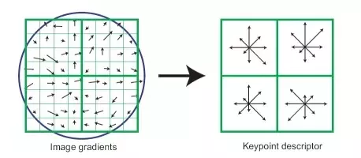

# What is bins ?

Github Issues :   

## 概要
なんかCV分野で出てくるbinがよく理解できていないので大雑把に調べた。

## 説明 or メモ
### 以下[1]の意訳
グレースケール画像の色ヒストグラムを考えてみましょう。各ピクセルは0~255の値を取ります。ヒストグラムを作成するとき、我々は強度"I"を用いてピクセルの数をカウントし、H(I)をカウントとして割り当てます。このとき、Hはヒストグラムです。ここで、ビン(bin)は各強度値"I"を示します。つまり、255個の強度値[0~255なら256では?]があるため、binの数は255となります。

これ以外にも、ヒストグラムを単純化するため、強度値をグループごとに分割する場合にも使われます。例えば、強度地が125以下のピクセルはグループAに、それ以外はグループBに属するようにします。これらのグループはビンとして定義できます。そのため、グループAとBの２つがあるため、2つのビンが定義されたことになります。

SIFTでは、方向ヒストグラムで使われます。この場合、ビンは強度ではなく角度を表します。8つのビンがある場合、角度の間隔は適切に選ばれ、ヒストグラムは以下に示すように、対応する角度の勾配のカウントで示されます。

  
画像は[1]より引用

## 論文関連リンク
1. [Quora, What is the perfect definition of "bin", and what's the difference between "feature" and "keypoint" in SIFT algorithm? 2016. (アクセス: 2019/11/19)](https://www.quora.com/What-is-the-perfect-definition-of-bin-and-whats-the-difference-between-feature-and-keypoint-in-SIFT-algorithm)
2. [Minghao Ning. Towards Data Science. SIFT(Scale-invariant feature transform). 2019. (アクセス: 2019/11/19)](https://towardsdatascience.com/sift-scale-invariant-feature-transform-c7233dc60f37)

## 投稿日付(yyyy/MM/dd)
2019/11/19

## コメント
なし

## key-words
Memo, CV

## status
省略

## read

## Citation
