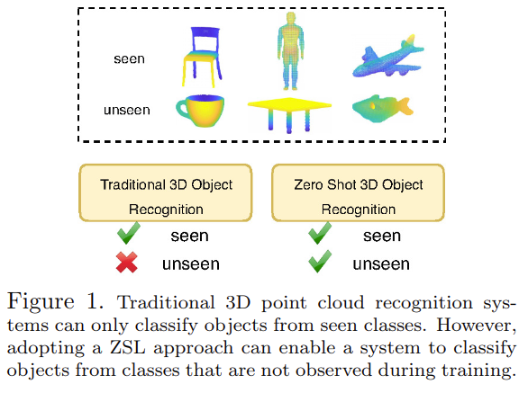
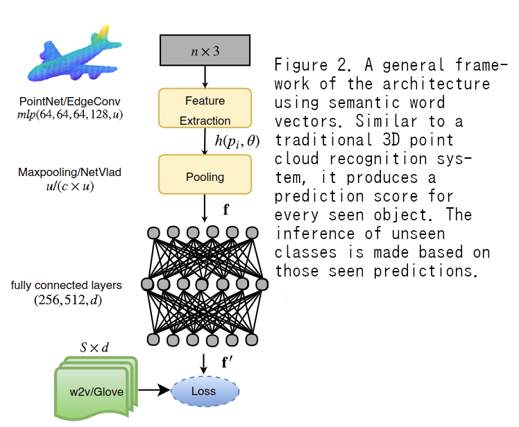

# Zero-shot Learning of 3D Point Cloud Objects

元の論文の公開ページ : [arxiv](https://arxiv.org/abs/1902.10272)  
Github Issues : [#128](https://github.com/Obarads/obarads.github.io/issues/128)

## どんなもの?
3Dオブジェクトに対してzero-shot learning(ZSL)を適応する。ZSLにより、通常の3Dオブジェクト認識では対応できなかった未確認クラスのオブジェクトに対する識別を行えるようになる(図1)。

ベースとなるアーキテクチャはEdgeConvやPointNet、NetVladを用いたものである。それらのアーキテクチャの力を借りて、著者らは点群と単語ベクトルの意味的特徴を組み合わせた新しい構造を構築し、それにより未確認クラスの分類を可能にする。

貢献は以下の通り。

- 著者らは3Dデータ用のZSLを提案する。3Dオブエジェクトに関してZSLが使われるのは初である。
- この提案手法は、3DのZSLのベースラインとして役立つ。
- 3D点群向けZSLのための新しい評価方法を導入する。

## 先行研究と比べてどこがすごいの?
ZSLは2D画像に対してよく研究されているが、3D点群に関しては全くされていない。本提案は3Dオブジェクトに関するZSL手法の最初の提案となる。

## 技術や手法のキモはどこ? or 提案手法の詳細
### アーキテクチャの訓練
提案するアーキテクチャの概要は図2(論文を元にやや修正)の通り。従来の3D点群アーキテクチャ等を用いて(訓練で)確認済みクラスに対する予測スコアを生成し、それに基づいて未確認クラスであるかどうかの推論を行う。

最初の入力はPointNetもしくはEdgeConvを使ったオブジェクト点群の特徴量化を行う。poolingによって(PointNetではグローバル特徴に当たる)特徴量$\mathbf{f}$が抽出された後は、$\mathbf{f}$をより識別可能な表現へ変換するのと同時に($\mathbf{f}$を)単語ベクトルの埋め込み空間へマッピングするため、$\mathbf{f}$を全結合層に入力する。最終的に全結合層の出力$\mathbf{f}^{\prime}$は意味的埋め込みベクトル$\mathbf{E}^{s}$と一緒に損失関数に組み込まれる。

[※ 単語埋め込みに関しては、2D画像に対するZSL手法を探すしかなさそう]

### Multiple semantic space fusion
GloveとWord2vecの２つの単語埋め込みがあるが、これらを連結して使うことで新しい単語埋め込みが出来上がる。著者らはこれを実装して用いた。

### Inference
あとで修正

## どうやって有効だと検証した?

## 議論はある?

## 次に読むべき論文は?
- なし

## 論文関連リンク
1. なし

## 会議
MAV 2019

## 著者
Ali Cheraghian, Shafin Rahman, Lars Petersson

## 投稿日付(yyyy/MM/dd)
2019/02/27

## コメント
なし

## key-words
Point_Cloud, Zero-Shot_Learning, CV

## status
修正

## read
A, I, R

## Citation
